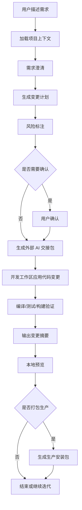

# Vibe Boot AI 工作台设计草案

## 1. 文档目的

本文定义 Vibe Boot AI 工作台的产品边界、核心流程、模块职责、风险控制和实现前准入条件。

AI 工作台是 Vibe Boot 区别于传统 Java Admin、低代码平台和普通 AI Chat 的核心入口。它不是简单聊天页面，而是围绕真实代码仓库工作的受控开发协作台。

AI 工具整体分工见 `docs/ai-tooling-strategy.md`。P0 阶段不自研完整 AI coding runtime，外部 AI coding 工具负责 Vibe Boot 自身开发和真实源码修改，平台内 AI 工作台负责面向用户的受控生成流程，并把已确认需求、上下文、风险和验证要求整理为可交给外部 AI Coding 工具执行的交接包。

## 2. 产品定位

| 项目 | 定位 |
| --- | --- |
| 核心目标 | 让用户通过自然语言描述需求，由 AI 在项目约束内生成、修改、验证真实代码 |
| 使用场景 | 开发模式为主，生产模式默认关闭代码编辑能力 |
| 主要用户 | 企业用户、实施人员、Java 全栈开发者 |
| 工作对象 | 文档、元模型、Java 后端、Vue 前端、SQL、测试、脚本 |
| 关键差异 | AI 必须遵守 skills、产品约束、模块边界和质量门禁 |
| 交接方式 | 平台内完成澄清、计划、风险和确认，外部 AI Coding 工具按交接包修改源码 |

一句话：

> AI 工作台是 Vibe Boot 的“受控代码生产线”，不是无边界聊天框。

## 3. 不做什么

| 不做项 | 原因 |
| --- | --- |
| 不做通用 ChatGPT 套壳 | 必须围绕当前项目上下文和代码仓库工作 |
| 不做低代码拖拽编辑器 | 首版坚持真实代码生成 |
| 不做生产在线改源码 | 生产模式默认关闭代码编辑 |
| 不绕过 Git/文件系统 | 所有变更必须能被 diff、审查、回滚 |
| 不自动执行高风险操作 | 删除数据、改权限、引入依赖、发布生产必须人工确认 |
| 不直接暴露模型供应商细节给业务模块 | 统一通过模型网关 |
| 不把交接包当生产执行脚本 | 交接包只用于开发/实施协作，不能在生产环境直接执行补丁、SQL 或 shell |

## 4. 核心用户流程

| 阶段 | 输入 | 输出 | 约束 |
| --- | --- | --- | --- |
| 需求输入 | 用户自然语言 | 初步任务 | 不直接改代码 |
| 上下文加载 | 文档、代码、skills、元模型 | 上下文摘要 | 必须说明使用了哪些上下文 |
| 需求澄清 | 不完整需求 | 问题列表或假设 | 关键字段、权限、数据影响必须澄清 |
| 变更计划 | 已澄清需求 | 文件、接口、表、页面、测试计划 | 高风险标记 |
| 外部交接 | 已确认计划、风险、验证命令 | 交接包 | 缺少阶段、范围、禁止项、验证命令时不得进入实现 |
| 代码变更 | 已确认计划 | 补丁或生成结果 | 仅限开发工作区，由外部 AI Coding 工具或本地受控执行器承接，不覆盖用户未确认改动 |
| 自动验证 | 当前工作区 | 编译/测试/构建结果 | 失败必须解释 |
| 结果摘要 | diff、验证结果 | 中文摘要 | 必须列出风险和下一步 |

## 5. 工作台页面组成

| 区域 | 作用 |
| --- | --- |
| 任务输入区 | 用户描述需求、选择任务类型、选择模型 |
| 上下文面板 | 展示本次 AI 使用的文档、代码、skills、规则 |
| 需求澄清区 | 展示 AI 问题、用户回答、已确认假设 |
| 计划区 | 展示变更计划、影响文件、数据库和权限影响 |
| 风险区 | 展示高风险操作、是否需要确认 |
| 交接包区 | 展示可复制/导出的外部 AI Coding 工具提示词、范围、禁止项和验证命令 |
| 变更区 | 展示 diff、生成文件、待应用补丁 |
| 验证区 | 展示编译、测试、前端构建、脚本执行结果 |
| 预览区 | 展示本地访问地址、页面入口、接口文档 |
| 历史区 | 展示历史任务、对话、变更摘要、回滚点 |

首版页面不追求复杂视觉编辑，优先保证任务闭环清晰。

## 5.1 角色视图约束

AI 工作台不是所有角色共用同一套按钮。不同用户看到的信息深度、可操作动作和风险确认必须不同，避免企业用户被迫理解源码细节，也避免实施人员缺少交接依据。

| 角色 | 默认视图 | 允许动作 | 不允许动作 |
| --- | --- | --- | --- |
| 企业管理员 | 业务需求、澄清问题、计划摘要、风险提示、验收入口 | 描述需求、回答澄清、确认计划、确认 L2/L3 风险、查看结果摘要 | 直接编辑源码、执行 shell、在线改表、跳过实施复核 |
| 实施人员 | 企业用户确认内容、外部 AI 交接包、验证要求、风险清单 | 复制交接包、交给外部 AI Coding 工具执行、回填验证摘要、发起预览 | 未确认计划时执行源码变更、绕过验证交付 |
| Java 开发者 | 上下文文件、允许范围、禁止范围、验证命令、diff 摘要 | 使用外部 AI Coding 工具修改源码、补测试、解释失败、提交修复建议 | 自行更换技术栈、跨阶段扩范围、把验证通过当作产品签收 |
| 生产用户 | 业务 AI 功能、业务数据结果、使用记录 | 执行业务问答、摘要、分类、文案或分析 | 接触交接包、补丁、源码、安装脚本或数据库结构变更 |

首版若无法实现完整权限视图，也必须在任务详情中明确当前角色、当前入口和不可执行动作。角色不明确的 AI 任务不得进入代码生成或交接包执行。

## 5.2 任务状态机约束

AI 工作台必须把一次生成任务拆成可观察状态，而不是只显示模型输出文本。状态机用于防止“用户一句继续”被误解成无限授权。

| 状态 | 含义 | 可进入下一步的条件 |
| --- | --- | --- |
| draft | 用户刚输入需求 | 已选择任务类型并保存原始需求 |
| clarifying | AI 正在澄清需求 | 关键字段、权限、数据影响已回答或记录假设 |
| planned | 已生成变更计划 | 文件、接口、表、页面、验证命令和风险已列出 |
| waiting_confirm | 等待用户确认 | L2/L3 风险、范围、验收标准被明确确认 |
| handoff_ready | 可生成外部 AI 交接包 | 准入卡、允许范围、禁止范围、上下文和验证命令齐全 |
| executing_external | 外部 AI Coding 工具或开发工作区受控执行器处理中 | 只在开发模式出现，且必须绑定执行摘要 |
| verifying | 正在验证 | 至少有一条验证命令或未执行原因 |
| completed | 任务完成 | 变更摘要、验证结果、风险和下一步齐全 |
| failed | 任务失败 | 有失败原因、日志或可定位线索 |
| blocked | 任务阻塞 | 明确缺少的输入、环境或签收条件 |

状态机约束：

| 约束 | 说明 |
| --- | --- |
| 不允许从 draft 直接到 executing_external | 必须先澄清、计划、风险确认和生成交接包 |
| 不允许未签收时进入源码执行 | 未完成编码签收和阶段启动口令时，只能处理文档任务 |
| 不允许生产模式出现 executing_external | 生产模式只允许业务 AI 或只读查看 |
| 不允许 completed 缺少验证结论 | 验证成功、失败或未执行原因必须至少有一种 |
| 不允许 blocked 被包装成完成 | 缺少模型、环境、签收或需求信息时必须保留阻塞状态 |

## 6. 任务类型

| 任务类型 | P0/P1 | 说明 |
| --- | --- | --- |
| 需求澄清 | P0 | 把用户想法整理为可实现需求 |
| 文档修订 | P0 | 按文档优先原则更新架构、约束、模块设计 |
| CRUD 模块生成 | P0 | 生成实体、接口、页面、菜单权限、SQL |
| 代码修改 | P0 | 在已有模块内做小范围修改 |
| 外部 AI 交接包生成 | P0 | 把已确认任务整理为可交给 Codex、Cursor、Claude Code、通义灵码等工具执行的提示词 |
| 代码解释 | P0 | 解释现有代码和模块关系 |
| 测试生成 | P1 | 为关键逻辑补测试 |
| 构建修复 | P1 | 根据编译/构建错误修复 |
| 生产打包 | P1 | 调用打包脚本生成安装包 |
| 数据迁移生成 | P1 | 生成版本化 SQL 或迁移脚本 |
| 流程/报表生成 | P2 | 后续增强 |

## 7. AI 编排组件

| 组件 | 职责 |
| --- | --- |
| Task Orchestrator | 任务编排，决定澄清、计划、修改、验证顺序 |
| Context Builder | 构建上下文，读取文档、代码、元模型、历史任务 |
| Skill Loader | 加载工程、业务、安全、测试、文档 skills |
| Model Gateway | 统一模型调用、路由、重试、用量统计 |
| Risk Analyzer | 判断是否涉及数据、安全、依赖、发布风险 |
| Handoff Package Builder | 生成外部 AI Coding 工具交接包 |
| Patch Manager | 管理补丁预览、应用、回滚 |
| Verification Runner | 执行编译、测试、构建、脚本检查 |
| Audit Logger | 记录 AI 输入、输出、上下文、变更、验证结果 |

模块落点建议：

| 组件 | 后端模块 |
| --- | --- |
| Task Orchestrator | `vibe-ai` |
| Context Builder | `vibe-ai` + `vibe-skill` |
| Skill Loader | `vibe-skill` |
| Model Gateway | `vibe-ai` |
| Risk Analyzer | `vibe-skill` |
| Handoff Package Builder | `vibe-ai` + `vibe-skill` |
| Patch Manager | `vibe-gen` 或独立支撑包 |
| Verification Runner | P0/S4 由外部 AI Coding 工具或脚本执行；P1 若需要后台任务，先更新模块设计 |
| Audit Logger | `vibe-ai` + `vibe-system` |

## 8. 上下文策略

AI 工作台必须清楚知道自己基于什么做判断。

| 上下文类型 | 示例 | P0 要求 |
| --- | --- | --- |
| 产品文档 | 架构、产品约束、模块设计、MVP | 必须读取 |
| 工程规则 | Java/Spring Boot、Vue、测试规范 | 必须读取 |
| 业务知识 | 用户定义的术语、流程、字段说明 | 可手动维护 |
| 代码文件 | 相关 Controller、Service、Mapper、Vue 页面 | 按任务读取 |
| 数据库元模型 | 表、字段、关联、权限 | CRUD 生成必须读取 |
| 用户上传业务文件 | txt/md/csv/json | 必须逐个明确选择、再次鉴权和脱敏，合计不超过 1 MB |
| 历史任务 | 上次变更、失败原因、用户偏好 | P1 |

代码文件上下文属于开发工作区，由外部 AI Coding 工具按任务范围读取；用户上传业务文件属于 `vibe-file` 受控对象。两者不得混用：平台服务端不能借“上下文文件”读取任意源码或磁盘路径，上传文件也不能自动变成代码修改输入。

上下文输出必须包含：

| 内容 | 说明 |
| --- | --- |
| 使用了哪些文档 | 文件名和关键章节 |
| 使用了哪些代码 | 文件路径 |
| 使用了哪些规则 | skill 或规则集名称 |
| 未能读取什么 | 说明缺失原因 |
| 基于哪些假设 | 用户未明确时的默认假设 |

## 9. 模型网关约束

模型网关的详细施工规格见 `docs/model-gateway-spec.md`。本文只保留 AI 工作台对模型网关的使用约束。

| 约束 | 说明 |
| --- | --- |
| 供应商可替换 | 业务代码不依赖某个模型 SDK |
| OpenAI 兼容优先 | 降低国内模型和国际模型接入成本 |
| API Key 加密保存 | 不进入 Git，不明文返回前端 |
| 用量可统计 | 记录任务、模型、token、耗时、成功失败 |
| 成本可控 | 模型网关提供单次 token 上限、限流、每日上限和用量摘要 |
| 超时可配置 | 避免任务长时间卡死 |
| 错误中文化 | 模型错误转为用户能理解的提示 |
| 支持禁用 | 生产模式可关闭开发型模型能力 |

AI 工作台对模型失败的处理：

| 场景 | 工作台状态 |
| --- | --- |
| 未配置模型 | blocked，并提示进入模型配置 |
| 限流或配额耗尽 | blocked 或 waiting_confirm，不生成空计划 |
| 模型超时 | failed，可重试，保留失败原因 |
| 供应商返回异常 | failed，展示中文错误和 traceId |
| token 未返回 | 结果可继续，但用量显示未知，不估算精确成本 |

建议首版模型配置字段：

| 字段 | 说明 |
| --- | --- |
| providerCode | 供应商编码 |
| providerName | 供应商名称 |
| apiBase | API 地址 |
| apiKeyEncrypted | 加密后的 API Key |
| modelName | 默认模型 |
| modelType | chat/code/embedding 等 |
| enabled | 是否启用 |
| timeoutSeconds | 超时时间 |
| maxTokens | 最大输出 |

## 10. 风险分级

| 风险级别 | 示例 | 处理方式 |
| --- | --- | --- |
| L0 低风险 | 文档修改、注释修改、小型样式调整 | 在当前授权模式内可直接处理，输出摘要 |
| L1 普通风险 | 新增 CRUD、普通接口、普通页面 | 生成计划后由开发工作区应用，必须验证 |
| L2 高风险 | 数据库结构变更、权限变更、依赖引入 | 必须用户确认 |
| L3 严重风险 | 删除数据、修改登录认证、生产发布 | 必须二次确认，建议备份 |

高风险判断规则：

| 触发条件 | 风险 |
| --- | --- |
| 包含 `DROP`、`DELETE`、清空表 | L3 |
| 修改登录、Token、权限核心代码 | L3 |
| 新增 Maven/npm 依赖 | L2 |
| 修改生产安装脚本 | L2 |
| 修改数据库表结构 | L2 |
| 覆盖已有用户代码 | L2 |
| 生成新业务模块 | L1 |

## 11. 变更应用策略

本节只描述开发模式下的变更应用语义。P0 阶段的真实文件修改主路径仍是外部 AI Coding 工具；P1 若实现本地受控补丁应用器，也必须运行在开发工作区。平台服务端不得提供任意文件写入或任意 shell 能力，生产模式不得应用代码补丁。

| 策略 | 说明 |
| --- | --- |
| 优先补丁 | 对已有文件使用 diff/patch，而不是整文件覆盖 |
| 新文件明确 | 新增文件必须列出路径和用途 |
| 覆盖前检查 | 如果目标文件已被用户修改，必须提示 |
| 生成后格式化 | 按项目格式化规则处理 |
| 生成后验证 | 后端编译、前端构建、必要测试 |
| 失败可恢复 | 应用失败时保留错误和回滚方式 |

## 11.1 外部 AI 交接包

外部 AI 交接包是 AI 工作台面向开发模式的核心产物之一。它把企业用户不需要理解的源码上下文，转化为实施人员或开发者可以直接交给外部 AI Coding 工具执行的结构化提示。

| 字段 | 必填 | 说明 |
| --- | --- | --- |
| taskTitle | 是 | 任务名称，使用业务语言描述 |
| currentStage | 是 | 当前阶段，例如 S1、S4、S5、S7 |
| userGoal | 是 | 用户真实目标 |
| confirmedRequirements | 是 | 已澄清并确认的需求 |
| allowedScope | 是 | 允许修改的模块、文件类型和行为 |
| forbiddenScope | 是 | 禁止修改的模块、技术栈、生产环境动作 |
| contextFiles | 是 | 需要读取的文档、代码、skills、规则 |
| riskLevel | 是 | L0-L3 风险级别和触发原因 |
| admissionCard | 是 | AI 使用准入卡结论，包含编码许可、任务阶段、执行入口、上下文、风险、验证和生产边界 |
| verificationCommands | 是 | 必须运行或说明不能运行的验证命令 |
| expectedOutput | 是 | 外部 AI 完成后必须返回的摘要格式 |
| signoffState | 是 | 当前签收状态，未签收时不得越级进入编码 |

交接包约束：

| 约束 | 说明 |
| --- | --- |
| 只能用于开发/实施链路 | 不作为生产环境补丁执行入口 |
| 缺少准入卡不得执行 | 必须先补齐编码许可、任务阶段、执行入口、上下文、风险、验证和生产边界 |
| 缺少验证命令不得执行 | 必须先补充验证门禁或标记阻塞 |
| 禁止越界实现 | 外部 AI 只能在 allowedScope 内行动 |
| 禁止替换产品决策 | 外部 AI 不得自行改技术栈、阶段范围或模块边界 |
| 必须回填结果 | 完成后回填变更文件、验证结果、风险和待确认问题 |

## 12. 验证策略

完整质量门禁、验证命令和失败处理见 `docs/quality-gates.md`。AI 工作台必须引用该文档中的结果格式展示验证结果。

| 验证项 | P0/P1 | 说明 |
| --- | --- | --- |
| 后端编译 | P0 | Maven package 或 test |
| 前端构建 | P0 | npm run build |
| 单元测试 | P1 | 核心逻辑和生成器 |
| 接口测试 | P1 | 登录、权限、CRUD |
| 数据库迁移检查 | P1 | SQL 语法和版本 |
| 开发包启动检查 | P1 | doctor/dev-start 脚本 |
| 生产包安装检查 | P1 | build-prod/install 脚本 |

验证结果必须以中文展示：

| 结果 | 要求 |
| --- | --- |
| 成功 | 说明执行了哪些命令 |
| 失败 | 说明失败命令、关键错误、建议修复 |
| 未执行 | 说明原因，例如缺少 MySQL、Node、模型配置 |

## 13. 审计与历史

AI 工作台的每次任务都应形成记录。

| 记录项 | 说明 |
| --- | --- |
| taskId | 任务 ID |
| taskType | 任务类型 |
| userInput | 用户原始输入 |
| contextSummary | 上下文摘要 |
| plan | 变更计划 |
| riskLevel | 风险级别 |
| changedFiles | 变更文件 |
| verificationResult | 验证结果 |
| handoffPackage | 外部 AI 交接包快照 |
| modelUsage | 模型、token、耗时 |
| createdAt | 创建时间 |

历史记录用途：

| 用途 | 说明 |
| --- | --- |
| 用户回看 | 知道系统为何变成现在这样 |
| AI 上下文 | 后续任务可参考历史决策 |
| 审计 | 追踪谁让 AI 做了什么 |
| 成本统计 | 统计模型调用成本 |

## 14. 前端交互约束

| 约束 | 说明 |
| --- | --- |
| 中文优先 | 首版所有工作台提示中文 |
| 状态明确 | 排队、执行中、等待确认、验证中、完成、失败 |
| 风险突出 | L2/L3 风险必须明显展示 |
| 不隐藏 diff | 代码变更必须可查看 |
| 不用营销文案 | 工作台是工具界面，强调清晰和可操作 |
| 长任务可恢复 | 页面刷新后能看到任务状态 |

## 15. 生产模式限制

生产模式默认不允许 AI 工作台执行代码级任务。

| 能力 | 生产默认 |
| --- | --- |
| 需求澄清 | 可用 |
| 文档问答 | 可用 |
| 业务数据问答 | 可选 |
| 代码解释 | 关闭或仅管理员可用 |
| 代码修改 | 关闭 |
| 数据库结构修改 | 关闭 |
| 安装包生成 | 关闭 |
| 脚本执行 | 关闭 |
| 外部 AI 交接包生成 | 关闭或只读查看 |

若未来需要生产环境 AI 运维能力，必须单独设计权限、审计和回滚。

## 16. 数据库表草案

| 表 | 用途 |
| --- | --- |
| `ai_provider` | 模型供应商 |
| `ai_model_config` | 模型配置 |
| `ai_task` | AI 任务 |
| `ai_conversation` | 对话记录 |
| `ai_message` | 消息明细 |
| `ai_context_ref` | 上下文引用 |
| `ai_patch` | 变更补丁 |
| `ai_verification` | 验证结果 |
| `ai_usage_log` | 模型用量 |

表结构不在本文展开，进入数据库设计文档时细化。

## 17. 已收敛决策项

| 决策 | 取舍口径 | 当前结论 |
| --- | --- | --- |
| Patch 应用方式 | P0 由外部 AI Coding 工具在开发工作区应用；P1 才可引入本地受控执行器 | 不提供平台服务端任意文件写入、任意 shell 或生产在线执行能力 |
| 任务执行方式 | 同步 HTTP / 后台任务 | 普通问答同步，代码生成和验证走后台任务 |
| 上下文索引 | 简单文件读取 / 向量检索 | P0 简单读取，P1 再考虑向量检索 |
| 模型供应商 | OpenAI 兼容 + 国内模型 | 首版至少支持 OpenAI 兼容接口 |
| 代码 diff 展示 | 前端组件 / 纯文本 | P0 可纯文本，P1 优化为 diff viewer |

## 18. 编码准入

AI 工作台进入编码前必须满足：

| 条件 | 状态 |
| --- | --- |
| 模型网关字段确认 | 已由 ADR-0002 确认 |
| AI 任务状态机确认 | 已由 ADR-0002 确认 |
| 风险分级规则确认 | 已由 `skill-rule-design.md` 与 ADR-0002 确认 |
| Patch 应用方式确认 | 已由 ADR-0003、`docs/ai-tool-usage-guide.md` 和本文第 17 节确认为 P0 外部 AI Coding 工具承接，P1 才可引入开发工作区本地受控执行器 |
| 验证命令最小集确认 | 已由 ADR-0002 确认 |
| 生产模式禁用策略确认 | 已由 ADR-0002 确认 |
| 外部 AI 交接包字段确认 | 已由 `docs/ai-tool-usage-guide.md` 与本文第 11.1 节确认 |

## 19. 一句话总结

Vibe Boot AI 工作台的核心不是“能聊天”，而是能在文档、skills、模块边界和质量门禁约束下，把用户需求稳定转化为可审查、可验证、可打包的真实代码变更。
