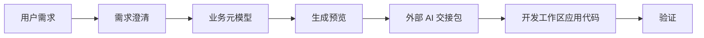

# Vibe Boot 代码生成设计草案

## 1. 文档目的

本文定义 Vibe Boot 的代码生成设计。代码生成是 Vibe Boot “超过低代码”的核心能力之一：它不把业务逻辑困在平台运行时配置里，而是生成可阅读、可测试、可审查、可打包的真实项目代码。

本文用于指导后续 `vibe-gen` 模块实现，在编码前必须先明确元模型、模板边界、生成策略、覆盖策略、权限策略和验证门禁。

## 2. 核心定位

| 项目 | 定位 |
| --- | --- |
| 生成目标 | Java 后端、Vue 前端、SQL 迁移、权限菜单、测试和文档 |
| 输入来源 | AI 澄清后的需求、业务元模型、数据库表、用户配置 |
| 输出形式 | 真实文件补丁、新文件、生成预览、外部 AI 交接包 |
| 核心约束 | 生成前可预览，生成后可验证，生成失败可解释 |
| 不做方向 | 不生成只能由平台运行时解释的黑盒配置 |

一句话：

> Vibe Boot 代码生成的产物必须能离开平台继续维护。

## 3. 生成范围

### 3.1 P0 范围

| 生成对象 | 内容 |
| --- | --- |
| 后端实体 | Entity、DTO、VO、Query |
| 后端接口 | Controller、Service、ServiceImpl、Mapper |
| 数据库 | 表结构迁移 SQL、初始菜单权限 SQL |
| 前端页面 | 列表、搜索、表单、新增、编辑、删除 |
| 前端 API | TypeScript API 文件 |
| 权限 | 菜单、按钮、接口权限标识 |
| 文档 | 模块说明、字段说明、变更摘要 |

### 3.2 P1 范围

| 生成对象 | 内容 |
| --- | --- |
| 测试 | Controller/API 测试、Service 单测 |
| 字典联动 | 字典字段自动关联 |
| 详情页 | 复杂详情、关联信息展示 |
| 简单状态流转 | 状态枚举、操作按钮、后端校验 |

### 3.3 P2 范围

| 生成对象 | 内容 |
| --- | --- |
| 审批流 | 流程定义、状态流转、审批页面 |
| 报表 | 查询模型、图表、仪表盘 |
| 第三方集成 | API 客户端、Webhook、同步任务 |
| 行业模板 | CRM、进销存、售后、项目管理等 |
| 通用导入导出 | Excel 导入导出、导入模板和错误回执 |

## 4. 不生成什么

| 不生成项 | 原因 |
| --- | --- |
| 绕过权限的接口 | 安全底线 |
| 不可解释的动态脚本 | 违背真实代码优先 |
| 未版本化的数据库变更 | 无法升级和回滚 |
| 未经确认的删除字段/删除表 SQL | 数据风险高 |
| 新技术栈样板 | 技术栈必须先修订文档 |
| 复杂跨模块业务逻辑 | 需要先形成业务设计 |
| 可直接在生产执行的补丁包 | 生产环境不承接开发型 AI 修改源码、SQL 或 shell 动作 |

## 5. 元模型设计

代码生成不应直接从一句话拼文件，而要先形成元模型。

### 5.1 实体元模型

| 字段 | 说明 |
| --- | --- |
| entityName | Java 实体名，例如 CustomerVisit |
| tableName | 数据库表名，例如 biz_customer_visit |
| moduleName | 所属模块 |
| displayName | 中文名称 |
| description | 业务说明 |
| fields | 字段列表 |
| relations | 关联关系 |
| permissions | 权限定义 |
| pages | 页面定义 |

### 5.2 字段元模型

| 字段 | 说明 |
| --- | --- |
| fieldName | Java/TS 字段名 |
| columnName | 数据库字段名 |
| displayName | 中文名称 |
| dataType | string/int/decimal/date/datetime/boolean/enum/ref |
| dbType | varchar/bigint/decimal/datetime 等 |
| required | 是否必填 |
| unique | 是否唯一 |
| searchable | 是否可搜索 |
| listVisible | 是否列表展示 |
| formVisible | 是否表单展示 |
| dictType | 字典类型 |
| defaultValue | 默认值 |
| validation | 校验规则 |

### 5.3 页面元模型

| 字段 | 说明 |
| --- | --- |
| listPage | 是否生成列表页 |
| createForm | 是否生成新增表单 |
| updateForm | 是否生成编辑表单 |
| detailPage | 是否生成详情页 |
| searchFields | 搜索字段 |
| tableColumns | 表格列 |
| rowActions | 行操作 |
| batchActions | 批量操作 |

### 5.4 权限元模型

| 权限 | 示例 |
| --- | --- |
| list | `biz:customerVisit:list` |
| query | `biz:customerVisit:query` |
| create | `biz:customerVisit:create` |
| update | `biz:customerVisit:update` |
| delete | `biz:customerVisit:delete` |
| export | `biz:customerVisit:export` |

## 6. 生成流程

| 阶段 | 说明 | 是否必须 |
| --- | --- | --- |
| 需求澄清 | AI 追问实体、字段、权限、页面、数据规则 | 是 |
| 元模型生成 | 形成结构化 JSON/YAML 元模型 | 是 |
| 用户确认 | 用户确认字段、页面、权限和风险 | 是 |
| 生成预览 | 展示将新增/修改的文件和 SQL | 是 |
| 风险检查 | 检查高风险 SQL、依赖、权限、覆盖 | 是 |
| 交接包生成 | 输出给外部 AI Coding 工具的任务范围、上下文、禁止项和验证命令 | 是 |
| 应用补丁 | 在开发工作区写入文件，或生成交给外部 AI Coding 工具/本地受控执行器的补丁 | 是 |
| 自动验证 | 编译、构建、测试或说明无法验证 | 是 |
| 输出摘要 | 中文说明变更、验证结果、下一步 | 是 |

## 6.1 外部 AI 交接包

代码生成模块必须向 AI 工作台提供生成交接包所需的结构化信息。交接包不是另一套生成逻辑，而是把元模型、预览结果、风险检查和验证门禁打包成外部 AI Coding 工具可执行的上下文。

| 内容 | 来源 | 说明 |
| --- | --- | --- |
| 业务元模型 | 第 5 节 | 实体、字段、页面、权限和关系 |
| 生成预览 | 第 6 节 | 预计新增/修改文件、SQL、菜单权限 |
| 风险结果 | 风险检查 | SQL、权限、依赖、覆盖、生产脚本影响 |
| AI 使用准入卡 | AI 工作台 | 编码许可、任务阶段、执行入口、上下文、风险、验证和生产边界结论 |
| 允许范围 | 模块设计与任务计划 | 外部 AI 只能修改的目录、模块和文件类型 |
| 禁止范围 | 产品约束与阶段边界 | 不得新增技术栈、不得越过 S1/S4/S5/S7 范围、不得生产执行 |
| 验证命令 | `docs/quality-gates.md` | Maven、npm、SQL、脚本等必须执行或说明原因 |
| 回填格式 | AI 工作台 | 完成后返回变更摘要、验证结果、风险和待确认问题 |

交接包生成规则：

| 规则 | 说明 |
| --- | --- |
| 必须来自已确认任务 | draft/planned 状态不能导出执行型交接包 |
| 必须包含禁止项 | 尤其是生产环境、技术栈、保留模块和高风险 SQL |
| 必须包含准入卡 | 缺少编码许可、任务阶段、执行入口、上下文、风险、验证或生产边界结论即失败 |
| 不替代人工确认 | L2/L3 风险仍需要用户确认 |
| 不自带执行权限 | 交接包不能被平台服务端直接执行为 shell、SQL 或补丁 |
| 缺少验证命令即失败 | 需要返回补充质量门禁，而不是默认通过 |

## 7. 模板设计

模板必须简单、可读、可版本化。首版使用 Velocity 2.4.1，已由 ADR-0001 确认。

| 模板 | 输出 |
| --- | --- |
| `entity.java.vm` | Entity |
| `dto.java.vm` | Create/Update DTO |
| `vo.java.vm` | VO |
| `query.java.vm` | Query |
| `mapper.java.vm` | Mapper |
| `service.java.vm` | Service |
| `serviceImpl.java.vm` | ServiceImpl |
| `controller.java.vm` | Controller |
| `api.ts.vm` | 前端 API |
| `index.vue.vm` | 列表页面 |
| `form.vue.vm` | 表单组件 |
| `migration.sql.vm` | 数据库迁移 |
| `menu.sql.vm` | 菜单权限 |
| `README.md.vm` | 模块说明 |

模板约束：

| 约束 | 说明 |
| --- | --- |
| 模板不包含业务黑魔法 | 生成代码应直观 |
| 模板版本化 | 生成任务记录模板版本 |
| 模板可预览 | 用户能看到生成结果 |
| 模板不直接写密钥 | 禁止输出敏感配置 |
| 模板与模块设计一致 | 包结构和目录必须符合 `module-design.md` |
| 后端模板与实现规范一致 | 分层、事务、权限、异常必须符合 `backend-implementation-spec.md` |
| 前端模板与管理端规格一致 | 列表、表单、权限按钮必须符合 `frontend-admin-spec.md` |

可维护性约束：

| 约束 | 说明 |
| --- | --- |
| 生成代码像人工代码 | 命名、分层、错误处理、权限和字典用法必须与人工规范一致 |
| 不生成 TODO 占位 | P0 生成结果不得留下“后续实现”“请自行补充”等未完成代码路径 |
| 不生成 Lombok 注解 | P0 不输出 `@Data`、`@Getter`、`@Setter`、`@Builder` 等 Lombok 注解，避免隐藏编译和 IDE 依赖 |
| 不生成魔法注释控制逻辑 | 生成指纹优先存在生成记录，不靠源码注释驱动运行行为 |
| 不静默覆盖并发修改 | 可编辑主表、Entity、UpdateDTO 和 VO 生成 version；更新匹配旧版本并原子加一，冲突返回 `DATA_0409` |
| 不生成通用幂等中间件 | P0 创建使用前端防重和唯一约束，状态流转使用预期状态条件更新 |
| 不生成隐藏运行时依赖 | 产物离开生成器后仍应可编译、可构建、可维护 |
| 不生成整文件大拼接脚本 | 生成逻辑必须能解释每个产物来源 |
| 模板变更可追踪 | 模板版本、元模型 hash、产物 hash 必须进入生成记录 |

## 8. 文件写入策略

文件写入只允许发生在开发工作区。P0 可由外部 AI Coding 工具根据交接包修改文件；P1 若实现本地受控执行器，也必须先完成签收、范围确认、预览、风险确认和验证命令确认。生产环境不得通过代码生成模块在线写源码、执行 shell 或直接改表结构。

| 场景 | 策略 |
| --- | --- |
| 新文件 | 在开发工作区生成到预期路径 |
| 已存在且由生成器管理 | 需要展示 diff，可确认覆盖 |
| 已存在且用户修改过 | 默认不覆盖，提示冲突 |
| 局部插入 | 使用明确锚点或 AST/结构化方式 |
| 删除文件 | P0 禁止自动删除 |

生成器必须记录生成指纹：

| 字段 | 说明 |
| --- | --- |
| generatedBy | 生成器名称 |
| templateVersion | 模板版本 |
| metaHash | 元模型摘要 |
| generatedAt | 生成时间 |

生成指纹可写入生成记录表，不一定写入源码注释，避免污染代码。

二次生成与人工接管策略：

| 场景 | 策略 |
| --- | --- |
| 元模型未变化 | 默认不写文件，可提示无变化 |
| 元模型变化且目标文件未人工修改 | 展示 diff，用户确认后可覆盖生成区 |
| 目标文件已人工修改 | 默认冲突，必须展示差异并由实施人员或开发者处理 |
| 用户选择接管文件 | 标记为 user_owned，后续生成只给建议补丁 |
| 模板版本升级 | 必须展示模板版本变化和影响文件 |
| 生成失败 | 保留原文件，不写半成品 |

P0 不要求实现复杂 AST merge，但必须避免静默覆盖人工代码。若无法安全合并，宁可生成外部 AI 交接包或冲突说明。

## 9. 数据库迁移策略

数据库变更必须版本化。

| 项目 | 约束 |
| --- | --- |
| 工具 | Flyway，已由 ADR-0001 确认 |
| 文件 | `V{version}__{description}.sql` |
| 高风险 SQL | 必须确认 |
| 删除字段 | P0 不自动执行，只生成建议 |
| 初始化菜单 | 单独 SQL 或迁移脚本 |
| 回滚 | P0 可提供手工回滚说明，P1 再自动化 |

SQL 生成规则：

| 规则 | 说明 |
| --- | --- |
| 字符集 | `utf8mb4` |
| 表注释 | 必须生成 |
| 字段注释 | 必须生成 |
| 索引 | 唯一字段和常用查询字段生成 |
| 逻辑删除 | 默认 `deleted` |
| 审计字段 | 默认生成 |

## 10. 权限与菜单生成

| 对象 | 说明 |
| --- | --- |
| 菜单 | 生成模块菜单和页面路由 |
| 按钮权限 | 新增、编辑、删除、导出 |
| 接口权限 | Controller 注解 |
| 前端权限 | 按钮显示控制 |

权限约束：

| 约束 | 说明 |
| --- | --- |
| 权限标识统一 | `模块:资源:动作` |
| 后端强校验 | 前端隐藏不是安全边界 |
| 菜单 SQL 可预览 | 不直接静默写入 |
| 公开接口需标记 | 不能默认公开 |

## 11. 生成后的验证

完整质量门禁和验证结果格式见 `docs/quality-gates.md`。代码生成模块不得自定义另一套通过/失败标准。

| 验证项 | P0/P1 | 说明 |
| --- | --- | --- |
| 后端编译 | P0 | 生成 Java 后必须编译 |
| 前端构建 | P0 | 生成 Vue 后必须构建 |
| SQL 语法检查 | P1 | 至少在开发库执行或 dry-run |
| 权限扫描 | P1 | 检查 Controller 权限注解 |
| 生成记录 | P0 | 记录任务、模板、文件 |
| 文档更新 | P0 | 更新模块说明 |
| 交接包完整性 | P0 | 检查任务阶段、允许范围、禁止范围、风险和验证命令是否齐全 |
| 可维护性扫描 | P0 | 检查 TODO 占位、硬编码 API、缺权限、未脱敏字段、不可解释脚本 |

验证失败时不得假装成功，必须返回：

| 内容 | 说明 |
| --- | --- |
| 失败命令 | 哪个命令失败 |
| 错误摘要 | 中文解释 |
| 影响范围 | 哪些文件可能需要修复 |
| 修复建议 | 下一步怎么做 |

## 12. 生成任务状态

| 状态 | 说明 |
| --- | --- |
| draft | 元模型草案 |
| planned | 已生成计划 |
| confirmed | 用户已确认 |
| generated | 已生成文件 |
| conflict | 发现人工修改或无法安全覆盖 |
| verified | 验证通过 |
| failed | 生成或验证失败 |
| reverted | 已回滚 |

## 13. 数据库表草案

| 表 | 说明 |
| --- | --- |
| `gen_entity` | 实体元模型 |
| `gen_field` | 字段元模型 |
| `gen_page` | 页面元模型 |
| `gen_permission` | 权限元模型 |
| `gen_task` | 生成任务 |
| `gen_artifact` | 生成产物 |
| `gen_template` | 模板定义 |
| `gen_template_version` | 模板版本 |

`gen_artifact` 至少应能表达产物所有权和二次生成状态：

| 字段 | 说明 |
| --- | --- |
| artifact_path | 文件路径 |
| artifact_type | java/vue/sql/menu/doc 等 |
| template_version | 模板版本 |
| meta_hash | 元模型摘要 |
| artifact_hash | 上次生成产物 hash |
| ownership | generated/user_owned/conflict |
| last_generated_at | 最近生成时间 |

## 14. 与 AI 工作台关系

| AI 工作台 | 代码生成 |
| --- | --- |
| 负责需求澄清 | 接收结构化元模型 |
| 负责风险提示 | 提供 SQL/权限/覆盖风险 |
| 负责用户确认 | 在确认后触发生成 |
| 负责外部 AI 交接 | 提供元模型、预览、风险和验证信息 |
| 负责展示结果 | 返回文件、diff、验证结果 |
| 负责历史记录 | 写入生成任务和产物记录 |

代码生成模块不直接决定产品方向，必须服从 AI 工作台、skills、产品约束和模块设计。

## 15. 已收敛决策项

| 决策 | 取舍口径 | 当前结论 |
| --- | --- | --- |
| 模板引擎 | Velocity 2.4.1 | 已由 ADR-0001 确认 |
| 迁移工具 | Flyway | 已由 ADR-0001 确认 |
| 文件覆盖策略 | 指纹 / Git diff / 人工确认 | P0 使用 diff + 人工确认 |
| 元模型格式 | JSON / YAML / 数据库表 | P0 数据库 + JSON 快照 |
| 前端页面模板 | 单文件页面 / 页面+表单组件 | 优先页面+表单组件 |

## 16. 编码准入

进入 `vibe-gen` 编码前必须满足：

| 条件 | 状态 |
| --- | --- |
| 元模型字段确认 | 已由本文第 5 节和 ADR-0002 确认 |
| 模板引擎确认 | 已由 ADR-0001 确认为 Velocity 2.4.1 |
| Flyway 是否使用确认 | 已由 ADR-0001 确认使用 |
| 权限标识规则确认 | 已由 ADR-0002 确认为 `模块:资源:动作` |
| 文件覆盖策略确认 | 已由 ADR-0002 确认为 diff + 人工确认 |
| P0 CRUD 模板范围确认 | 已由 ADR-0002 确认为单表 CRUD |
| 前端页面模式确认 | 已由 `docs/frontend-admin-spec.md` 确认 |
| 后端实现规范确认 | 已由 `docs/backend-implementation-spec.md` 确认 |
| 质量门禁确认 | 已由 `docs/quality-gates.md` 确认 |
| 外部 AI 交接包确认 | 已由 `docs/ai-workbench-design.md`、`docs/ai-tool-usage-guide.md` 与本文第 6.1 节确认 |

## 17. 一句话总结

Vibe Boot 的代码生成不是低代码运行时，而是把用户需求和 AI 澄清结果转化为真实 Java、Vue、SQL、测试和文档，并通过预览、确认、验证和记录保证可维护。
