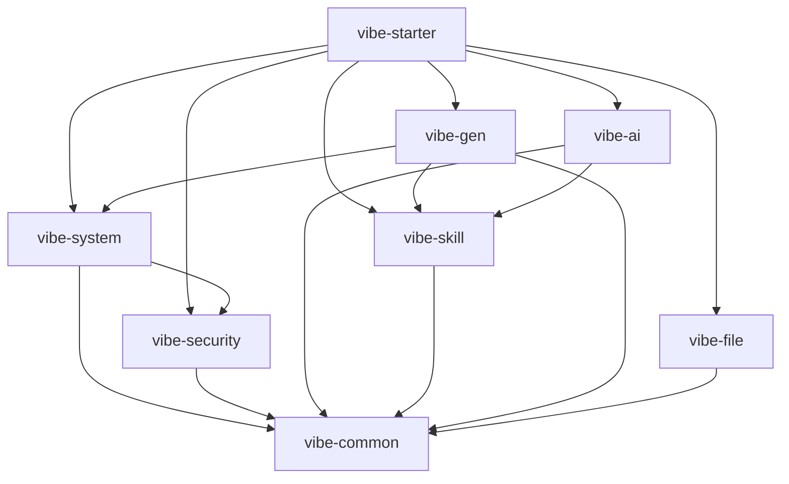

# Vibe Boot 模块设计草案

## 1. 文档目的

本文定义 Vibe Boot 首版模块化单体的模块边界、依赖关系、职责划分和实现约束。它用于指导后续编码前的工程结构设计，避免一开始把系统做成传统大泥球、过度微服务或复杂低代码运行时。

本文仍属于编码前文档，后续进入实现前必须先完成本设计的评审和收敛。

## 2. 设计原则

| 原则 | 说明 |
| --- | --- |
| 模块化单体 | 一个部署单元，内部模块边界清晰 |
| 技术栈克制 | 不为抽象而抽象，不为未来可能性引入复杂依赖 |
| 真实代码 | 所有业务能力最终落到 Java、Vue、SQL、测试和文档 |
| AI 友好 | 模块、包、命名、模板必须让 AI 容易理解和修改 |
| Windows 友好 | 构建、运行、日志、配置和脚本必须服务 Windows 首版 |
| 可测试 | 核心业务和生成链路必须有明确测试入口 |
| 可打包 | 模块结构必须支持开发模式和生产安装包双模式 |
| 可交接 | AI 工作台生成的计划必须能转成外部 AI Coding 工具可执行的交接包 |

## 3. 总体工程结构

首版建议采用 Maven 多模块后端 + 独立前端目录 + 脚本/runtime/docs 的组合。

```text
vibe-boot/
├── docs/                         # 产品、架构、约束、模块设计文档
├── backend/                      # 后端 Maven 多模块工程
│   ├── pom.xml                   # 后端父 POM
│   ├── vibe-starter/             # 启动模块
│   ├── vibe-common/              # 通用基础
│   ├── vibe-system/              # 系统管理
│   ├── vibe-security/            # 认证授权
│   ├── vibe-ai/                  # 模型网关与 AI 任务
│   ├── vibe-skill/               # skills 与规则
│   ├── vibe-gen/                 # 代码生成与元模型
│   └── vibe-file/                # 文件存储
├── frontend/                     # Vue 3 管理端
├── scripts/                      # Windows PowerShell 脚本
├── runtime/                      # 开发包预置 JDK/Maven/Node/Redis 等
├── data/                         # 本地数据目录，Git 忽略
├── logs/                         # 日志目录，Git 忽略
├── package/                      # 生产安装包输出目录，Git 忽略
├── .gitignore
└── README.md
```

目录约束：

| 目录 | 约束 |
| --- | --- |
| `docs/` | 编码前持续优先维护 |
| `backend/` | 只放 Java 后端源码和 Maven 配置 |
| `frontend/` | 只放 Vue 管理端源码 |
| `scripts/` | 只放开发、构建、安装、备份、恢复脚本 |
| `runtime/` | 预置运行时，不提交大型二进制，后续用下载脚本或发行包处理 |
| `data/` | 用户数据，不提交 Git |
| `logs/` | 运行日志，不提交 Git |
| `package/` | 安装包产物，不提交 Git |

## 4. 后端模块划分

| 模块 | 职责 | 是否 P0 |
| --- | --- | --- |
| `vibe-starter` | Spring Boot 启动入口、配置装配、静态资源托管 | 是 |
| `vibe-common` | 基础实体、统一响应、异常、工具、校验、分页 | 是 |
| `vibe-security` | 登录认证、Token、权限校验、数据权限基础 | 是 |
| `vibe-system` | 用户、角色、菜单、部门、字典、参数、日志 | 是 |
| `vibe-ai` | 模型供应商、模型网关、对话、任务、用量统计 | 是 |
| `vibe-skill` | skills、规则集、提示词模板、项目上下文 | 是 |
| `vibe-gen` | 元模型、代码生成、模板、SQL 迁移草案 | 是 |
| `vibe-file` | 本地文件上传、下载、预览、存储策略接口 | 是 |
| `vibe-workflow` | 审批流、状态流转 | P2 |
| `vibe-report` | 报表、统计图、查询面板 | P2 |
| `vibe-message` | 站内信、通知、WebSocket、企业微信/钉钉集成 | P2+ |
| `vibe-integration` | 第三方系统连接器、Webhook | P2 |

首版 P0 不应超过 8 个后端模块。`vibe-workflow`、`vibe-report`、`vibe-message`、`vibe-integration` 只能作为文档预留，不进入第一轮实现。

## 5. 后端依赖方向

依赖必须单向，禁止循环依赖。



依赖约束：

| 规则 | 说明 |
| --- | --- |
| 所有模块可依赖 `vibe-common` | 公共基础能力只向下，不依赖业务模块 |
| `vibe-starter` 负责装配 | 启动模块可以依赖业务模块，业务模块不能依赖启动模块 |
| `vibe-system` 可依赖 `vibe-security` | 系统用户、角色、菜单需要权限能力 |
| `vibe-ai` 可依赖 `vibe-skill` | AI 执行需要读取规则和上下文 |
| `vibe-gen` 可依赖 `vibe-system` 与 `vibe-skill` | 生成菜单权限、读取规则 |
| `vibe-file` 不依赖业务模块 | 文件能力作为基础服务 |
| 禁止跨模块直接访问 Mapper | 通过 Service 或应用服务接口交互 |

需要进一步评审的依赖：

| 依赖 | 风险 | 建议 |
| --- | --- | --- |
| `vibe-system -> vibe-security` | 容易互相引用 | 权限校验接口抽到 security，用户信息查询由 system 暴露服务 |
| `vibe-gen -> vibe-system` | 生成菜单权限需要系统模块 | 通过接口隔离，不直接操作系统内部表 |
| `vibe-ai -> vibe-gen` | AI 可能触发代码生成 | 首版避免直接依赖，可通过任务编排层或事件调用 |

## 6. 模块内部包结构

每个业务模块采用一致包结构，便于 AI 和开发者理解。

后端代码的分层、Controller、Service、Mapper、DTO/VO、事务、权限和异常规范见 `docs/backend-implementation-spec.md`。本文只定义模块和包边界。

```text
com.vibeboot.<module>/
├── controller/       # REST API
├── service/          # 服务接口
├── service/impl/     # 服务实现
├── mapper/           # MyBatis-Plus Mapper
├── entity/           # 数据库实体
├── dto/              # 入参对象
├── vo/               # 出参对象
├── query/            # 查询条件
├── convert/          # 对象转换
├── enums/            # 枚举
├── config/           # 模块配置
└── support/          # 模块内部支撑类
```

包结构约束：

| 约束 | 说明 |
| --- | --- |
| Controller 不直接调用 Mapper | 必须通过 Service |
| Controller 不写业务逻辑 | 只处理参数、鉴权、响应 |
| Entity 不直接暴露给前端 | 入参用 DTO，出参用 VO |
| Query 独立于 DTO | 查询条件与创建/更新入参分离 |
| Convert 独立 | 后续可用 MapStruct，也可先手写 |
| support 不跨模块使用 | 模块内部工具不能成为隐式公共 API |

## 7. 核心模块职责

### 7.1 `vibe-common`

| 内容 | 说明 |
| --- | --- |
| `Result<T>` | 统一响应 |
| `PageResult<T>` | 分页响应 |
| `BaseEntity` | 基础字段：id、createdAt、updatedAt、createdBy、updatedBy、deleted |
| `BusinessException` | 业务异常 |
| `ErrorCode` | 错误码 |
| `IdGenerator` | ID 生成接口 |
| `JsonUtils` | JSON 工具 |
| `ValidationGroups` | 创建、更新校验分组 |

约束：`vibe-common` 不允许依赖 Spring Web Controller、业务模块或数据库 Mapper。

### 7.2 `vibe-security`

| 内容 | 说明 |
| --- | --- |
| 登录认证 | 用户名密码登录，预留模型接入配置独立认证 |
| Token | 首版使用 Sa-Token 1.45.0，封装在 `vibe-security` |
| 权限注解 | 接口权限校验 |
| 当前用户 | 获取当前登录用户、角色、部门 |
| 数据权限 | 提供数据范围表达和拦截扩展点 |
| 密钥保护 | 敏感配置读取与脱敏展示 |

权限框架已由 ADR-0001 确认为 Sa-Token 1.45.0。业务模块不得直接散落 Sa-Token 调用，应通过 `vibe-security` 封装当前用户、权限校验和数据权限扩展。

### 7.3 `vibe-system`

| 子能力 | 说明 |
| --- | --- |
| 用户管理 | 用户 CRUD、状态、密码重置 |
| 角色管理 | 角色 CRUD、菜单权限 |
| 菜单管理 | 菜单、按钮、权限标识 |
| 部门管理 | 树形组织 |
| 字典管理 | 字典类型、字典项 |
| 参数配置 | 系统参数 |
| 操作日志 | 操作审计 |
| 登录日志 | 登录审计 |

约束：系统模块是基础盘，必须稳定克制，不混入 AI 业务和代码生成细节。

S2 基础后台的页面、接口、权限、初始数据和验收标准见 `docs/basic-admin-spec.md`。实现时应以该文档为施工规格。

### 7.4 `vibe-ai`

| 子能力 | 说明 |
| --- | --- |
| 模型供应商 | OpenAI 兼容接口、国内模型供应商适配 |
| 模型配置 | API Base、API Key、模型名、启用状态 |
| 模型网关 | 统一请求、响应、错误、重试、超时 |
| 对话记录 | 开发模式对话、任务上下文 |
| 用量统计 | token、调用次数、任务成本 |
| 脱敏处理 | 发送模型前处理敏感字段 |
| 外部 AI 交接 | 记录交接包、签收状态、风险级别和验证要求 |

约束：业务模块不得直接调用模型 SDK，必须通过 `vibe-ai`。生产模式即使配置模型，也只能启用业务 AI 能力，不得开启代码修改、补丁应用、shell 执行或在线数据库结构变更。

### 7.5 `vibe-skill`

| 子能力 | 说明 |
| --- | --- |
| Skill 注册 | 工程、业务、安全、测试、文档等 skill |
| 规则集 | 项目约束、禁止项、质量门禁 |
| 上下文索引 | 文档、代码、元模型、历史变更摘要 |
| 提示词模板 | 需求澄清、变更计划、代码生成、验证摘要 |
| 规则检查 | 生成前和生成后检查 |
| 规则快照 | 记录 skill/rule 版本、状态、优先级、checksum 和来源文档 |
| 冲突裁决 | 按固定优先级输出 block、ask_first、warn、verify 或 document |

约束：`vibe-skill` 不执行代码修改，只提供规则和上下文。P0 管理端只读展示 skill、规则、快照和裁决结果；规则编辑、启停、导入和在线发布属于 P1。生产模式不得提供会影响代码生成、源码修改或交接包执行的规则编辑入口。

### 7.6 `vibe-gen`

| 子能力 | 说明 |
| --- | --- |
| 实体元模型 | 表、字段、关联、枚举、校验 |
| 页面元模型 | 列表、表单、详情、搜索、操作 |
| 权限元模型 | 菜单、按钮、接口权限 |
| 代码模板 | Java、Vue、SQL、测试、文档模板 |
| 生成任务 | 生成、预览、应用、回滚 |
| 迁移脚本 | 生成版本化 SQL 或迁移草案 |
| 交接包素材 | 提供元模型、生成预览、风险检查和验证命令 |

约束：代码生成必须先预览和说明风险，不能默认直接覆盖用户改过的文件。`vibe-gen` 不能把交接包升级为服务端任意执行能力，生产环境不得直接执行生成补丁、SQL 或 shell。

### 7.7 `vibe-file`

| 子能力 | 说明 |
| --- | --- |
| 本地存储 | 首版默认 |
| 文件上传 | 类型、大小、路径限制 |
| 文件下载 | 鉴权、审计 |
| 文件预览 | P0 只支持 jpg/jpeg/png/webp 图片 |
| 存储接口 | 预留 MinIO/OSS 扩展 |

P0 只实现本地目录、单文件上传、鉴权下载、图片预览、元数据和两阶段删除。允许类型、20 MB 上限、10 GB 配额、2 GB 磁盘保留空间、路径布局、安全响应头、状态机和错误码以 ADR-0002 为准。

约束：首版不引入 MinIO/OSS，不提供静态目录映射、公开直链、业务附件绑定、Office/音视频/压缩包、分片上传、秒传或在线文档预览。存储策略只保留接口边界，不提前实现第二种驱动。

## 8. 前端模块设计

首版前端只做 PC 管理端，不做移动端、小程序、门户站。

```text
frontend/
├── package.json
├── vite.config.ts
├── src/
│   ├── api/                 # API 请求封装
│   ├── assets/              # 静态资源
│   ├── components/          # 通用组件
│   ├── layout/              # 后台布局
│   ├── router/              # 路由
│   ├── stores/              # 状态管理
│   ├── styles/              # 全局样式
│   ├── utils/               # 工具函数
│   └── views/
│       ├── login/           # 登录
│       ├── dashboard/       # 首页
│       ├── system/          # 系统管理
│       ├── ai/              # AI 工作台
│       ├── gen/             # 代码生成
│       ├── skill/           # skills 与规则
│       └── file/            # 文件管理
└── .npmrc
```

前端约束：

| 约束 | 说明 |
| --- | --- |
| UI 库固定 | Element Plus，已由 ADR-0001 确认 |
| API 分模块 | `src/api/<module>` 对应后端模块 |
| 页面分模块 | `src/views/<module>` 对应业务域 |
| 权限前后端一致 | 前端按钮权限与后端接口权限同源 |
| AI 工作台是核心页面 | 不是隐藏工具页 |
| 生产静态资源由后端承载 | 首版减少 Nginx 依赖 |

前端管理端的布局、路由、权限按钮、页面模式和生成规范见 `docs/frontend-admin-spec.md`。实现和代码生成都必须遵守该文档。

## 9. 配置文件设计

后端配置按模式拆分。

```text
backend/vibe-starter/src/main/resources/
├── application.yml
├── application-dev.yml
├── application-prod.yml
└── application-local.yml.example
```

| 文件 | 是否提交 | 用途 |
| --- | --- | --- |
| `application.yml` | 是 | 通用配置 |
| `application-dev.yml` | 是 | 开发模式默认配置 |
| `application-prod.yml` | 是 | 生产模式模板 |
| `application-local.yml` | 否 | 本地密钥、数据库密码、模型 API Key |
| `.env` | 否 | 脚本或前端本地环境变量 |

配置约束：

| 约束 | 说明 |
| --- | --- |
| 密钥不入库 | API Key、数据库/Redis/TLS 私钥密码不提交；P0 不使用 JWT Token Secret |
| 生产配置外置 | 安装包生成后允许用户修改外部配置 |
| 默认中文错误 | 配置缺失时输出中文提示 |
| 模型配置独立 | 不散落在业务模块配置中 |

## 10. 数据库设计约束

首版数据库只支持 MySQL 8。

| 约束 | 说明 |
| --- | --- |
| 表名统一前缀 | 系统表 `sys_`，AI 表 `ai_`，生成表 `gen_`，文件表 `file_` |
| 字段命名统一 | 使用 snake_case |
| 主键统一 | 默认 `bigint` 或雪花 ID，编码前定稿 |
| 审计字段统一 | `created_at`、`updated_at`、`created_by`、`updated_by` |
| 逻辑删除统一 | `deleted` |
| 字符集统一 | `utf8mb4` |
| 迁移脚本版本化 | 不允许散落 SQL |

建议首版表域：

| 表域 | 示例 |
| --- | --- |
| 系统 | `sys_user`、`sys_role`、`sys_menu`、`sys_dept`、`sys_dict_type`、`sys_dict_item` |
| 日志 | `sys_login_log`、`sys_oper_log` |
| AI | `ai_provider`、`ai_model_config`、`ai_conversation`、`ai_task`、`ai_usage_log` |
| Skill | `skill_definition`、`skill_rule`、`skill_context` |
| 生成 | `gen_entity`、`gen_field`、`gen_task`、`gen_artifact` |
| 文件 | `file_object`、`file_group` |

## 11. 测试模块约束

测试不是后补项，尤其是 AI 生成代码后必须能验证。

完整质量门禁、验证命令、失败处理和阶段验收见 `docs/quality-gates.md`。本节只保留模块设计层面的测试类型和最小命令。

| 测试类型 | 首版要求 |
| --- | --- |
| 单元测试 | 核心工具、规则检查、代码生成逻辑 |
| 集成测试 | 登录、权限、CRUD 生成链路 |
| API 测试 | 关键 Controller 使用 MockMvc 或等价方式 |
| 数据库测试 | 可使用 H2 或 Testcontainers，编码前决策 |
| 前端测试 | P0 可先不强制，但关键工具函数应可测 |
| E2E 测试 | P1 引入，用于开发包启动和核心流程 |

质量门禁最小集：

| 阶段 | 命令目标 |
| --- | --- |
| 后端 | `mvn test` 或至少 `mvn -DskipTests package` |
| 前端 | `npm run build` |
| 生成后 | 生成模块能编译，接口和页面路径存在 |
| 发布前 | 后端 jar 和前端静态资源能组成安装包 |
| 外部交接 | 交接包字段完整，且包含禁止项和验证命令 |

## 12. 脚本与安装包模块

脚本属于产品体验，不是辅助杂项。

| 脚本 | P0/P1 | 说明 |
| --- | --- | --- |
| `dev-start.ps1` | P0 | 启动开发环境 |
| `dev-stop.ps1` | P0 | 停止开发环境 |
| `doctor.ps1` | P0 | 检查 JDK、Maven、Node、MySQL、Redis、端口、镜像 |
| `build-prod.ps1` | P1 | 构建生产安装包 |
| `install.ps1` | P1 | 安装生产系统 |
| `uninstall.ps1` | P1 | 卸载生产系统 |
| `backup.ps1` | P1 | 备份数据库、文件、配置 |
| `restore.ps1` | P1 | 恢复备份 |

脚本约束：

| 约束 | 说明 |
| --- | --- |
| 输出中文 | 面向中国中小企业用户 |
| 失败可诊断 | 错误提示必须包含原因和建议 |
| 幂等优先 | 重复执行时检测状态 |
| 不破坏数据 | 删除、覆盖、清理前必须确认 |
| 日志落盘 | 构建和安装日志写入 `logs/scripts/` |

## 13. 首版不实现模块

| 模块/能力 | 不做原因 |
| --- | --- |
| 微服务网关 | 单体优先 |
| 多租户 SaaS | 复杂度高，先预留 |
| 工作流引擎 | P2，再基于真实需求选择 |
| 大屏设计器 | 容易走向低代码平台 |
| 插件市场 | 核心闭环未稳定前不做 |
| 移动端/小程序 | 首版只做 PC 管理端 |
| 多数据库适配 | 首版只支持 MySQL |
| Kubernetes 部署 | 非首版目标用户需求 |

## 14. 已收敛决策项

| 决策 | 取舍口径 | 当前结论 |
| --- | --- | --- |
| UI 组件库 | Element Plus | 已由 ADR-0001 确认 |
| 权限框架 | Sa-Token 1.45.0 | 已由 ADR-0001 确认 |
| ID 策略 | 雪花 ID | 已由 ADR-0001 确认 |
| 迁移工具 | Flyway | 已由 ADR-0001 确认 |
| Redis Windows | 开发可选内置，生产外部连接 | 已由 ADR-0001 确认 |
| Windows 服务 | WinSW | 已由 ADR-0001 确认 |
| 测试数据库 | P0 本地 MySQL，P1 Testcontainers | 已由 ADR-0001 确认 |

## 15. 编码准入

本模块设计满足以下条件后，才建议开始搭建工程骨架：

| 条件 | 状态 |
| --- | --- |
| P0 后端模块列表确认 | 已在本文第 4 节确认 |
| 前端 UI 组件库确认 | 已由 ADR-0001 确认为 Element Plus |
| 权限框架确认 | 已由 ADR-0001 确认为 Sa-Token 1.45.0 |
| 数据库迁移方案确认 | 已由 ADR-0001 确认为 Flyway |
| Windows 脚本范围确认 | 已在本文第 12 节和 `windows-devkit-design.md` 确认 |
| 开发包目录结构确认 | 已在 `windows-devkit-design.md` 确认 |
| 生产安装包策略确认 | 已在 `release-package-design.md` 确认 |
| AI 交接包边界确认 | 已在 `ai-workbench-design.md`、`code-generation-design.md`、`ai-tool-usage-guide.md` 确认 |

## 16. 一句话总结

Vibe Boot 的模块设计必须服务一个目标：用最少模块支撑 AI coding、企业后台基础能力、Windows 开发包和生产安装包闭环。任何不能增强这个闭环的模块，都不应进入首版。
