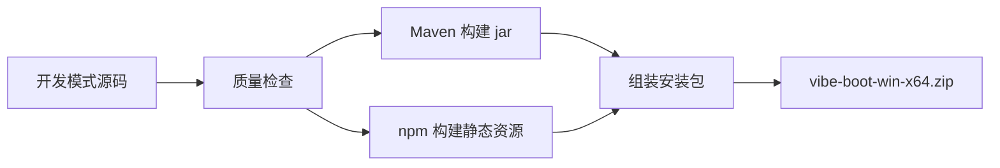
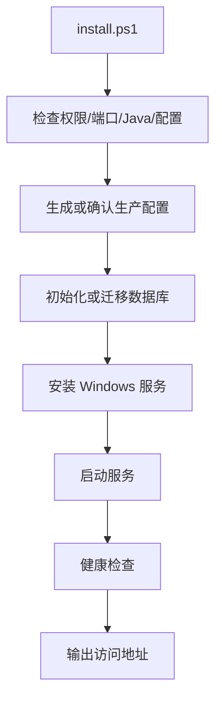

# Vibe Boot 生产安装包设计草案

## 1. 文档目的

本文定义 Vibe Boot 生产安装包的构建、目录结构、安装、运行、卸载、备份、恢复、升级和回滚约束。

生产安装包面向中小企业部署场景，目标是让用户完成开发后，可以生成一个可复制到 Windows 服务器、可自动安装、可稳定运行、可备份恢复的业务系统。

## 2. 核心目标

| 目标 | 说明 |
| --- | --- |
| 构建产物运行 | 生产运行 jar 和前端静态资源，不运行源码开发环境 |
| Windows 一键安装 | 执行 `install.ps1` 完成配置检查、服务安装、启动 |
| 可备份恢复 | 数据库、文件、配置可通过脚本备份和恢复 |
| 可升级回滚 | 升级前创建回滚点，失败时可恢复 |
| 可诊断 | 安装和运行失败时有中文日志 |
| 最小依赖 | 不强制 Docker、Nginx、Kubernetes |

一句话：

> 生产安装包是 Vibe Boot 从“AI 生成代码”走向“真实企业系统交付”的最后一公里。

## 3. 生产包与开发包区别

| 项目 | 开发包 | 生产安装包 |
| --- | --- | --- |
| 用途 | AI coding、源码修改、调试预览 | 稳定运行业务系统 |
| 是否包含源码 | 是 | 默认否 |
| 是否包含 Maven/Node | 是 | 否 |
| runtime 版本记录 | `runtime/RUNTIME-MANIFEST.json` 记录 JDK/Maven/Node/npm/Redis 完整版本、来源、许可证、SHA256 | 记录 JDK runtime 完整版本、来源、许可证、SHA256 |
| 开发型 AI 改代码 | 允许，必须受文档和质量门禁约束 | 禁止 |
| 业务 AI 能力 | 可用于开发辅助和业务验证 | 可选开启，只能做问答、摘要、文案、分析 |
| 前端 | Vite dev server | 静态资源 |
| 后端 | 开发 profile | 生产 profile |
| 日志 | 开发调试 | 生产滚动日志 |
| 配置 | local 配置 | 外置生产配置 |

## 4. 生产包目录结构

```text
vibe-boot-release/
├── app/
│   ├── vibe-boot.jar
│   ├── public/                     # 前端静态资源
│   └── VERSION
├── config/
│   ├── application-prod.yml
│   ├── model-prod.yml
│   └── install.yml
├── runtime/
│   └── jdk17/                      # 生产运行 JRE/JDK
├── notices/
│   ├── THIRD-PARTY-NOTICES.txt     # 第三方依赖和 runtime 许可证摘要
│   └── DEPENDENCY-MANIFEST.json    # Maven/npm/runtime 依赖清单
├── scripts/
│   ├── install.ps1
│   ├── uninstall.ps1
│   ├── start.ps1
│   ├── stop.ps1
│   ├── status.ps1
│   ├── backup.ps1
│   ├── restore.ps1
│   ├── upgrade.ps1
│   └── common.ps1
├── db/
│   ├── migration/                  # 版本化 SQL
│   └── init/                       # 初始化脚本
├── data/
│   └── files/
├── logs/
│   ├── app/
│   ├── install/
│   └── backup/
├── backup/
└── README.md
```

约束：

| 路径 | 说明 |
| --- | --- |
| `app/` | 程序产物，不放源码 |
| `config/` | 外置配置，可由用户修改 |
| `runtime/` | 生产运行 Java |
| `notices/` | 第三方依赖、runtime、工具许可证和来源清单 |
| `scripts/` | 生产运维脚本 |
| `db/` | 数据库初始化和迁移脚本 |
| `data/` | 运行数据 |
| `logs/` | 日志 |
| `backup/` | 备份归档 |

## 5. 构建流程



构建步骤：

| 步骤 | 输入 | 输出 |
| --- | --- | --- |
| 版本检查 | Git 状态、版本号 | 构建元信息 |
| 后端构建 | `backend/` | `vibe-boot.jar` |
| 前端构建 | `frontend/` | `public/` |
| 数据库脚本收集 | migration SQL | `db/migration/` |
| 配置模板生成 | prod yml | `config/` |
| 许可证清单生成 | Maven/npm/runtime 依赖 | `notices/` |
| runtime 复制 | JDK 17 | `runtime/jdk17/` |
| 脚本复制 | install/start/backup | `scripts/` |
| 压缩打包 | 目录 | zip |

构建约束：

| 约束 | 说明 |
| --- | --- |
| 构建前检查 Git 状态 | 有未提交变更时提示用户 |
| 构建失败停止 | 不生成半成品包 |
| 包含版本信息 | 版本号、构建时间、提交哈希 |
| 不包含密钥 | API Key、数据库密码不进入安装包默认配置 |
| 不包含 node_modules | 生产不需要 |
| 不包含 Maven 仓库 | 生产不需要 |
| 包含 NOTICE | 第三方依赖、runtime 和工具来源必须可追踪 |
| 高风险许可证阻断 | 来源不明、禁止分发或许可证风险未确认时停止打包 |

### 5.1 唯一发布通道

生产环境只能接收 `build-prod.ps1` 生成的受控安装包，不能把开发工作区直接搬到服务器。

| 通道 | 是否允许 | 说明 |
| --- | --- | --- |
| `build-prod.ps1` 生成 zip 后安装 | 允许 | 正式生产发布入口 |
| `upgrade.ps1` 基于新安装包升级 | 允许 | 升级前必须备份 |
| Flyway 迁移随安装/升级执行 | 允许 | 结构变化必须版本化、可追踪 |
| 复制 `backend/`、`frontend/` 到生产运行 | 禁止 | 会把源码、开发配置和构建工具带入生产 |
| 在生产服务器执行外部 AI 交接包 | 禁止 | 交接包不是生产补丁、SQL 或 shell 输入 |
| 手工执行零散 SQL 改结构 | 禁止 | 破坏迁移记录、备份恢复和升级可追踪性 |
| 复制开发库覆盖生产库 | 禁止 | 数据风险不可控 |

## 6. 安装流程



安装步骤：

| 步骤 | 说明 |
| --- | --- |
| 权限检查 | 若安装服务需要管理员权限，明确提示 |
| 端口检查 | 检查业务端口和回环 Actuator 管理端口 |
| 配置检查 | 检查数据库、Redis、文件目录、模型配置 |
| 数据库检查 | 检查连接和版本 |
| 数据库迁移 | 执行未执行的迁移脚本 |
| 服务安装 | 安装为 Windows 服务或后台进程 |
| 启动服务 | 启动应用 |
| 健康检查 | 调用 health 接口 |
| 输出结果 | 打印访问地址、日志路径、管理账号提示 |

### 6.1 安装前预检清单

`install.ps1` 必须先完成预检，再执行迁移和服务安装。预检失败时不得留下半安装状态。

| 检查项 | 失败处理 |
| --- | --- |
| 管理员权限 | 如需安装 Windows 服务，提示以管理员运行；演示后台进程需明确限制 |
| 生产包完整性 | 检查 `app/VERSION`、jar、public、runtime、scripts、db、config 模板 |
| 端口占用 | 输出占用进程，不自动杀进程 |
| 数据库连接 | 连接失败则停止安装，提示配置项和日志路径 |
| Redis 连接 | 生产必需，连接失败则停止；内存降级只允许开发模式 |
| 迁移状态 | 显示目标版本和待执行迁移数量 |
| 磁盘空间 | 不足时停止安装或备份 |
| 敏感配置 | 检查默认密码、数据库/Redis/TLS 私钥密码和明文输出风险 |
| 网络访问 | local 模式必须绑定 127.0.0.1；lan 模式必须启用 HTTPS、提供可读取的 PKCS12 和明确 allowedOrigin |
| 文件目录 | 检查 storage root 位于 data 目录、可写、无 junction/reparse point、ACL 仅服务账号和管理员可写，并满足配额及 2 GB 保留空间 |
| 生产 AI 白名单 | 确认未启用代码生成、补丁、shell、在线 SQL 和交接包执行入口 |
| 第三方 NOTICE | 检查 `notices/THIRD-PARTY-NOTICES.txt` 和 `notices/DEPENDENCY-MANIFEST.json` 存在 |

预检结果必须写入 `logs/install/precheck-YYYYMMDD-HHmmss.log`，并在控制台输出中文摘要。

安装或升级迁移失败时不得继续安装服务或把服务标记为可用。若失败发生在升级中，脚本必须停止服务、保留失败日志和回滚点，不得自动反复重启应用重试同一迁移。

## 7. Windows 服务策略

候选方案：

| 方案 | 优点 | 风险 |
| --- | --- | --- |
| WinSW | 成熟、XML 配置、Windows 服务友好 | 需要打包 exe |
| NSSM | 简单、常见 | 维护状态需评估 |
| PowerShell 后台进程 | 简单无额外二进制 | 稳定性和开机自启弱 |

首版决策已由 ADR-0001 确认为 WinSW：

| 场景 | 策略 |
| --- | --- |
| 正式生产 | 使用 WinSW |
| 演示环境 | 可用 `start.ps1` 后台启动 |

服务约束：

| 约束 | 说明 |
| --- | --- |
| 服务名固定可配置 | 默认 `VibeBoot` |
| 默认安装目录 | `C:\VibeBoot`，可通过 `install.yml` 覆盖 |
| 默认数据库名 | `vibe_boot` |
| 建议数据库用户 | `vibe_boot`，生产密码安装时输入或外置生成 |
| 默认端口 | 业务 8080、Actuator 管理 8081、MySQL 3306、Redis 6379 |
| 日志路径固定 | `logs/app/` |
| 重启策略明确 | 服务异常退出可重启 |
| 卸载不删数据 | `uninstall.ps1` 默认保留 data/backup |

## 8. 配置策略

| 配置 | 说明 |
| --- | --- |
| `application-prod.yml` | 后端生产配置 |
| `model-prod.yml` | 模型配置，生产默认可为空 |
| `install.yml` | 安装路径、服务名、访问模式、绑定地址、业务/管理端口、TLS、数据库和 Redis 连接 |

生产包中的配置文件是部署产物，不是源码仓库内容。源码仓库只允许提交模板或 example；生产包生成时如果需要写入数据库密码、Redis 密码、TLS 私钥密码、模型 API Key，必须由安装脚本或部署人员在目标环境生成，并在日志和备份摘要中脱敏。P0 使用 Redis 不透明会话，不生成 JWT Token Secret。

`model-prod.yml` 只用于生产业务 AI，例如问答、摘要、分类、文案和分析。它不得开启代码编辑、源码读取、补丁应用、shell 执行或数据库结构在线修改能力。

生产包必须把业务 AI 能力做成白名单，不允许存在“启用 AI 后自动开放开发工具”的隐式行为。

| 能力 | 生产包处理 |
| --- | --- |
| 模型连接测试 | 允许，用于确认供应商配置 |
| 业务问答/摘要/分类/文案/分析 | 可选开启，必须经过模型网关、权限和脱敏 |
| 外部 AI 交接包生成 | 不提供执行入口；如保留历史记录，只能只读查看 |
| 代码生成补丁、源码读取、文件写入 | 不打包，不暴露入口 |
| shell/PowerShell 执行 | 不由模型触发，生产脚本只由管理员显式执行 |
| 在线数据库结构修改 | 不提供入口，只接受受控升级包和迁移流程 |

敏感配置：

| 类型 | 策略 |
| --- | --- |
| 数据库密码 | 安装时输入或手工编辑，日志脱敏 |
| Redis 密码 | 同上 |
| 模型 API Key | 默认不启用代码编辑能力 |
| TLS 私钥密码 | 仅 lan 模式需要，由部署人员外置提供，日志和 manifest 完全隐藏 |

约束：

| 约束 | 说明 |
| --- | --- |
| 配置外置 | 不打入 jar |
| 配置可备份 | backup 包含 config，但整个备份按敏感运维资产处理 |
| 配置不打印明文 | 日志脱敏 |

生产访问模式：

| 模式 | 绑定与协议 | 安装要求 |
| --- | --- | --- |
| `local` | 业务端口绑定 `127.0.0.1:8080`，允许 HTTP | 默认模式，只允许同一台 Windows 主机浏览器访问 |
| `lan` | 业务端口绑定显式的非回环具体地址并启用 HTTPS | 必须提供 PKCS12、私钥密码、证书对应主机名和精确 `allowedOrigin`；任一缺失都阻断安装，不允许 `0.0.0.0` 或 `::` 通配绑定 |

P0 不自动生成或静默信任自签名生产证书，不捆绑 Nginx/IIS 反向代理，也不支持 LAN 明文 HTTP。企业可以使用内部 CA 或合法证书生成 PKCS12。业务前端和 API 由同一 Spring Boot 来源提供；如未来引入受信反向代理，必须先补充代理 IP、转发头和 TLS 终止 ADR。

lan 模式证书预检必须确认 PKCS12 可读取、密码正确、包含私钥、当前未过期、允许服务器认证，且 SAN 覆盖配置的访问主机名；`allowedOrigin` 必须是无 path/query/fragment 的精确 `https://host:port`。安装器不能把证书或私钥密码复制进日志、manifest、默认包或 AI 上下文。

Windows 防火墙默认不自动放行。只有 `install.yml` 显式设置 `openFirewall=true` 且管理员确认时，安装器才创建产品自有、名称稳定的入站规则，只开放配置的 HTTPS 业务端口和适用网络配置文件；不得开放 8081、MySQL 或 Redis。卸载只删除自己创建且标识匹配的规则，不能修改其他现有规则。

Actuator 独立监听 `127.0.0.1:8081` 的 HTTP 管理端口，只开放 health；业务端口不暴露 `/actuator/**`。管理端口不可通过防火墙、端口转发或代理公开。

## 9. 数据库初始化与迁移

首版使用 Flyway，已由 ADR-0001 确认。

| 场景 | 处理 |
| --- | --- |
| 空数据库 | 执行全部初始化和迁移 |
| 已安装旧版本 | 执行未执行迁移 |
| 迁移失败 | 停止安装/升级，提示恢复 |
| 高风险迁移 | 安装前明确提示并建议备份 |

迁移约束：

| 约束 | 说明 |
| --- | --- |
| 不静默删数据 | DROP/DELETE 需确认 |
| 每次升级前备份 | upgrade 默认创建备份 |
| 记录数据库版本 | 可查询当前 schema 版本 |

Flyway 迁移一旦开始，不能假设 MySQL DDL 可事务回退。升级失败后禁止仅替换回旧 jar 或前端资源；必须停止服务，并使用升级前同一个回滚点恢复程序、数据库、文件和配置。

## 10. 备份策略

`backup.ps1` 应备份：

| 内容 | 说明 |
| --- | --- |
| MySQL 数据 | 使用 `mysqldump` 或用户配置路径 |
| 上传文件 | `data/files/` |
| 生产配置 | `config/` |
| 版本信息 | `app/VERSION` |
| 清单 | `manifest.json`，记录类型、完整产品版本、数据库迁移版本、相对路径、大小和 SHA256 |

备份分为两类：

| 类型 | 附加内容 | 恢复边界 |
| --- | --- | --- |
| 日常备份 | 无 | 只用于与备份完整产品版本一致的程序 |
| 升级回滚点 | 升级前 `app/` 程序产物 | 升级失败时整套恢复旧程序、数据库、文件和配置 |

备份目录：

```text
backup/
└── vibe-boot-backup-YYYYMMDD-HHmmss/
    ├── database.sql
    ├── files.zip
    ├── config.zip
    ├── app.zip              # 仅升级回滚点包含
    └── manifest.json
```

备份约束：

| 约束 | 说明 |
| --- | --- |
| 停止服务后备份 | 防止数据库导出、上传文件和配置处于不一致时间点 |
| 恢复原服务状态 | 独立日常备份校验结束后恢复调用前状态；由升级或恢复流程调用时保持停服 |
| 备份前检查空间 | 空间不足时在修改现状前停止 |
| 敏感资产处理 | 包含数据库导出或 `config` 的备份不得进入 Git、AI 上下文、日志附件、默认生产包或公开共享目录 |
| Windows ACL | 默认保存在安装目录 `backup/` 并继承受限 ACL；P0 不承诺备份加密，外拷前由管理员负责加密和访问控制 |
| 备份结果校验 | 检查文件存在、大小和 SHA256；校验失败不得标记成功 |
| manifest 脱敏 | 不记录密码、Token、API Key、配置值或业务数据摘要 |
| 不自动清理 | P0 不自动删除历史备份 |
| 中文输出 | 明确备份路径 |

## 11. 恢复策略

`restore.ps1` 必须谨慎。

| 步骤 | 说明 |
| --- | --- |
| 选择备份 | 指定备份目录 |
| 校验 manifest | 检查版本和完整性 |
| 兼容性检查 | 日常恢复要求完整产品版本一致；跨版本默认阻断 |
| 二次确认 | 恢复会覆盖当前数据 |
| 停止服务 | 保护性备份和恢复期间保持停止 |
| 保护当前状态 | 覆盖前创建当前状态备份，失败则终止恢复 |
| 恢复数据库 | 导入 SQL |
| 恢复文件 | 覆盖 data/files |
| 恢复配置 | 可选恢复 config |
| 启动服务 | 恢复后启动 |
| 健康检查 | 检查应用 |

约束：

| 约束 | 说明 |
| --- | --- |
| 日常恢复不自动覆盖配置 | 只有显式选择并二次确认后才覆盖 `config/` |
| 升级回滚恢复旧配置 | 使用升级回滚点时，旧程序、数据库、文件和旧配置必须作为同一集合恢复 |
| 配置日志脱敏 | 只记录文件名和结果，不得输出配置值 |
| 版本不兼容阻断 | P0 不是只提示；完整产品版本不一致时必须停止 |
| 失败保持停止 | 任一步失败都不得自动恢复业务流量，必须保留日志并提示人工处理 |

## 12. 升级与回滚

升级流程：

| 步骤 | 说明 |
| --- | --- |
| 读取当前版本 | `app/VERSION` |
| 读取目标版本 | 新安装包 VERSION |
| 停止服务 | 停止当前版本 |
| 创建回滚点 | 停止服务后备份旧程序、数据库、文件和配置 |
| 替换 app | jar 和 public |
| 执行迁移 | 数据库升级 |
| 启动服务 | 新版本启动 |
| 健康检查 | 失败则停止服务并进入待回滚状态 |

回滚策略：

| 内容 | P0/P1 |
| --- | --- |
| 无数据库迁移时的程序文件回滚 | P0，可单独恢复旧 jar 和前端资源 |
| 已开始数据库迁移后的整套回滚 | P0，旧程序、数据库、文件和配置必须来自同一次升级回滚点 |
| 数据库自动回滚 | P1，P0 提供备份恢复 |
| 日常数据恢复 | P0，只支持同一完整产品版本 |

P0 回滚必须使用同一次升级生成的回滚点。若目标包不包含待执行 Flyway 迁移，可以回滚程序和前端产物；只要迁移已经开始，就必须整套恢复旧程序、数据库、文件和配置，禁止程序单独回滚。脚本不得在未确认恢复成功前删除回滚点。

## 13. 健康检查

生产健康检查遵守 ADR-0002 的三层模型：

| 入口 | 发布用途 | 成功标准 |
| --- | --- | --- |
| `/actuator/health/liveness` | 判断服务进程是否存活 | HTTP 200 且 `status=UP` |
| `/actuator/health/readiness` | install/start/upgrade/restore/status 判断是否可接流量 | HTTP 200 且 `status=UP` |
| `/api/system/health` | 登录后的管理页面查看脱敏明细 | 有 `system:health:info` 权限，返回稳定三态和检查项 |

脚本固定请求 `http://127.0.0.1:8081`，不得通过业务端口、公网或反向代理暴露 Actuator。readiness 在生产模式必须检查 MySQL、Redis、文件目录可写和 Flyway schema 兼容；模型供应商连通性不属于 readiness，避免外部模型故障阻断基础业务系统启动。

系统健康接口中的 version 必须来自 Maven build info，并与生产包 `app/VERSION` 完全一致。`build-prod.ps1` 在打包时读取 jar 内 `META-INF/build-info.properties` 并校验两者，不一致即停止打包。Actuator 摘要不增加 version；`status.ps1` 只显示已安装的 `app/VERSION`，不得伪称已从运行进程验证版本。

`start.ps1`、`install.ps1`、`upgrade.ps1` 和 `restore.ps1` 默认等待 readiness 60 秒。超时或非 `UP` 时不得输出成功；升级或恢复场景还必须保持服务停止并进入既定回滚处理。`status.ps1` 必须使用 ADR-0002 固定的 `0/10/11/12/20/21/30/31` 退出码。

任何健康响应都不得暴露密钥、数据库密码、连接串、主机名、数据库名、用户名、Redis Key、服务器绝对路径、配置值、异常堆栈或供应商原始错误。

## 14. 安装包验收标准

| 验收项 | 标准 |
| --- | --- |
| 构建成功 | 生成 zip |
| 不含源码 | 默认不包含 backend/frontend 源码 |
| 不含构建工具 | 默认不包含 Maven、Node、node_modules 和 Maven 仓库 |
| 不含密钥 | 无 local 配置和 API Key |
| 初始管理员安全 | 生产初始密码安装时输入、一次性生成或外置提供；不得公开固定，首次登录必须强制改密 |
| 认证安全 | PBKDF2 参数、登录限流、HttpOnly Cookie、CSRF、会话撤销和无 Web Storage Token 可验证 |
| 网络安全 | local 仅回环；lan 只允许 HTTPS；Actuator 独立监听 127.0.0.1:8081 |
| 许可证清单 | 包含第三方依赖、runtime 和工具的 NOTICE 与依赖 manifest |
| 预检可执行 | install 先输出权限、端口、数据库、Redis、迁移、磁盘和生产 AI 白名单检查 |
| 可安装 | install 执行完成 |
| 可启动 | 服务启动并健康检查通过 |
| 可停止 | stop 或服务停止正常 |
| 可卸载 | uninstall 默认保留数据 |
| 可备份 | backup 生成归档 |
| 可恢复 | restore 可恢复测试备份 |

## 15. 已收敛决策项

| 决策 | 取舍口径 | 当前结论 |
| --- | --- | --- |
| Windows 服务工具 | WinSW | 已由 ADR-0001 确认 |
| 数据库迁移 | Flyway | 已由 ADR-0001 确认 |
| 是否内置 MySQL | 否 | 已由 ADR-0001 确认为生产默认外部 MySQL |
| 是否内置 Redis | 否 | 已由 ADR-0001 确认为生产默认外部 Redis |
| 前端承载方式 | 后端静态资源 / Nginx | 首版后端承载 |
| 生产访问模式 | local / lan | 默认 local；lan 强制 Spring Boot 原生 HTTPS，P0 不捆绑反向代理 |
| 备份工具 | mysqldump 路径配置 / 内置 | 用户配置 MySQL bin 路径 |
| 第三方许可证清单 | 不生成 / 随包生成 | 随开发包和生产包生成 NOTICE 与依赖 manifest |

## 16. 编码准入

进入生产安装包实现前必须确认：

| 条件 | 状态 |
| --- | --- |
| Windows 服务方案确认 | 已由 ADR-0001 确认为 WinSW |
| 迁移工具确认 | 已由 ADR-0001 确认为 Flyway |
| 生产配置字段确认 | 已由 ADR-0002 确认 |
| 备份恢复范围确认 | 已由 ADR-0002 确认 |
| 健康检查接口确认 | 已由 ADR-0002 确认为 Actuator liveness/readiness、受权限保护的系统健康接口和固定脚本退出码 |
| 认证与生产网络确认 | 已由安全治理、ADR-0002 和本文确认 |
| 升级回滚策略确认 | 已由 ADR-0002 确认 |
| 第三方 NOTICE 和依赖清单确认 | 已由本文第 4、5、6、14 节确认 |

## 17. 一句话总结

Vibe Boot 生产安装包必须把 AI coding 的成果变成真正可交付的软件：可安装、可运行、可停止、可备份、可恢复、可升级，并且不把开发复杂度带到生产环境。
