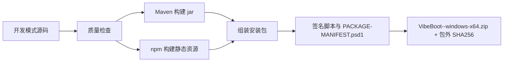
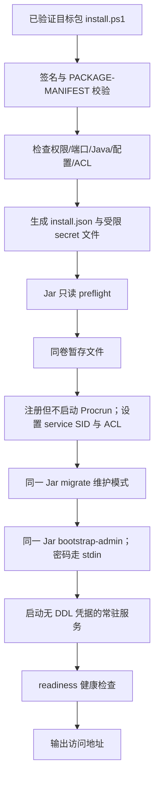

# Vibe Boot 生产安装包设计规格

## 1. 文档目的

本文定义 Vibe Boot 生产安装包的构建、目录结构、安装、运行、卸载、备份、恢复、升级和回滚约束。

生产安装包面向中小企业部署场景，目标是让用户完成开发后，可以生成一个可复制到 Windows 服务器、可自动安装、可稳定运行、可备份恢复的业务系统。

## 2. 核心目标

| 目标 | 说明 |
| --- | --- |
| 构建产物运行 | 生产运行 jar 和前端静态资源，不运行源码开发环境 |
| Windows 一键安装 | 执行 `install.ps1` 完成配置检查、服务安装、启动 |
| 可备份恢复 | 数据库、文件、配置可通过脚本备份和恢复 |
| 可升级回滚 | 升级前创建回滚点，失败时可恢复 |
| 可诊断 | 安装和运行失败时有中文日志 |
| 最小依赖 | 不强制 Docker、Nginx、Kubernetes |

一句话：

> 生产安装包是 Vibe Boot 从“AI 生成代码”走向“真实企业系统交付”的最后一公里。

## 3. 生产包与开发包区别

| 项目 | 开发包 | 生产安装包 |
| --- | --- | --- |
| 用途 | AI coding、源码修改、调试预览 | 稳定运行业务系统 |
| 是否包含源码 | 是 | 默认否 |
| 是否包含 Maven/Node | 是 | 否 |
| runtime 版本记录 | `runtime/RUNTIME-MANIFEST.json` 记录 JDK/Maven/Node/npm 完整版本、来源、许可证、SHA256 | `notices/RUNTIME-MANIFEST.json` 记录 JDK runtime 完整版本、来源、许可证、SHA256 |
| 开发型 AI 改代码 | 允许，必须受文档和质量门禁约束 | 禁止 |
| 业务 AI 能力 | 可用于开发辅助和业务验证 | 可选开启，只能做问答、摘要、文案、分析 |
| 前端 | Vite dev server | 静态资源 |
| 后端 | 开发 profile | 生产 profile |
| 日志 | 开发调试 | 生产滚动日志 |
| 配置 | local 配置 | 外置生产配置 |

## 4. 生产包目录结构

```text
vibe-boot-release/
├── PACKAGE-MANIFEST.psd1            # Authenticode 签名的包内容与 SHA256 清单
├── app/
│   ├── vibe-boot.jar               # 生产 thin jar，包含应用类和资源
│   ├── lib/                         # Maven runtime 依赖，版本与 hash 全量入清单
│   ├── public/                     # 前端静态资源
│   └── VERSION
├── config/
│   ├── application-prod.yml
│   ├── model-prod.yml
│   ├── install.json.example
│   └── secrets/             # 安装时生成，默认包为空且源码仓库忽略
├── runtime/
│   └── jdk17/                      # 生产运行 JRE/JDK
├── service/
│   └── VibeBootService.exe         # Apache Commons Daemon Procrun 1.6.1 x64
├── notices/
│   ├── THIRD-PARTY-NOTICES.txt     # 第三方依赖和 runtime 许可证摘要
│   ├── RUNTIME-MANIFEST.json       # 内置 JDK 的版本、来源、许可证、SHA256
│   └── DEPENDENCY-MANIFEST.json    # Maven/npm/工具依赖和交付产物校验清单
├── scripts/
│   ├── install.ps1
│   ├── uninstall.ps1
│   ├── start.ps1
│   ├── stop.ps1
│   ├── status.ps1
│   ├── backup.ps1
│   ├── restore.ps1
│   ├── upgrade.ps1
│   └── common.ps1
├── db/
│   ├── migration/                  # jar 内迁移的只读审计副本，不直接执行
│   └── MIGRATION-MANIFEST.json     # 迁移版本、风险标记和 SHA256
├── data/
│   └── files/
├── logs/
│   ├── app/
│   ├── install/
│   └── backup/
├── backup/
├── staging/                        # 已认证目标包的同卷暂存目录
├── operations/
│   └── trusted-launcher.ps1        # 已签名可信启动器；安装后仅管理员/SYSTEM 可访问
└── README.md
```

约束：

| 路径 | 说明 |
| --- | --- |
| `app/` | thin jar、runtime 依赖和静态资源，不放源码；`app/lib/` 是生产运行 classpath 的组成部分 |
| `config/` | 外置配置，可由用户修改 |
| `runtime/` | 生产运行 Java |
| `notices/` | 第三方依赖、runtime、工具许可证和来源清单 |
| `scripts/` | 生产运维脚本 |
| `db/` | jar 内 Flyway 迁移的只读审计副本和哈希清单，不是脚本执行源 |
| `data/` | 运行数据 |
| `logs/` | 日志 |
| `backup/` | 备份归档 |
| `staging/` | 安装/升级暂存，必须与安装目录同一 NTFS 卷且只允许 Administrators/SYSTEM 写入 |

## 5. 构建流程



构建步骤：

| 步骤 | 输入 | 输出 |
| --- | --- | --- |
| 版本检查 | Git 状态、版本号 | 构建元信息 |
| 后端构建 | `backend/` | `vibe-boot.jar` |
| 前端构建 | `frontend/` | `public/` |
| 数据库迁移审计副本 | classpath 权威迁移 | `db/migration/`、`db/MIGRATION-MANIFEST.json`，并与 jar 内资源校验一致 |
| 配置模板生成 | prod yml | `config/` |
| 合规清单生成 | Maven/npm/runtime/Procrun 依赖与交付物 | `notices/` 三个清单文件 |
| runtime 复制 | JDK 17 | `runtime/jdk17/` |
| 脚本复制 | install/start/backup | `scripts/` |
| 签名与清单 | 组装目录、代码签名证书 | 先签名全部 PowerShell，再生成覆盖其最终字节及其他产物的 manifest（不自含），最后签名 `PACKAGE-MANIFEST.psd1` 并全量复核 |
| 压缩打包 | 已签名目录 | `VibeBoot-<version>-windows-x64.zip` 与带外发布的 `.zip.sha256` |

构建约束：

| 约束 | 说明 |
| --- | --- |
| 构建前检查 Git 状态 | 工作区非干净时默认阻断；不允许用提交哈希标记包含未提交代码的生产包 |
| 构建失败停止 | 不生成半成品包 |
| 包含版本信息 | 版本号、构建时间、提交哈希 |
| 不包含密钥 | API Key、数据库密码不进入安装包默认配置 |
| 不包含 node_modules | 生产不需要 |
| 不包含 Maven 仓库 | 生产不需要 |
| 包含 NOTICE | 第三方依赖、runtime 和工具来源必须可追踪 |
| 高风险许可证阻断 | 来源不明、禁止分发或许可证风险未确认时停止打包 |
| 迁移副本一致 | 权威源、jar 内资源、审计副本和迁移清单任一 SHA256 不一致时停止打包 |
| 生产签名必需 | `build-prod.ps1 -CodeSigningThumbprint <thumbprint>` 必须接收有效代码签名证书；脚本或 `PACKAGE-MANIFEST.psd1` 签名失败即停止 |
| 测试包隔离 | 只有显式 `-UnsignedDevelopmentPackage` 可生成未签名测试包；根目录写入 `UNSIGNED-DEVELOPMENT-ONLY`，生产 install/upgrade 必须拒绝 |

生产合规文件的职责不得合并成一句模糊的“有清单”：

| 文件 | P0 必填内容 |
| --- | --- |
| `notices/RUNTIME-MANIFEST.json` | 内置 JDK 的发行版、完整版本、架构、来源 URL、许可证标识和归档 SHA256 |
| `notices/DEPENDENCY-MANIFEST.json` | Maven 运行依赖、npm 构建依赖、Procrun 等随包工具的名称/版本/来源/许可证，以及 jar、`app/lib`、public、Procrun 和 runtime 归档的 SHA256 |
| `notices/THIRD-PARTY-NOTICES.txt` | 上述依赖、runtime 和工具的版权与许可证摘要、完整许可证位置和替换说明 |

### 5.1 生产包信任链

生产包的可信根不能来自包自身。发布方必须在发布页或企业制品库带外公布签名证书 SHA-256 thumbprint；管理员必须先信任证书链，再由 Windows 自带 Authenticode API 验证目标入口，只有 `Status=Valid` 且 signer thumbprint 与带外值逐字节一致时才可执行入口。zip 的 SHA256 只验证下载完整性，不能替代这一动作。

首次安装尚无本机可信启动器，支持的入口是管理员在提升权限的 Windows PowerShell 5.1 中运行以下 OS-only 引导命令；`<解压目录>` 与 `<带外 thumbprint>` 必须由管理员显式替换，不能从包内或环境变量读取：

```powershell
$root = (Resolve-Path -LiteralPath '<解压目录>').Path
$entry = Join-Path $root 'scripts\install.ps1'
$expected = '<带外 thumbprint>'.Replace(' ', '').ToUpperInvariant()
$sig = Get-AuthenticodeSignature -LiteralPath $entry
if ($sig.Status -ne 'Valid' -or $null -eq $sig.SignerCertificate -or
    $sig.SignerCertificate.Thumbprint.Replace(' ', '').ToUpperInvariant() -ne $expected) {
    throw '安装入口签名或 signer thumbprint 校验失败'
}
& $entry -PackageRoot $root -TrustedSignerThumbprint $expected -InstallConfig (Join-Path $root 'config\install.json')
```

首次安装成功后，签名且已被 package manifest 覆盖的 `operations/trusted-launcher.ps1` 被复制到安装目录，并置于仅 Administrators/SYSTEM 可读写的非继承 ACL 下。以后升级的唯一支持命令为：

```powershell
powershell.exe -NoProfile -ExecutionPolicy AllSigned -File C:\VibeBoot\operations\trusted-launcher.ps1 `
  -PackageRoot 'D:\releases\VibeBoot-<version>-windows-x64' `
  -EntryPoint upgrade -TrustedSignerThumbprint '<带外 thumbprint>'
```

若安装目录不是 `C:\VibeBoot`，命令使用 `install.json` 中的规范化绝对目录。可信启动器只接受 `install|upgrade` 两个固定入口，先拒绝 package root/entrypoint 上的 reparse point，再验证目标入口签名与带外 thumbprint，最后才调用目标脚本；它不解析包内 signer 声明，也不提供任意脚本路径或任意参数转发。可信启动器缺失、签名失效或 ACL 不符时，升级必须停止；管理员只能重新使用上面的 OS-only 引导逻辑验证目标 `upgrade.ps1`，不能直接双击或绕过签名检查。

目标 `install.ps1`/`upgrade.ps1` 被可信启动后还必须再次执行以下顺序。任一失败都不能写安装目录、创建数据库备份、停止现有服务或改变防火墙：

| 顺序 | 检查 |
| --- | --- |
| 1 | signer thumbprint 只能来自每次调用必填参数 `-TrustedSignerThumbprint`，不能读取包内声明、环境变量或安装目录配置 |
| 2 | 校验自身、`operations/trusted-launcher.ps1`、所有 `scripts/*.ps1` 和 `PACKAGE-MANIFEST.psd1` 的 Authenticode 状态及 signer 一致性 |
| 3 | 读取签名后的 `PACKAGE-MANIFEST.psd1`，执行严格 schema、路径、大小、SHA256 与文件集合相等性校验 |
| 4 | 校验包外 `.zip.sha256` 时只作为下载完整性辅助；不得用它替代签名验证 |
| 5 | 检测 `UNSIGNED-DEVELOPMENT-ONLY`，生产模式命中即拒绝 |

`PACKAGE-MANIFEST.psd1` 的 P0 schema 固定为下表；manifest 自身由 Authenticode 保护，因此不把自身哈希递归写入 `Files`。除 manifest 自身外，包根目录下每个普通文件必须恰好出现一次，不能只覆盖“可执行文件”。

| 字段 | 类型/约束 |
| --- | --- |
| `SchemaVersion` | 整数常量 `1` |
| `PackageId` | 字符串常量 `vibe-boot` |
| `ProductVersion` | SemVer 字符串，必须等于 `app/VERSION` 和 jar build info |
| `Architecture` | 字符串常量 `windows-x64` |
| `CreatedAtUtc` | RFC 3339 UTC 时间 |
| `SignerThumbprint` | 40 位十六进制证书 thumbprint，仅用于一致性审计；不能成为信任锚 |
| `ManifestSchemaVersion` | 整数常量 `1` |
| `RequiredLauncherSchemaVersion` | 整数常量 `1` |
| `MinUpgradableVersion` / `MaxUpgradableVersion` | SemVer；目标升级路径闭区间，首装也必须存在 |
| `Files` | 对象数组；每项严格只有 `Path`、`Length`、`Sha256`、`Role`，未知字段拒绝 |
| `Files[].Path` | 使用 `/` 的包根相对路径；大小写不敏感唯一；不得为空、绝对路径、UNC、盘符、`..`、`.`、空段、冒号、ADS、设备名、尾随点/空格或反斜杠 |
| `Files[].Length` | 非负 Int64，必须等于实际文件字节数 |
| `Files[].Sha256` | 64 位小写十六进制，基于最终发布字节计算 |
| `Files[].Role` | `application|dependency|runtime|service|script|config-template|migration-audit|notice|documentation` 之一 |

校验器必须用 `GetFullPath(join(root, Path))` 后确认结果仍位于同一 package root，拒绝任意目录/文件 reparse point、硬链接数大于 1 的可变文件和大小写折叠后的重复路径；递归枚举普通文件并与 `Files + PACKAGE-MANIFEST.psd1` 做集合完全相等比较，任何未列文件、缺失文件或类型变化都失败。构建顺序固定为：先签名全部 PowerShell，生成覆盖其最终字节的 manifest，再签名 manifest；签名 manifest 后不得再修改包内字节。

首装的唯一入口是经 OS-only 引导验证后的目标包 `scripts/install.ps1`。升级的唯一入口是经已安装可信启动器或同等 OS-only 引导预验证后的目标包 `scripts/upgrade.ps1`；旧版普通运维脚本、运行中的应用和生产 AI 均不得触发升级。P0 不提供在线自动更新。

### 5.2 唯一发布通道

生产环境只能接收 `build-prod.ps1` 生成的受控安装包，不能把开发工作区直接搬到服务器。

| 通道 | 是否允许 | 说明 |
| --- | --- | --- |
| `build-prod.ps1` 生成 zip 后安装 | 允许 | 正式生产发布入口 |
| 已验证目标包中的 `upgrade.ps1` 升级 | 允许 | 目标脚本是唯一升级执行器；升级前必须通过预检并创建回滚点 |
| 同一 Jar 的一次性 `--vibe.operation=migrate` | 允许 | Jar 内 Flyway 是唯一执行器；PowerShell 不执行 SQL 或 Flyway CLI，常驻服务不持有 DDL 权限 |
| 复制 `backend/`、`frontend/` 到生产运行 | 禁止 | 会把源码、开发配置和构建工具带入生产 |
| 在生产服务器执行外部 AI 交接包 | 禁止 | 交接包不是生产补丁、SQL 或 shell 输入 |
| 手工执行零散 SQL 改结构 | 禁止 | 破坏迁移记录、备份恢复和升级可追踪性 |
| 复制开发库覆盖生产库 | 禁止 | 数据风险不可控 |

## 6. 安装流程



安装步骤：

| 步骤 | 说明 |
| --- | --- |
| 包信任 | 在任何写盘或服务操作前验证带外 signer thumbprint、所有 PowerShell 签名和签名 package manifest |
| 权限检查 | 必须以管理员运行；检查安装路径位于 NTFS 且无 reparse point |
| 端口检查 | 检查业务端口和回环 Actuator 管理端口 |
| 配置检查 | PowerShell 5.1 的 `ConvertFrom-Json` 只做可读性初筛；已认证的同一 Java classpath 必须重新读取原始 JSON bytes，以 strict duplicate detection 和 `docs/contracts/install-v1.schema.json` 做权威校验；密码只进入受限 secret 文件；生产检测到 `VIBEBOOT_MODEL_MASTER_KEY` 或 YAML 内嵌模型主密钥时拒绝安装 |
| 数据库检查 | 分别检查运行账号与迁移账号连接、TLS 和最小权限；只读 preflight 输出稳定 JSON |
| Redis 检查 | 检查 ACL 用户、TLS、产品 key 前缀与所需命令，拒绝管理员账号和明文非回环连接 |
| 暂存 | 将已验证文件完整复制到同卷 `staging/<operationId>/`，再次核对 manifest 后才修改 live 目录 |
| 服务注册 | Procrun 使用 `NT Authority\LocalService`，启用 `NT SERVICE\VibeBoot` service SID，注册后保持停止 |
| ACL | 按第 7 节重建并复核安装目录 ACL；失败时注销新服务并停止 |
| 数据库迁移 | 每次交互读取独立迁移密码，只向 preflight/migrate 维护子进程环境注入；只有 migrate 内 Flyway 可写库。常驻服务固定禁用 Flyway，P0 不承诺无人值守迁移 secret 注入 |
| 初始管理员 | 空库迁移后运行 `bootstrap-admin`；密码只经 stdin 传入并强制首次改密 |
| 启动服务 | 启动仅持有业务 DML 与受限 Redis 权限的常驻服务 |
| 健康检查 | readiness 只有在迁移完成后才可为 `UP` |
| 输出结果 | 打印访问地址、日志路径、管理账号提示 |

### 6.1 安装前预检清单

`install.ps1` 必须在注册或启动服务前完成全部只读预检。预检失败时不得创建服务、写数据库或输出安装成功。

| 检查项 | 失败处理 |
| --- | --- |
| 管理员权限 | 如需安装 Windows 服务，提示以管理员运行；演示后台进程需明确限制 |
| 生产包信任与完整性 | 校验带外 signer、所有脚本签名、签名 `PACKAGE-MANIFEST.psd1`、`app/VERSION`、jar、public、runtime、service、db、config 模板和三个 notices 文件 |
| 端口占用 | 输出占用进程，不自动杀进程 |
| 数据库连接与权限 | 运行账号必须只有业务 DML；迁移账号必须只有目标 schema DDL/DML 且无全局管理权限；连接、TLS 或权限不符即停止 |
| Redis 连接与权限 | 生产必需；校验 ACL 用户、密码、TLS、`vibe-boot:<instanceId>:` key 范围及所需命令；失败停止，内存降级只允许开发模式 |
| 模型主密钥来源 | 生产只允许 `config/secrets/model-master.key`；环境变量、YAML 内嵌、非法 Base64URL 或解码后非 32 bytes 均停止 |
| MySQL Client | 校验用户配置的 MySQL 8 `mysqldump`/`mysql` 路径和版本；缺失时无法满足备份恢复承诺，停止生产安装 |
| 迁移状态 | Jar `preflight` stdout 必须是 ADR-0002 冻结 JSON，退出码为 0；高风险迁移需要显式确认，且不执行 migrate |
| 磁盘空间 | 不足时停止安装或备份 |
| 敏感配置 | `install.json` 不含密码；检查受限 secret 文件、默认密码、数据库/Redis/TLS 私钥密码、模型主密钥和明文输出风险；主密钥不存在时生成 32-byte 随机值并限制 ACL |
| 网络访问 | local 模式必须绑定 127.0.0.1；lan 模式必须启用 HTTPS、提供可读取的 PKCS12 和明确 allowedOrigin |
| 文件目录 | 检查 storage root 位于 data 目录、可写、无 junction/reparse point、ACL 仅服务账号和管理员可写，并满足配额及 2 GB 保留空间 |
| 生产 AI 白名单 | 确认未启用代码生成、补丁、shell、在线 SQL 和交接包执行入口 |
| 第三方 NOTICE | 检查 `notices/RUNTIME-MANIFEST.json`、`notices/DEPENDENCY-MANIFEST.json`、`notices/THIRD-PARTY-NOTICES.txt` 存在且哈希一致 |
| 服务身份与 ACL | 固定 LocalService + service SID；普通用户或服务进程可写 app/runtime/service/scripts 即停止 |

预检结果必须写入 `logs/install/precheck-YYYYMMDD-HHmmss.log`，并在控制台输出中文摘要。

一次性 migrate 或 bootstrap-admin 失败时不得启动业务服务。全新安装应注销本次创建的 Procrun 服务，保留受限暂存目录和失败日志，并提示恢复或重建目标库；升级应保持服务停止、保留失败日志和回滚点，并使用同一次回滚点受控恢复。两种场景都不得自动反复运行同一迁移。

### 6.2 外部 MySQL/Redis 责任边界

| 事项 | 客户/实施方责任 | Vibe Boot 责任 |
| --- | --- | --- |
| 安装与补丁 | 安装并维护受支持的 MySQL 8、Redis 7 或兼容服务 | 不下载、不安装、不升级、不卸载外部数据服务 |
| 账号与加固 | 分别创建运行账号、迁移账号和 Redis ACL 用户，管理密码、TLS、网络 ACL、防火墙和补丁 | 校验冻结的最小权限、TLS、key 前缀，并对日志、响应和配置输出脱敏 |
| 可用性与容量 | 监控服务、容量、复制/高可用和基础设施故障 | readiness 反映依赖是否可用，不承诺替代数据库监控平台 |
| schema | 预先创建目标库和两个 MySQL 账号 | 仅由同一 Jar 的一次性 Flyway 维护模式管理 Vibe Boot 自身 schema |
| 备份恢复 | 负责实例级、物理级和 Redis 持久化备份恢复 | 在显式配置兼容 MySQL Client 路径时提供 Vibe Boot 逻辑备份/恢复流程 |
| 防火墙 | 决定并配置数据服务网络访问 | 安装器永不开放 MySQL/Redis 端口 |

生产安装前置文档必须明确上述责任。缺少外部 MySQL/Redis、账号权限或 MySQL Client 时，安装/备份预检应给出中文修复建议，不能静默下载组件或宣称平台已接管数据服务。

生产 MySQL/Redis 权限与连接基线：

| 主体 | 最小权限/安全要求 |
| --- | --- |
| MySQL 运行账号 | 仅 `vibe_boot.*` 的 `SELECT/INSERT/UPDATE/DELETE`；禁止 DDL、用户管理、文件和全局权限 |
| MySQL 迁移账号 | 仅 `vibe_boot.*` 的 `SELECT/INSERT/UPDATE/DELETE/CREATE/ALTER/DROP/INDEX/REFERENCES`；禁止 `GRANT OPTION/CREATE USER/FILE/PROCESS/SUPER` |
| Redis ACL 用户 | 只能访问 `vibe-boot:<instanceId>:*`，只开放会话/缓存/计数所需的 GET/SET/DEL/UNLINK/EXISTS/EXPIRE/PEXPIRE/TTL/PTTL/MGET/MSET/INCR/INCRBY/SCAN/PING/EVALSHA/SCRIPT LOAD；禁止 KEYS、FLUSH、CONFIG、MODULE 和任意 key |
| Sa-Token 搜索边界 | P0 使用 `sa-token-redis-jackson`，但不得调用其依赖 Redis `KEYS` 的 `searchData` 路径；在线会话全量搜索/列表属于 P1。账号禁用、改密和登出必须通过已知账号会话映射撤销，不得扫描全库 |
| 非回环 MySQL | Connector/J `sslMode=VERIFY_IDENTITY`，显式 CA，证书主机名匹配 |
| 非回环 Redis | TLS + 显式 CA + ACL 用户；不得以“同一内网”为由降级明文 |
| 回环例外 | 只有同机 `127.0.0.1`/`::1` 可通过 `allowInsecureLoopback=true` 显式关闭 TLS，预检和日志必须给出警告 |

TLS 文件到各客户端的映射固定如下，不能在实现时临场选择“信任系统证书”或关闭主机名校验：

| 客户端 | P0 配置映射 |
| --- | --- |
| Connector/J 常驻连接 | 安装器把 mysql CA PEM 复制到 `config/certs/mysql-ca.pem`，再用内置 JDK `keytool -importcert -noprompt` 生成 `config/secrets/mysql-truststore.p12`；随机 truststore 密码写 secret properties。Hikari data-source properties 固定 `sslMode=VERIFY_IDENTITY`、`trustCertificateKeyStoreUrl=file:<内部规范 URI>`、`trustCertificateKeyStoreType=PKCS12`、`trustCertificateKeyStorePassword=<secret 占位>`、`fallbackToSystemTrustStore=false`、`tlsVersions=TLSv1.2,TLSv1.3`、`allowPublicKeyRetrieval=false` |
| Flyway 维护连接 | 使用同一 Connector/J truststore 与 TLS 参数；只把 migration username/password 注入一次性 preflight/migrate 子进程，常驻服务配置中不存在迁移密码 |
| `mysql.exe` / `mysqldump.exe` | 使用内部 `config/certs/mysql-ca.pem`，固定传 `--ssl-mode=VERIFY_IDENTITY --ssl-ca=<内部 PEM>`；不使用系统 trust store、不传 `--ssl-mode=PREFERRED` |
| Spring Data Redis/Lettuce | CA 复制为 `config/certs/redis-ca.pem`；配置 `spring.ssl.bundle.pem.vibe-redis.truststore.certificate=file:<内部 PEM>`、`spring.data.redis.ssl.enabled=true`、`spring.data.redis.ssl.bundle=vibe-redis`，并使用 install.json 的 DNS host 与 ACL username |
| 回环明文例外 | 仅在跨字段门禁通过时删除对应 CA/bundle 配置并显式禁用 TLS；日志写固定警告码，不自动回退 |

依据：[MySQL Connector/J 服务器认证与 `VERIFY_IDENTITY`](https://dev.mysql.com/doc/connector-j/en/connector-j-server-authentication.html)、[Connector/J 安全属性](https://dev.mysql.com/doc/connector-j/en/connector-j-reference-configuration-properties.html)、[Spring Boot SSL Bundles](https://docs.spring.io/spring-boot/reference/features/ssl.html)、[Spring Boot Redis SSL bundle](https://docs.spring.io/spring-boot/reference/data/nosql.html)。

## 7. Windows 服务策略

首版决策已由 ADR-0001 确认为 Apache Commons Daemon Procrun `1.6.1` x64。它替代 WinSW，不与 WinSW/NSSM 并存；开发模式仍由 `dev-start.ps1` 启动，只有生产安装使用 Procrun。

生产构建必须保留普通 thin jar 与枚举后的 runtime 依赖，而不是只保留 Spring Boot nested fat jar：

```text
app/vibe-boot.jar
app/lib/<groupId>.<artifactId>-<version>.jar
```

`app/vibe-boot.jar` 包含 `com.vibeboot.starter.VibeBootWindowsService`。其 `public static void start(String[] args)` 只允许启动一次，在当前 JVM 创建 Spring `ConfigurableApplicationContext` 后等待停止锁；`public static void stop(String[] args)` 关闭同一上下文、等待 Spring 优雅停机完成后释放停止锁。两方法不得启动第二 JVM、调用 shell、开放远程 shutdown API 或读取服务注册表中的 secret。维护模式和命令行验证使用同一 thin jar 与同一 `app/lib` classpath。

`install.ps1` 先按 package manifest 中 `Path` 的 ordinal 顺序枚举 `app/lib/*.jar`，与 `app/vibe-boot.jar` 用分号拼成绝对 classpath；缺少、多出或重复依赖即停止。然后以参数数组调用 `service/VibeBootService.exe //IS//VibeBoot`，固定写入以下 Procrun 参数，不允许模板自由发挥：

| Procrun 参数 | 固定值/生成规则 |
| --- | --- |
| `DisplayName` / `Description` | `Vibe Boot` / `Vibe Boot business application` |
| `Install` | `<installRoot>\service\VibeBootService.exe` |
| `Startup` | `delayed` |
| `ServiceUser` | `NT Authority\LocalService`；无密码 |
| `Jvm` / `JavaHome` | `<installRoot>\runtime\jdk17\bin\server\jvm.dll` / `<installRoot>\runtime\jdk17` |
| `Classpath` | thin jar + manifest 中全部 `app/lib/*.jar` 的规范化绝对路径，不使用通配符 |
| `StartMode` / `StopMode` | 均为 `jvm` |
| `StartClass` / `StopClass` | 均为 `com.vibeboot.starter.VibeBootWindowsService` |
| `StartMethod` / `StopMethod` | `start` / `stop` |
| `StartParams` | `--spring.profiles.active=prod` 与三个固定外置配置文件路径；只含路径和非敏感值 |
| `StopTimeout` | `60` 秒；超时后 Procrun 可终止其创建的进程树，脚本判定失败并保留诊断 |
| `JvmOptions9` | `-Dfile.encoding=UTF-8`、`-Djava.awt.headless=true`、`-XX:+ExitOnOutOfMemoryError` |
| `LogPath` / `LogPrefix` / `LogLevel` | `<installRoot>\logs\service` / `procrun` / `Info` |
| `StdOutput` / `StdError` | `auto` / `auto`；不得输出 secret，启动时清理 30 天前的 wrapper 日志 |

三个固定配置文件为 `config/application-prod.yml`、`config/model-prod.yml`、`config/secrets/application-prod.secrets.properties`。注册表中只能出现这些路径和非敏感 JVM 参数，不能出现数据库/Redis/TLS 密码、模型主密钥或供应商 API Key。注册后依次执行 `sc.exe sidtype VibeBoot unrestricted`、`sc.exe failure VibeBoot reset= 86400 actions= restart/10000/restart/30000/none/0` 和 `sc.exe failureflag VibeBoot 1`，逐项检查退出码并回读 SCM 配置；任何失败都注销新服务并停止安装。依赖故障只影响 readiness，不得通过 liveness 触发无效重启循环。

服务约束：

| 约束 | 说明 |
| --- | --- |
| 服务名固定 | P0 必须为 `VibeBoot`，不支持同机多实例；因此 service SID 固定为 `NT SERVICE\VibeBoot` |
| 默认安装目录 | `C:\VibeBoot`，可通过 `install.json` 覆盖 |
| 默认数据库名 | `vibe_boot` |
| 服务登录账号 | 固定 `NT AUTHORITY\LOCAL SERVICE`，不得使用 LocalSystem、交互式管理员或当前安装用户 |
| 服务 SID | 安装后设置 `NT SERVICE\VibeBoot` 为 unrestricted，并以该 SID 授权目录，不给 LocalService 通用写权限 |
| 数据库用户 | 运行账号与迁移账号分离；生产密码安装时输入或从受限 secret 文件提供 |
| 默认端口 | 业务 8080、Actuator 管理 8081、MySQL 3306、Redis 6379 |
| 日志路径固定 | `logs/app/` |
| 重启策略明确 | 首次异常 10 秒后重启，第二次 30 秒后重启，第三次保持停止；连续正常 24 小时重置失败计数 |
| 卸载不删数据 | `uninstall.ps1` 默认保留 data/backup |

安装目录 ACL 必须关闭继承并显式设置，不能依赖 `C:\` 或父目录当前权限：

| 路径 | Administrators / SYSTEM | `NT SERVICE\VibeBoot` | 普通用户 |
| --- | --- | --- | --- |
| 安装根目录 | FullControl | ReadAndExecute，仅用于遍历 | 无权限 |
| `app/ runtime/ service/ db/ notices/` | FullControl | ReadAndExecute | 不得写 |
| `config/` | FullControl | Read | 不得写 |
| `config/secrets/` | FullControl | Read | 无读取权限 |
| `data/ logs/` | FullControl | Modify | 无写权限 |
| `scripts/ staging/ backup/ operations/` | FullControl | 无权限 | 无权限 |

每个表中路径都必须关闭继承并写入显式 ACE；不能只在父目录追加一条权限。`operations/` 与 `data/` 是安装根的兄弟目录，因此服务在 `data/` 上的 `Modify`/`DELETE_CHILD` 无法删除、替换或重命名操作状态与可信启动器。`scripts/` 由管理员显式执行，常驻服务不需要读取。ACL 设置后必须逐目录复核 owner、继承、ACE、有效权限、hardlink/reparse point 和“服务 SID 无法创建/删除 operations 测试文件”；任何失败均不得启动服务。

## 8. 配置策略

| 配置 | 说明 |
| --- | --- |
| `application-prod.yml` | 后端非敏感生产配置和 secret 属性占位符 |
| `model-prod.yml` | 主密钥文件路径、业务 AI 白名单和非敏感默认值；不得内嵌主密钥 |
| `install.json` | `schemaVersion=1` 的非敏感安装参数、连接地址、用户名和安装输入路径；不含任何 secret 值 |
| `secrets/application-prod.secrets.properties` | 数据库、Redis、TLS 私钥密码；安装时生成并使用受限 ACL |
| `secrets/model-master.key` | Base64URL no-padding 的 32-byte 模型主密钥；与数据库密文分离且不进入备份 |

生产包中的真实配置文件是部署产物，不是源码仓库内容。源码仓库只允许提交模板或 example。数据库密码、Redis 密码、TLS 私钥密码和模型主密钥由安装脚本写入固定的 `config/secrets/`，并在日志、manifest 和备份摘要中完全隐藏。供应商 API Key 不写入任何配置，而是由有权限管理员在模型配置页面录入并按 ADR-0002 加密入库。P0 使用 Redis 不透明会话，不生成 JWT Token Secret。

### 8.1 `install.json` 唯一 schema

权威机器 Schema 为 `docs/contracts/install-v1.schema.json`，标准请求样例为 `docs/contracts/examples/install-v1.example.json`。生产包中的 `config/install.json.example` 必须由该样例生成；P0 不接受 YAML、环境变量覆盖、命令行散装连接参数或第二种配置格式。下列代码块是便于审查的同步副本，文档验证必须比较规范化 JSON，任一漂移都阻断签收和构建：

```json
{
  "schemaVersion": 1,
  "installRoot": "C:\\VibeBoot",
  "serviceName": "VibeBoot",
  "accessMode": "local",
  "bindAddress": "127.0.0.1",
  "businessPort": 8080,
  "managementPort": 8081,
  "allowedOrigin": "http://127.0.0.1:8080",
  "openFirewall": false,
  "instanceId": "GENERATE",
  "allowInsecureLoopback": false,
  "mysql": {
    "host": "mysql.example.cn",
    "port": 3306,
    "database": "vibe_boot",
    "applicationUsername": "vibe_boot_app",
    "migrationUsername": "vibe_boot_migration",
    "tlsMode": "verify-identity",
    "caFile": "D:\\install-input\\mysql-ca.pem",
    "mysqlClientBin": "C:\\Program Files\\MySQL\\MySQL Server 8.4\\bin"
  },
  "redis": {
    "host": "redis.example.cn",
    "port": 6379,
    "username": "vibe_boot",
    "tlsEnabled": true,
    "caFile": "D:\\install-input\\redis-ca.pem",
    "database": 0
  },
  "tls": {
    "keyStorePath": null
  }
}
```

结构 schema 固定如下，并与 `docs/contracts/install-v1.schema.json` 规范化后一致。实现不得新增隐式默认字段；未知字段、重复 JSON key、注释、尾逗号、NaN/Infinity 和大小写不同的近似字段都必须拒绝：

```json
{
  "$schema": "https://json-schema.org/draft/2020-12/schema",
  "$id": "https://vibe-boot.local/schemas/install-v1.json",
  "type": "object",
  "additionalProperties": false,
  "required": [
    "schemaVersion", "installRoot", "serviceName", "accessMode",
    "bindAddress", "businessPort", "managementPort", "allowedOrigin",
    "openFirewall", "instanceId", "allowInsecureLoopback",
    "mysql", "redis", "tls"
  ],
  "properties": {
    "schemaVersion": { "const": 1 },
    "installRoot": { "type": "string", "minLength": 4, "maxLength": 120 },
    "serviceName": { "const": "VibeBoot" },
    "accessMode": { "enum": ["local", "lan"] },
    "bindAddress": { "type": "string", "minLength": 3, "maxLength": 45 },
    "businessPort": { "type": "integer", "minimum": 1024, "maximum": 65535 },
    "managementPort": { "const": 8081 },
    "allowedOrigin": { "type": "string", "minLength": 10, "maxLength": 255 },
    "openFirewall": { "type": "boolean" },
    "instanceId": {
      "anyOf": [
        { "const": "GENERATE" },
        { "type": "string", "pattern": "^[0-9a-f]{8}-[0-9a-f]{4}-4[0-9a-f]{3}-[89ab][0-9a-f]{3}-[0-9a-f]{12}$" }
      ]
    },
    "allowInsecureLoopback": { "type": "boolean" },
    "mysql": {
      "type": "object",
      "additionalProperties": false,
      "required": [
        "host", "port", "database", "applicationUsername",
        "migrationUsername", "tlsMode", "caFile", "mysqlClientBin"
      ],
      "properties": {
        "host": { "type": "string", "minLength": 1, "maxLength": 253 },
        "port": { "type": "integer", "minimum": 1, "maximum": 65535 },
        "database": { "const": "vibe_boot" },
        "applicationUsername": { "type": "string", "pattern": "^[A-Za-z][A-Za-z0-9_]{2,31}$" },
        "migrationUsername": { "type": "string", "pattern": "^[A-Za-z][A-Za-z0-9_]{2,31}$" },
        "tlsMode": { "enum": ["verify-identity", "disabled"] },
        "caFile": { "type": ["string", "null"] },
        "mysqlClientBin": { "type": "string", "minLength": 4, "maxLength": 240 }
      }
    },
    "redis": {
      "type": "object",
      "additionalProperties": false,
      "required": ["host", "port", "username", "tlsEnabled", "caFile", "database"],
      "properties": {
        "host": { "type": "string", "minLength": 1, "maxLength": 253 },
        "port": { "type": "integer", "minimum": 1, "maximum": 65535 },
        "username": { "type": "string", "minLength": 1, "maxLength": 64 },
        "tlsEnabled": { "type": "boolean" },
        "caFile": { "type": ["string", "null"] },
        "database": { "const": 0 }
      }
    },
    "tls": {
      "type": "object",
      "additionalProperties": false,
      "required": ["keyStorePath"],
      "properties": {
        "keyStorePath": { "type": ["string", "null"] }
      }
    }
  }
}
```

PowerShell 5.1 先用 `Get-Content -Raw -Encoding UTF8 | ConvertFrom-Json` 做可读性预检；随后必须把已完成包路径校验的原始 `install.json` 文件路径传给已认证包内同一 Java classpath 的 `--vibe.operation=validate-install-config`。Java 进程重新读取原始 bytes，由 Jackson 开启 strict duplicate detection 并按上面 schema 做权威校验；不得把 PowerShell 解析后再序列化的对象传入，否则重复 key 已丢失。Java 校验器 stdout 只返回冻结 JSON 结果，退出 0 才可继续；这样不引入 PowerShell YAML/JSON Schema 模块，也不会接受 `ConvertFrom-Json` 可能折叠的重复 key。

结构 schema 之外的跨字段与路径规则同样是必选门禁：

| 规则 | 唯一处理 |
| --- | --- |
| `installRoot` | 必须是本机固定盘 NTFS 绝对目录；禁止 UNC、映射盘、卷根、Windows/Program Files/用户配置/Temp 子目录、`#`、`;`、尾随点空格、ADS 和任意 reparse point；新装时目标不存在或为空 |
| 派生目录 | storage=`<root>\data\files`、backup=`<root>\backup`、operations=`<root>\operations`、staging=`<root>\staging`、certs=`<root>\config\certs`、secrets=`<root>\config\secrets`；P0 不允许外置覆盖 |
| local 模式 | `bindAddress=127.0.0.1`、`allowedOrigin=http://127.0.0.1:<businessPort>`、`openFirewall=false`、`tls.keyStorePath=null` |
| lan 模式 | bindAddress 必须是本机网卡上的具体非回环地址；禁止 `0.0.0.0`/`::`；allowedOrigin 是无 path/query/fragment 的单一 `https://host:<businessPort>`；keyStorePath 必填；openFirewall 才可由用户选择 |
| 端口 | businessPort 不得等于 8081，两个端口都必须空闲；managementPort 固定 8081 且只绑定回环 |
| instanceId | 新装只接受 `GENERATE`，安装器生成小写 UUIDv4 后写入持久化配置；升级只接受已安装值且不得改变 |
| host | 只接受 DNS 名或 IP 字面量，不接受 scheme、userinfo、path、query 或 fragment；非回环必须使用证书可验证的 DNS 名 |
| MySQL TLS | 非回环固定 `verify-identity` 且 caFile 为 `.pem` 普通文件；`disabled` 只允许 host 为 `127.0.0.1`/`::1` 且 `allowInsecureLoopback=true` |
| Redis TLS | 非回环固定 `tlsEnabled=true` 且 caFile 为 `.pem` 普通文件；false 只允许 literal loopback 且 `allowInsecureLoopback=true` |
| 外部输入文件 | CA/PKCS12 必须是本机普通文件且路径链无 reparse point；安装器单次打开、校验、复制到固定内部目录、复核 SHA256 后仅使用内部副本，不保留运行时外部引用 |
| MySQL Client | mysqlClientBin 必须是本机 NTFS 绝对目录，路径链无 reparse point，包含同一 MySQL 8.x 发行版的 `mysql.exe` 与 `mysqldump.exe`；目录/二进制不得被普通用户写入，每次使用前复核安装时记录的版本和 SHA256 |
| 持久化配置 | 成功安装后把 instanceId 和内部证书/keystore 路径写入 `<root>\config\install.json`；不得保留 `GENERATE` 或 CA/keystore 外部源路径 |

安装器交互读取运行数据库密码、Redis 密码和 lan PKCS12 密码，写入固定 secret properties；迁移账号密码从不持久化。模型主密钥由安装器生成 32-byte 随机值。上述密码、密钥和值都不属于 install.json schema。

`model-prod.yml` 只用于生产业务 AI，例如问答、摘要、分类、文案和分析。它不得开启代码编辑、源码读取、补丁应用、shell 执行或数据库结构在线修改能力。

生产包必须把业务 AI 能力做成白名单，不允许存在“启用 AI 后自动开放开发工具”的隐式行为。

| 能力 | 生产包处理 |
| --- | --- |
| 模型连接测试 | 允许，用于确认供应商配置 |
| 业务问答/摘要/分类/文案/分析 | 可选开启，必须经过模型网关、权限和脱敏 |
| 开发需求澄清、项目文档问答、代码变更计划 | 不打包、不暴露入口；即使只读也属于开发链路 |
| 外部 AI 交接包与开发任务历史 | 不打包、不提供页面或 API；生产只能查看生产业务 AI 自身的调用与审计记录 |
| 代码生成补丁、源码读取、文件写入 | 不打包，不暴露入口 |
| shell/PowerShell 执行 | 不由模型触发，生产脚本只由管理员显式执行 |
| 在线数据库结构修改 | 不提供入口，只接受受控升级包和迁移流程 |

敏感配置：

| 类型 | 策略 |
| --- | --- |
| 数据库密码 | 安装时输入或手工编辑，日志脱敏 |
| Redis 密码 | 同上 |
| 模型 API Key | 由管理页面只写录入，按 ADR-0002 使用 AES-GCM 加密入库；API 只返回是否已配置 |
| 模型凭据主密钥 | 安装时生成或安全输入，单独写入 `config/secrets/model-master.key` 并限制为 service SID、SYSTEM 和 Administrators 可读；不得进入 YAML、数据库、日志、manifest、备份或默认包 |
| TLS 私钥密码 | 仅 lan 模式需要，由部署人员外置提供，日志和 manifest 完全隐藏 |

约束：

| 约束 | 说明 |
| --- | --- |
| 配置外置 | 不打入 jar |
| 配置可备份 | 只备份 allowlist 中的非敏感配置；`config/secrets/**` 永远排除，密钥材料由客户独立托管 |
| 配置不打印明文 | 日志脱敏 |

生产访问模式：

| 模式 | 绑定与协议 | 安装要求 |
| --- | --- | --- |
| `local` | 业务端口绑定 `127.0.0.1:8080`，允许 HTTP | 默认模式，只允许同一台 Windows 主机浏览器访问 |
| `lan` | 业务端口绑定显式的非回环具体地址并启用 HTTPS | 必须提供 PKCS12、私钥密码、证书对应主机名和精确 `allowedOrigin`；任一缺失都阻断安装，不允许 `0.0.0.0` 或 `::` 通配绑定 |

P0 不自动生成或静默信任自签名生产证书，不捆绑 Nginx/IIS 反向代理，也不支持 LAN 明文 HTTP。企业可以使用内部 CA 或合法证书生成 PKCS12。业务前端和 API 由同一 Spring Boot 来源提供；如未来引入受信反向代理，必须先补充代理 IP、转发头和 TLS 终止 ADR。

lan 模式证书预检必须确认 PKCS12 可读取、密码正确、包含私钥、当前未过期、允许服务器认证，且 SAN 覆盖配置的访问主机名；`allowedOrigin` 必须是无 path/query/fragment 的精确 `https://host:port`。安装器不能把证书或私钥密码复制进日志、manifest、默认包或 AI 上下文。

Windows 防火墙默认不自动放行。只有 `install.json` 显式设置 `openFirewall=true` 且管理员确认时，安装器才创建产品自有、名称稳定的入站规则，只开放配置的 HTTPS 业务端口和适用网络配置文件；不得开放 8081、MySQL 或 Redis。卸载只删除自己创建且标识匹配的规则，不能修改其他现有规则。

Actuator 独立监听 `127.0.0.1:8081` 的 HTTP 管理端口，只开放 health；业务端口不暴露 `/actuator/**`。管理端口不可通过防火墙、端口转发或代理公开。

## 9. 数据库初始化与迁移

首版使用 Flyway，已由 ADR-0001 确认；唯一执行契约以 ADR-0002 为准。

| 迁移角色 | 唯一口径 |
| --- | --- |
| 权威源 | `backend/vibe-starter/src/main/resources/db/migration/` |
| 风险权威源 | `backend/vibe-starter/src/main/resources/db/migration-risk.json`；与迁移一起打入 classpath，不从包外临时编辑 |
| 运行输入 | jar classpath 中由 Maven 从权威源打入的迁移 |
| 审计副本 | `db/migration/` 与构建生成的 `db/MIGRATION-MANIFEST.json`，只读且必须与 jar 内 SQL/风险源哈希一致 |
| 执行器 | 同一 Jar 的 Spring Boot + Flyway；生产只允许一次性 `--vibe.operation=migrate` 维护进程执行 |
| 账号 | migrate 子进程临时使用独立迁移账号；常驻服务仅使用 DML 运行账号并固定 `spring.flyway.enabled=false` |
| PowerShell | 只做签名/完整性检查、只读 preflight、启动 migrate 子进程、启停、readiness 和失败编排，不执行 SQL/Flyway CLI |

| 场景 | 处理 |
| --- | --- |
| 空数据库 | install 在服务启动前运行一次性 migrate，执行全部版本化迁移 |
| 已安装旧版本 | upgrade 在服务启动前运行一次性 migrate，执行待执行迁移 |
| 迁移失败 | 停止安装/升级，提示恢复 |
| 高风险迁移 | preflight 返回风险项；没有 `-ConfirmHighRiskMigration` 时退出 44，升级不得继续 |

`migration-risk.json` schemaVersion 固定为 1，每个迁移 SQL 必须恰好有一项，示例结构如下：

```json
{
  "schemaVersion": 1,
  "migrations": [
    {
      "version": "1",
      "file": "V1__init_system_tables.sql",
      "sha256": "<64位小写十六进制>",
      "risk": "low",
      "categories": ["additive"],
      "reason": "仅创建空表和非敏感基础数据"
    }
  ]
}
```

字段严格拒绝未知值；`risk` 只能为 `low|high`，categories 只能从 `additive|seed-data|data-backfill|drop-object|destructive-alter|unbounded-dml|unique-enforcement|manual` 选择，reason 为 1-500 字中文说明。version/file/sha256 必须与 Flyway 文件和实际字节完全一致，缺项、多项、重复版本或孤立项均阻断测试与打包。`db/MIGRATION-MANIFEST.json` 只是从该权威源和实际 SQL 生成的审计投影，不接受手工风险覆盖。

构建期无新解析依赖的保守 SQL 词法门禁必须忽略注释和字符串后扫描：`DROP`、`TRUNCATE`、`DELETE`、`UPDATE`、`RENAME TABLE`、`ALTER TABLE ... DROP|MODIFY|CHANGE|RENAME|CONVERT`、增加 NOT NULL 到既有表、增加 UNIQUE/唯一索引，任一命中都要求 risk=high；迁移声明 high 即使扫描未命中仍保持 high。P0 迁移禁止 view、trigger、routine、event、动态 SQL 和供应商存储过程。扫描器不能把 high 自动降为 low，也不能代替人工 reason。

高风险确认协议固定为：

| 步骤 | 行为 |
| --- | --- |
| 1 | 脚本创建 operationId，首次调用 preflight 时传 `--vibe.operation-id=<id> --vibe.confirm-high-risk=false` |
| 2 | 无高风险时 stdout `result=pass`、退出 0；存在高风险时 stdout `result=confirmation_required`、列出完整 pending high-risk 项及 canonical `highRiskListSha256`，退出 44，且不得写库 |
| 3 | 未传 PowerShell switch `-ConfirmHighRiskMigration` 时立即停止；传入 switch 后仍必须由管理员键入精确短语 `确认执行高风险迁移 <currentVersion或EMPTY> -> <targetVersion>` |
| 4 | 短语正确后，脚本把 Windows SID、UTC 时间、operationId、highRiskListSha256 和确认结果原子写入 operations 状态；不记录迁移密码 |
| 5 | 脚本重跑 preflight，传 `--vibe.confirm-high-risk=true --vibe.high-risk-list-sha256=<sha> --vibe.operation-id=<id>`；Jar 重新计算列表/hash，不一致仍退出 44/43 |
| 6 | migrate 必须收到完全相同的三个参数，并再次核对 classpath SQL/risk hash、operationId 和 pending 列表；缺失或变化时拒绝执行 |

PowerShell switch 只是“允许进入交互确认”的门，不得单独变成静默确认。P0 不提供高风险迁移无人值守模式。

迁移约束：

| 约束 | 说明 |
| --- | --- |
| 不静默删数据 | 所有 high 风险类别都按上述双重确认协议处理，不只检查 DROP/DELETE |
| 每次升级前备份 | upgrade 默认创建备份 |
| 记录数据库版本 | 可查询当前 schema 版本 |
| 不存在第二执行源 | 不提供 `db/init`，不从审计副本、PowerShell、Flyway CLI 或手工 SQL 执行迁移 |
| 输出可判定 | preflight stdout 只输出 ADR-0002 冻结 JSON；中文说明写 stderr，调用方严格检查固定退出码 |
| 迁移凭据不驻留 | 用户名/密码只进入 migrate 子进程环境，退出后清除；不得写常驻服务配置或命令行 |

Flyway 迁移一旦开始，不能假设 MySQL DDL 可事务回退。升级脚本在启动 migrate 子进程前就把操作状态保守写为 `migration_started`；之后任何失败都禁止仅替换回旧 jar 或前端资源，必须停止服务，并使用升级前同一个回滚点恢复程序、数据库、文件和非敏感配置。

Flyway 只负责结构和不含 secret 的基础数据。空库迁移成功后，install 运行同一 Jar 的 `--vibe.operation=bootstrap-admin`：默认用 `Read-Host -AsSecureString` 交互输入并二次确认，只有管理员显式传入 `-GenerateInitialAdminPassword` 才生成冻结规则的 24 位随机值并在成功后只显示一次。两条路径都仅经 stdin 传入；Jar 使用冻结 PBKDF2 参数创建 `admin` 并设置首次登录强制改密标记。Flyway SQL、PowerShell 参数、环境变量、文件、日志和备份中都不得出现初始明文密码。

## 10. 备份策略

`backup.ps1` 应备份：

| 内容 | 说明 |
| --- | --- |
| MySQL 数据 | 使用客户显式配置的 MySQL 8 Client 路径执行 `mysqldump`；未配置或版本不兼容时备份预检失败 |
| 上传文件 | `data/files/` |
| 非敏感配置 | 只包含 allowlist 中的 `application-prod.yml`、`model-prod.yml` 和 `install.json` 脱敏副本；排除 `config/secrets/**` 与任何私钥 |
| 版本信息 | `app/VERSION` |
| 清单 | `manifest.json`，记录类型、完整产品版本、数据库迁移版本、模型主密钥 SHA256 指纹、相对路径、大小和 SHA256 |

备份分为两类：

| 类型 | 附加内容 | 恢复边界 |
| --- | --- | --- |
| 日常备份 | 无 | 只用于与备份完整产品版本一致的程序 |
| 升级回滚点 | 日常备份全部内容 + 升级前九类资源 `app/runtime/service/scripts/notices/db/config-public/trusted-launcher/service-registration`、SCM 参数与非敏感配置 | 升级失败时整套恢复旧程序、数据库、文件、服务注册和非敏感配置；secret/certs 原地保留 |

备份目录：

```text
backup/
└── vibe-boot-backup-YYYYMMDD-HHmmss/
    ├── database.sql
    ├── files.zip
    ├── config-nonsecret.zip
    ├── release-resources.zip # 仅升级回滚点；全部可替换资源
    ├── service-registration.json # 仅升级回滚点；脱敏 canonical SCM 参数
    └── manifest.json
```

备份约束：

| 约束 | 说明 |
| --- | --- |
| 停止服务后备份 | 防止数据库导出、上传文件和配置处于不一致时间点 |
| 恢复原服务状态 | 独立日常备份校验结束后恢复调用前状态；由升级或恢复流程调用时保持停服 |
| 备份前检查空间 | 空间不足时在修改现状前停止 |
| 敏感资产处理 | 包含数据库导出或业务文件的备份不得进入 Git、AI 上下文、日志附件、默认生产包或公开共享目录 |
| Windows ACL | 默认保存在安装目录 `backup/` 并继承受限 ACL；P0 不承诺备份加密，外拷前由管理员负责加密和访问控制 |
| 备份结果校验 | 检查文件存在、大小和 SHA256；校验失败不得标记成功 |
| manifest 脱敏 | 不记录密码、Token、API Key、配置值或业务数据摘要 |
| secret 永不合包 | `config/secrets/**`、模型主密钥、数据库/Redis/TLS 密码和私钥永不进入备份；客户必须通过独立密钥托管或受控运维流程保留恢复材料 |
| 不自动清理 | P0 不自动删除历史备份 |
| 中文输出 | 明确备份路径 |

脚本传递数据库凭据时不得把密码放入命令行参数、日志、临时 option file 或进程摘要。P0 的备份/恢复与迁移共用 `mysql.migrationUsername`：每次由提升权限的管理员通过 `Read-Host -AsSecureString` 输入密码，在最小 `try/finally` 作用域转换后只写当前 PowerShell 进程的 `MYSQL_PWD`，启动单个 MySQL Client 子进程后立即删除环境变量并清零 BSTR。P0 不承诺无人值守备份；脚本不得把该密码写入 `install.json`、secret properties 或磁盘。

`mysqldump.exe` 参数顺序固定如下，最后一个位置参数固定为 `vibe_boot`；TLS 回环例外只替换两项 TLS 参数，其他参数不变：

```text
--host=<mysql.host>
--port=<mysql.port>
--protocol=TCP
--user=<mysql.migrationUsername>
--ssl-mode=VERIFY_IDENTITY
--ssl-ca=<installRoot>\config\certs\mysql-ca.pem
--single-transaction
--quick
--skip-lock-tables
--skip-add-locks
--skip-disable-keys
--no-tablespaces
--set-gtid-purged=OFF
--default-character-set=utf8mb4
--hex-blob
--complete-insert
--skip-routines
--skip-events
--skip-triggers
--result-file=<operationTemp>\database.sql.partial
vibe_boot
```

运行前必须校验 P0 schema 只含 InnoDB 表且不存在 view/trigger/routine/event；否则产品级逻辑备份预检失败并提示改用客户实例级备份。退出码为 0、输出文件大于 0、能在不执行 SQL 的词法检查中确认包含 Flyway history 与全部 P0 表、并完成 SHA256 后，才把 `.partial` 同卷重命名为 `database.sql`。参数依据见 [MySQL mysqldump 官方说明](https://dev.mysql.com/doc/refman/8.0/en/mysqldump.html)；`--single-transaction + --no-tablespaces + --set-gtid-purged=OFF` 用于避免给维护账号增加 LOCK TABLES、PROCESS、RELOAD 或全局权限。

## 11. 恢复策略

`restore.ps1` 必须谨慎。

| 步骤 | 说明 |
| --- | --- |
| 选择备份 | 指定备份目录 |
| 校验 manifest | 检查版本和完整性 |
| 兼容性检查 | 日常恢复要求完整产品版本一致；跨版本默认阻断 |
| 二次确认 | 恢复会覆盖当前数据 |
| 停止服务 | 保护性备份和恢复期间保持停止 |
| 保护当前状态 | 覆盖前创建当前状态备份，失败则终止恢复 |
| 恢复数据库 | 导入 SQL |
| 恢复文件 | 覆盖 data/files |
| 恢复配置 | 只恢复 allowlist 非敏感配置；永不覆盖 `config/secrets/` |
| 校验模型密钥 | 比较 manifest 指纹与当前主密钥；不一致默认阻断 |
| 清理 Redis | 数据库恢复后用 SCAN + UNLINK 清空本实例 key 前缀，使会话、CSRF、限流和权限缓存全部失效 |
| 启动服务 | 恢复后启动 |
| 健康检查 | 检查应用 |

约束：

| 约束 | 说明 |
| --- | --- |
| 日常恢复只覆盖非敏感配置 | 只有显式选择并二次确认后才覆盖 allowlist 文件；secret 文件始终原地保留 |
| 升级回滚恢复旧配置 | 使用升级回滚点时，旧程序、数据库、文件和非敏感配置必须作为同一集合恢复；secret 不随包复制 |
| 模型密钥不匹配 | 可先从独立托管恢复匹配密钥后重试；或显式使用 `-DiscardModelCredentials`，由同一 Jar `--vibe.operation=discard-model-credentials` 在跳过供应商初始化时原子禁用全部模型配置并清空 `credential_ciphertext` |
| Redis 命名空间清理 | 只允许删除 `vibe-boot:<instanceId>:`；禁止 `FLUSHDB/FLUSHALL`。清理失败时保持停服，不得带旧会话启动 |
| 配置日志脱敏 | 只记录文件名和结果，不得输出配置值 |
| 版本不兼容阻断 | P0 不是只提示；完整产品版本不一致时必须停止 |
| 失败保持停止 | 任一步失败都不得自动恢复业务流量，必须保留日志并提示人工处理 |

数据库导入固定调用同一安装时锁定的 `mysql.exe`，账号仍为 `mysql.migrationUsername`，密码仍只通过上述短生命周期 `MYSQL_PWD` 传递。参数固定为 `--host/--port/--protocol=TCP/--user`、与备份相同的 TLS 参数、`--default-character-set=utf8mb4`、`--binary-mode=1`、`--database=vibe_boot`，禁止 `--force`；PowerShell 5.1 使用 `Start-Process -Wait -PassThru -NoNewWindow -RedirectStandardInput <database.sql>`，任一 SQL 错误或非零退出码即失败。导入后必须用同一账号只读检查 Flyway schema version、P0 表集合和关键行数，再进入 Redis 清理。

Redis 清理由同一应用 classpath 的一次性维护模式执行，不依赖 `redis-cli`，也不让 PowerShell 自己拼 Redis 协议：

```text
com.vibeboot.starter.VibeBootApplication
--vibe.operation=clear-redis-namespace
--spring.main.web-application-type=none
--spring.profiles.active=prod
```

该模式从受限生产配置读取 runtime Redis ACL 凭据，只允许对派生前缀 `vibe-boot:<instanceId>:` 执行 `SCAN MATCH <prefix>* COUNT 500`，逐个验证返回 key 仍以前缀开头，再按最多 100 个 key 一批执行 `UNLINK`，直到 cursor 回到 0。stdout 固定返回包含 `schemaVersion/operation/instanceIdHash/scanned/deleted/result/errors` 的单个 JSON；任何越界 key、连接错误、ACL 错误或未完成 cursor 都返回非零并保持服务停止。禁止 `KEYS`、`FLUSHDB`、`FLUSHALL` 和“失败后直接启动”。

## 12. 升级与回滚

升级只由第 5.1 节可信启动器预验证后的目标包 `scripts/upgrade.ps1` 执行。目标脚本必须先把包复制到安装目录同一 NTFS 卷的 `staging/<operationId>/package/`，完整复核后才允许触碰当前服务。升级期间的对外一致性由固定维护闸门 `config/maintenance.flag` 保证：该文件由管理员脚本创建/删除，服务 SID 只有 Read；后端过滤器在每次 `/api/**` 请求入口检查其存在性，存在时统一返回 HTTP 503 + `SYS_0503`，Actuator 回环健康端点仍可用。P0 无通用调度器，维护模式下也不得启动业务写入、模型调用或数据修复任务。

升级流程：

| 步骤 | 说明 |
| --- | --- |
| 认证目标包 | 校验带外 signer、全部 PowerShell 签名和签名 `PACKAGE-MANIFEST.psd1`；旧版脚本不得接管 |
| 读取版本与升级路径 | 当前 `app/VERSION`、目标 VERSION、目标包 Min/MaxUpgradableVersion、manifest/launcher schema；禁止降级、不支持跳跃和 signer 不匹配 |
| 创建操作记录 | 生成 `operationId`，以 temp + 同卷 rename 原子写入 `operations/upgrade-<id>.json` |
| 只读预检 | 目标 Jar preflight 必须返回 supportedUpgrade=true；高风险迁移需要显式参数确认 |
| 完整暂存 | 为九类资源 `app/runtime/service/scripts/notices/db/config-public/trusted-launcher/service-registration` 准备 next 内容或目标 SCM 快照，其中 `config-public` 由旧配置和目标 schema 确定性生成；全部写入 staging 并复核 manifest，不覆盖 live 文件 |
| 开启维护闸门 | 原子创建 `config/maintenance.flag`，记录 operationId/targetVersion；确认旧服务的新 API 请求已返回 503 后才停止服务 |
| 停止服务 | Procrun 优雅停止，等待进程退出并确认端口释放；失败不继续且闸门保持 |
| 创建回滚点 | 停服后备份全部可替换程序资源、SCM 注册参数、数据库、文件和非敏感配置；secret 原地保留 |
| 标记迁移开始 | 在启动 migrate 子进程前持久化 `migration_started`，此后失败统一走整套恢复 |
| 执行迁移 | 目标 Jar `--vibe.operation=migrate` 使用一次性迁移账号，退出 0 后才继续 |
| 逐资源提升 | 对每个资源先持久化子状态，再把 live 同卷 rename 到 operation 私有 old，把 next rename 到 live，复核 hash 后写 `verified`；SCM 参数以 before/after 快照更新 |
| 闸门内启动 | 常驻服务使用运行账号、固定禁用 Flyway，并在 maintenance.flag 仍存在时启动；所有业务 API 继续 503 |
| 健康检查 | liveness/readiness 与运行版本、schema、资源 hash 全部通过；失败则停止并进入 `rollback_required`，不得开放流量 |
| 提交与开放 | 先原子写 `phase=completed/result=success`，再删除 maintenance.flag；删除失败保持 503，恢复流程可安全重试 |
| 清理 | 只有 completed 且闸门已删除后才清理 next/old 暂存；回滚点按管理员策略保留，不由本次自动删除 |

升级状态文件 schemaVersion 固定为 2，至少包含以下字段，未知字段或缺字段视为损坏，不得猜测：

| 字段 | 内容 |
| --- | --- |
| 身份 | `operationId/type/fromVersion/toVersion/startedAt/updatedAt/operatorSid` |
| 包信任 | `packageSha256/manifestSha256/manifestSchemaVersion/requiredLauncherSchemaVersion/signerThumbprint/minUpgradableVersion/maxUpgradableVersion` |
| 执行状态 | `phase/migrationStarted/highRiskListSha256/maintenanceGate/rollbackPoint/result/errorCode` |
| `resources[]` | `name/kind/livePath/nextPath/oldPath/beforeSha256/targetSha256/phase/errorCode`；path 均为安装根相对路径 |
| SCM | `serviceRegistration.beforeSha256/afterSha256/phase`，对应脱敏 canonical 参数快照 |

资源名固定为 `app/runtime/service/scripts/notices/db/config-public/trusted-launcher/service-registration`。`config-public` 只包含 `application-prod.yml/model-prod.yml/install.json`，由旧配置和目标 schema 确定性生成；`config/secrets`、`config/certs`、`data`、`logs`、`backup`、`operations` 不参与资源替换。每个文件/目录提升阶段固定为：

`pending -> staged -> live_moved -> next_promoted -> verified`

不存在目标变化的资源仍写 `verified` 且 before/target hash 相同。全局 `phase` 固定为：

`created -> verified -> preflight_passed -> staged -> maintenance_enabled -> stopped -> backup_complete -> migration_started -> migration_succeeded -> promoting -> promoted -> service_starting -> readiness_passed -> completed`

失败分支只允许 `rollback_required -> rolling_back -> rolled_back` 或 `failed_manual`。每次状态写入必须 flush 临时文件后在同卷 rename；状态目录与 staging 均仅 Administrators/SYSTEM 可写。只要 `migrationStarted=true`，即使日志显示“可能尚未执行 DDL”，也按整套回滚处理。

所有 `start/install/upgrade/restore/uninstall` 脚本启动时都必须扫描 `operations/*.json`。存在非终态升级时，普通 start/install/upgrade/restore/uninstall 一律拒绝；管理员必须通过可信启动器对同一 staged package 调用 `upgrade.ps1 -ResumeOperation <operationId>`。可信启动器只额外允许传递这个 UUID 和布尔 `-ConfirmHighRiskMigration`，不提供任意参数转发。恢复矩阵固定如下：

| 持久状态/现场 | 恢复动作 |
| --- | --- |
| `migrationStarted=false`，尚未 promotion | 保持闸门，按调用前服务状态恢复；删除未使用 next，写 `failed_manual` 或经确认取消 |
| `migrationStarted=false`，出现任意 `live_moved/next_promoted` | 依据每个资源子状态逆序恢复 old 与 SCM before；复核旧版 readiness 后写 rolled_back，再删除闸门 |
| `migrationStarted=true` 且未到 `readiness_passed` | 不继续向前；停止服务，使用同一 rollbackPoint 整套恢复数据库、文件、全部程序资源、SCM 和非敏感配置，清 Redis，验证旧版 readiness 后 rolled_back |
| `readiness_passed` 且所有资源 verified，闸门仍存在 | 重新核对目标 signer/version/resource hash/readiness，原子写 completed 后删除闸门；任一不符走整套回滚 |
| `completed` 且闸门仍存在 | 复核 completed 状态、目标资源和 readiness 后只重试删除闸门；不重复迁移或 promotion |
| `completed` 且闸门不存在 | 操作已提交，只允许幂等清理 staging；不得回滚已开放流量后的业务写入 |
| 状态缺失/损坏、阶段不可能、资源现场与子状态不符 | 创建或保留 maintenance.flag，停止服务，标记 `failed_manual`；不得自动猜测，输出人工恢复证据路径 |

回滚策略：

| 内容 | P0/P1 |
| --- | --- |
| migrate 子进程从未启动时的逐资源回滚 | P0，按 resources 子状态逆序恢复；仍需核对 SCM、hash 和旧版 readiness |
| 已开始数据库迁移后的整套回滚 | P0，旧程序、数据库、文件和配置必须来自同一次升级回滚点 |
| 数据库自动回滚 | P1，P0 提供备份恢复 |
| 日常数据恢复 | P0，只支持同一完整产品版本 |

P0 回滚必须使用同一次升级生成的回滚点。只有状态文件证明 migrate 子进程从未启动时，才允许只恢复被提升的资源；只要迁移进程已启动，就必须整套恢复九类资源 `app/runtime/service/scripts/notices/db/config-public/trusted-launcher/service-registration`、SCM 参数、数据库、文件和非敏感配置，并清空本实例 Redis 命名空间，禁止程序单独回滚。新旧服务在 maintenance.flag 存在时都不得接受业务请求，因此 readiness 失败不会丢弃用户在“新版本试运行期”产生的写入。脚本不得在数据库导入、文件恢复、资源/SCM hash、Redis 清理和旧版 readiness 全部成功前写入 `rolled_back`；只有 rolled_back 落盘后才能删除闸门，回滚点不自动删除。

## 13. 健康检查

生产健康检查遵守 ADR-0002 的三层模型：

| 入口 | 发布用途 | 成功标准 |
| --- | --- | --- |
| `/actuator/health/liveness` | 判断服务进程是否存活 | HTTP 200 且 `status=UP` |
| `/actuator/health/readiness` | install/start/upgrade/restore/status 判断是否可接流量 | HTTP 200 且 `status=UP` |
| `/api/system/health` | 登录后的管理页面查看脱敏明细 | 有 `system:health:info` 权限，返回稳定三态和检查项 |

脚本固定请求 `http://127.0.0.1:8081`，不得通过业务端口、公网或反向代理暴露 Actuator。readiness 在生产模式必须检查 MySQL、Redis、文件目录可写和 Flyway schema 兼容；模型供应商连通性不属于 readiness，避免外部模型故障阻断基础业务系统启动。

系统健康接口中的 version 必须来自 Maven build info，并与生产包 `app/VERSION` 完全一致。`build-prod.ps1` 在打包时读取 jar 内 `META-INF/build-info.properties` 并校验两者，不一致即停止打包。Actuator 摘要不增加 version；`status.ps1` 只显示已安装的 `app/VERSION`，不得伪称已从运行进程验证版本。

`start.ps1`、`install.ps1`、`upgrade.ps1` 和 `restore.ps1` 默认等待 readiness 60 秒。超时或非 `UP` 时不得输出成功；升级或恢复场景还必须保持服务停止并进入既定回滚处理。`status.ps1` 必须使用 ADR-0002 固定的 `0/10/11/12/20/21/30/31` 退出码。

任何健康响应都不得暴露密钥、数据库密码、连接串、主机名、数据库名、用户名、Redis Key、服务器绝对路径、配置值、异常堆栈或供应商原始错误。

## 14. 安装包验收标准

| 验收项 | 标准 |
| --- | --- |
| 构建成功 | 生成 zip |
| 包可信 | 生产脚本与 `PACKAGE-MANIFEST.psd1` Authenticode 有效，signer 与带外 thumbprint 一致，包内全部文件哈希通过 |
| 不含源码 | 默认不包含 backend/frontend 源码 |
| 不含构建工具 | 默认不包含 Maven、Node、node_modules 和 Maven 仓库 |
| 不含密钥 | 无 local 配置和 API Key |
| 初始管理员安全 | 生产初始密码默认交互输入并二次确认；只有显式 `-GenerateInitialAdminPassword` 才生成 24 位随机值并仅显示一次；只经 stdin 传递且首次登录强制改密 |
| 认证安全 | PBKDF2 参数、登录限流、HttpOnly Cookie、CSRF、会话撤销和无 Web Storage Token 可验证 |
| 网络安全 | local 仅回环；lan 只允许 HTTPS；Actuator 独立监听 127.0.0.1:8081 |
| 许可证清单 | 三个 notices 文件齐全，runtime/依赖/工具来源、许可证和交付产物 SHA256 可追踪 |
| 服务最小权限 | LocalService + service SID；ACL 阻止普通用户和服务进程篡改 app/runtime/service/scripts |
| 数据最小权限 | MySQL 运行/迁移账号分离；Redis ACL 前缀与 TLS 策略可验证 |
| 预检可执行 | install 先输出签名、权限、端口、数据库、Redis、迁移、磁盘和生产 AI 白名单检查 |
| 可安装 | install 执行完成 |
| 可启动 | 服务启动并健康检查通过 |
| 可停止 | stop 或服务停止正常 |
| 可卸载 | uninstall 默认保留数据 |
| 可备份 | backup 生成归档 |
| 可恢复 | restore 可恢复测试备份 |
| 恢复会话失效 | restore/rollback 只清理本实例 Redis 前缀，旧会话与权限缓存不可继续使用 |

## 15. 已收敛决策项

| 决策 | 取舍口径 | 当前结论 |
| --- | --- | --- |
| Windows 服务工具 | Apache Commons Daemon Procrun 1.6.1 x64 | 已由 ADR-0001 确认；不与 WinSW/NSSM 并存 |
| 数据库迁移 | Flyway | 已由 ADR-0001 确认 |
| 是否内置 MySQL | 否 | 已由 ADR-0001 确认为生产默认外部 MySQL |
| 是否内置 Redis | 否 | 开发与生产发行包均不内置；开发可内存降级，生产强制外部 Redis |
| 前端承载方式 | Spring Boot 静态资源 / Nginx | 首版固定 Spring Boot 承载 |
| 生产访问模式 | local / lan | 默认 local；lan 强制 Spring Boot 原生 HTTPS，P0 不捆绑反向代理 |
| 备份工具 | mysqldump 路径配置 / 内置 | 用户配置 MySQL bin 路径 |
| 第三方许可证清单 | 不生成 / 随包生成 | 开发包生成 runtime manifest/NOTICE；生产包生成 runtime manifest、依赖 manifest 和 NOTICE |
| 包信任 | 仅包内 SHA256 / Authenticode + 签名 manifest | 生产固定后者，signer thumbprint 必须带外获得 |
| 服务身份 | LocalSystem / LocalService + service SID | 固定 LocalService + `NT SERVICE\VibeBoot` |
| 脚本配置格式 | YAML / JSON | PowerShell 5.1 固定 JSON；Spring Boot 配置继续使用 YAML |
| 生产迁移权限 | 常驻服务持有 DDL / 一次性迁移账号 | 固定一次性 migrate 维护进程，常驻服务只持有 DML |

## 16. 编码准入

进入生产安装包实现前必须确认：

| 条件 | 状态 |
| --- | --- |
| Windows 服务方案确认 | 已由 ADR-0001 确认为 Apache Commons Daemon Procrun 1.6.1 x64 |
| 迁移工具确认 | 已由 ADR-0001 确认为 Flyway |
| 生产配置字段确认 | 已由 ADR-0002 确认 |
| 备份恢复范围确认 | 已由 ADR-0002 确认 |
| 健康检查接口确认 | 已由 ADR-0002 确认为 Actuator liveness/readiness、受权限保护的系统健康接口和固定脚本退出码 |
| 认证与生产网络确认 | 已由安全治理、ADR-0002 和本文确认 |
| 升级回滚策略确认 | 已由 ADR-0002 确认 |
| 三项合规清单确认 | 已由本文第 4、5、6、14 节确认 |
| 包签名、服务身份与 ACL | 已由 ADR-0002 和本文第 5、7 节确认 |
| JSON 配置、账号分权与迁移模式 | 已由 ADR-0002 和本文第 6、8、9 节确认 |
| 备份 secret 排除、Redis 失效与升级状态机 | 已由 ADR-0002 和本文第 10-12 节确认 |

## 17. 一句话总结

Vibe Boot 生产安装包必须把 AI coding 的成果变成真正可交付的软件：可安装、可运行、可停止、可备份、可恢复、可升级，并且不把开发复杂度带到生产环境。
