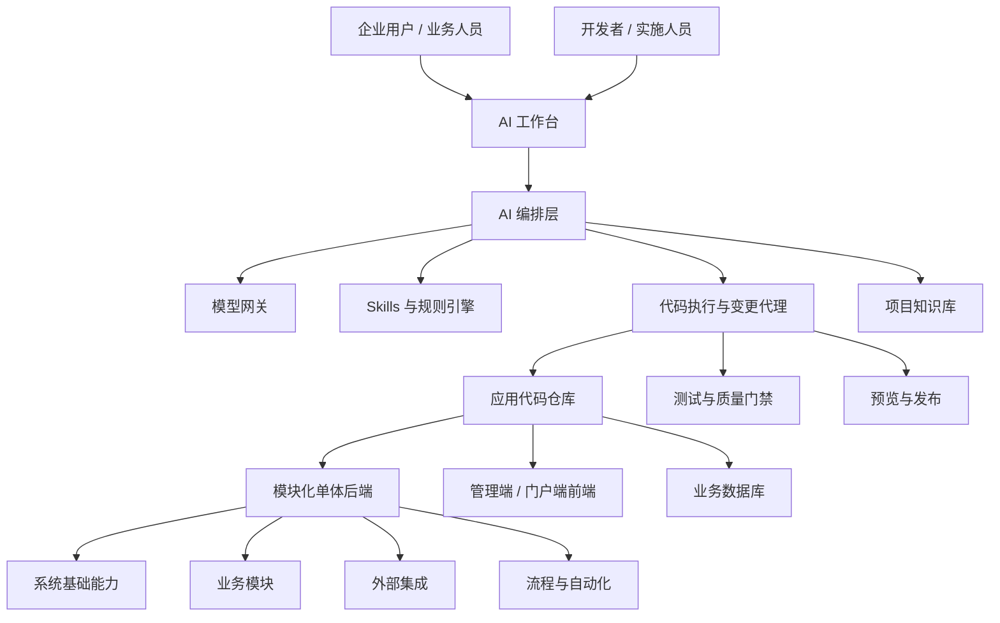
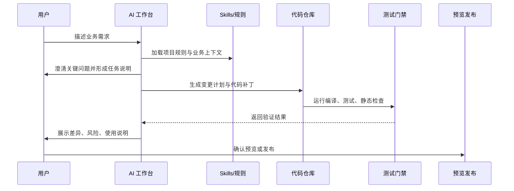

# Vibe Boot：面向中小企业的 AI 原生单体应用架构

## 1. 项目定位

Vibe Boot 不是传统低代码平台，也不是单纯的后台管理脚手架。它的目标是提供一个可运行、可理解、可持续演进的单体应用基础，让中小企业用户在 AI 辅助下，通过 vibe coding 的方式从真实代码开始迭代业务系统。

平台不追求让用户在页面上拖拽出所有能力，而是把一个企业系统常见的基础设施、业务骨架、模型接入、技能约束、代码生成、验证发布流程预先搭好。用户可以用自然语言描述需求，AI 在既定架构、规则和代码边界内生成、修改、测试和解释代码。

| 维度 | 设计取向 | 说明 |
| --- | --- | --- |
| 目标用户 | 中小企业、创业团队、内部系统团队 | 没有大型 IT 团队，但需要持续演进的信息系统 |
| 核心价值 | 极低成本搭建与扩展业务系统 | 从可运行底座开始，而不是从空仓库开始 |
| 产品形态 | AI 原生开发平台 + 单体应用模板 | 平台提供 AI、技能、规范、工程能力；应用仍是真代码 |
| 技术路线 | 模块化单体优先，保留未来拆分能力 | 降低部署、运维、调试和数据一致性成本 |
| 用户体验 | 对话驱动、代码可见、变更可审计 | 用户能看到、理解和接管 AI 生成的内容 |

## 2. 为什么要“超过低代码”

低代码平台解决了快速搭建的问题，但常见瓶颈是复杂业务难表达、平台锁定严重、工程质量不可控、后期扩展成本升高。AI 快速发展后，真正有价值的方向不是把所有业务都抽象成可视化配置，而是让用户和 AI 一起在高质量代码底座上迭代。

| 对比项 | 传统低代码 | Vibe Boot 目标 |
| --- | --- | --- |
| 业务表达 | 表单、流程、报表配置为主 | 自然语言 + 代码 + 结构化规则共同表达 |
| 扩展方式 | 插件、脚本、平台专用 DSL | 标准 Java / Spring Boot / Vue 工程扩展 |
| 复杂逻辑 | 容易绕路或写脚本堆积 | AI 直接在分层架构内实现业务逻辑 |
| 可维护性 | 依赖平台运行时和配置解释器 | 产物是真实代码，可测试、可审查、可迁移 |
| 成本结构 | 平台授权和定制成本可能上升 | 单体部署，低运维成本，按需接入模型能力 |
| 用户主权 | 用户受平台能力边界限制 | 用户逐渐拥有自己的系统代码资产 |

## 3. 核心原则

| 原则 | 含义 | 落地要求 |
| --- | --- | --- |
| 真实代码优先 | AI 生成的是标准工程代码，不是黑盒配置 | 后端、前端、数据库、测试均进入仓库 |
| 模块化单体优先 | 中小企业先要低成本稳定交付 | 采用清晰模块边界，避免过早微服务化 |
| AI 有边界 | AI 不是随意改代码的自由代理 | 通过 skills、约束规则、代码审查、测试门禁限制变更范围 |
| 人可接管 | 用户或开发者能理解和维护系统 | 文档、命名、分层、日志和测试要优先清晰 |
| 业务资产沉淀 | 每次迭代都沉淀为领域模型、流程、规则和知识 | 建立业务字典、实体模型、流程模型、提示词资产 |
| 渐进增强 | 从 CRUD 到流程、报表、AI 助手逐步扩展 | 不为了平台完整性牺牲首个可用版本 |

## 4. 总体架构

## 5. 架构分层

| 层级 | 职责 | 建议能力 |
| --- | --- | --- |
| 交互层 | 用户通过自然语言、表单、任务看板描述需求 | AI 工作台、需求澄清、变更预览、发布确认 |
| AI 编排层 | 管理模型调用、上下文、skills、约束和执行计划 | 模型网关、提示词模板、工具调用、审计日志 |
| 工程执行层 | 对代码仓库执行受控修改并验证 | 代码生成、补丁应用、单测运行、构建检查、差异摘要 |
| 应用层 | 真实业务系统运行体 | Spring Boot 模块化单体、Vue 管理端、API、任务调度 |
| 平台基础层 | 支撑用户、租户、权限、文件、消息、日志等通用能力 | RBAC、数据权限、字典、配置、通知、审计、对象存储 |
| 运维发布层 | 让中小企业低成本部署和升级 | Docker Compose、单机部署、备份恢复、版本升级脚本 |

## 6. 单体应用模块设计

模块化单体不是把所有代码放在一起，而是在一个部署单元内保持清晰边界。Vibe Boot 的第一阶段应优先构建可复用的企业应用底座。

| 模块 | 必要性 | 说明 |
| --- | --- | --- |
| `vibe-starter` | 必选 | 应用启动入口、环境配置、装配各模块 |
| `vibe-common` | 必选 | 通用结果、异常、工具、基础实体、校验规则 |
| `vibe-security` | 必选 | 登录认证、RBAC、数据权限、接口鉴权 |
| `vibe-system` | 必选 | 用户、角色、菜单、部门、岗位、字典、参数配置 |
| `vibe-ai` | 必选 | 模型接入、对话、上下文、工具调用、用量统计 |
| `vibe-skill` | 必选 | skills 管理、规则集、项目约束、提示词模板 |
| `vibe-gen` | 必选 | 代码生成、模板管理、元数据建模、脚手架生成 |
| `vibe-workflow` | 可选增强 | 审批流、状态机、自动化任务 |
| `vibe-report` | 可选增强 | 查询、报表、仪表盘、导入导出 |
| `vibe-file` | 必选 | 本地文件、MinIO、云 OSS 适配 |
| `vibe-message` | 可选增强 | 站内信、通知、WebSocket、企业微信/钉钉集成 |
| `vibe-integration` | 可选增强 | 第三方 API、Webhook、ERP/CRM/财务系统连接 |

## 7. AI 原生能力设计

### 7.1 模型网关

平台需要统一接入常用大模型，而不是让业务代码直接调用各家 SDK。模型网关负责路由、鉴权、用量、成本、降级和审计。

| 能力 | 说明 |
| --- | --- |
| 多模型接入 | 支持 OpenAI、Anthropic、Gemini、通义、DeepSeek、智谱等供应商 |
| 模型路由 | 按任务类型选择模型，例如代码生成、长文档、结构化抽取、轻量问答 |
| 成本控制 | 按用户、租户、项目、任务统计 token 和费用 |
| 敏感信息处理 | 请求前脱敏、输出后过滤、审计留痕 |
| 降级策略 | 主模型不可用时切换备用模型，或切换为人工确认流程 |

### 7.2 Skills 与约束规则

Skills 是平台超过普通 AI Chat 的关键。它让 AI 明确知道当前项目的技术栈、代码风格、架构边界、业务术语和禁止事项。

| 类型 | 示例 | 作用 |
| --- | --- | --- |
| 工程 Skill | Spring Boot 模块规范、Vue 页面规范、MyBatis-Plus 规范 | 保证生成代码符合项目结构 |
| 业务 Skill | 进销存术语、客户管理规则、审批状态流转 | 提高业务实现准确度 |
| 安全 Skill | 权限校验、数据权限、敏感字段处理 | 降低越权和泄露风险 |
| 测试 Skill | 单元测试模板、接口测试模板、回归检查清单 | 让 AI 变更必须可验证 |
| 文档 Skill | 需求说明、变更说明、接口说明模板 | 每次迭代沉淀项目知识 |

约束规则应显式化，例如：

| 规则 | 说明 |
| --- | --- |
| 禁止绕过权限 | 新增接口必须声明权限标识，除公开接口外不得匿名访问 |
| 禁止直接拼接 SQL | 查询必须使用 ORM、参数化 SQL 或经过审查的动态 SQL |
| 禁止跨模块随意依赖 | 业务模块只能依赖公共契约，不能循环引用 |
| 高风险变更需确认 | 删除字段、迁移数据、修改鉴权、批量任务必须人工确认 |
| 生成代码需验证 | 至少通过编译、格式化和关键单测，失败时返回原因 |

## 8. Vibe Coding 工作流

| 阶段 | 用户输入 | AI 产出 | 质量门禁 |
| --- | --- | --- | --- |
| 需求澄清 | “我要做客户拜访记录” | 实体、字段、页面、权限、流程草案 | 关键字段、角色、数据范围确认 |
| 变更计划 | 确认后的需求 | 文件清单、接口清单、数据库变更计划 | 高风险操作标记 |
| 代码生成 | 允许执行 | 后端、前端、SQL、测试、文档补丁 | 编译、格式化、单测 |
| 预览验收 | 页面试用反馈 | 修复补丁、说明文档 | 关键路径可运行 |
| 发布沉淀 | 发布确认 | 版本记录、回滚点、业务知识更新 | 备份、迁移、审计 |

## 9. 与参考项目的关系

当前仓库包含 `mars-admin` 与 `AgileBoot` 两类参考项目。Vibe Boot 可以吸收它们的优点，但不应简单复制。

| 参考来源 | 可借鉴点 | 需要调整的方向 |
| --- | --- | --- |
| `mars-admin` | Spring Boot 3、Vue 3、Naive UI、模块清晰、功能完整 | 增加 AI 编排、skills、代码生成闭环、租户/用量治理 |
| `AgileBoot` | 规范意识、测试覆盖、轻量后台脚手架、领域层整理 | 升级现代技术栈，减少传统后台模板味道，强化 AI 迭代体验 |

建议第一版以 `mars-admin` 的现代技术栈和模块化方式为主参考，同时吸收 `AgileBoot` 对规范、测试和简洁性的追求。

## 10. 数据与元模型

Vibe Boot 需要维护一套“业务元模型”，作为 AI 理解系统和生成代码的中间层。

| 元模型 | 内容 | 用途 |
| --- | --- | --- |
| 实体模型 | 表、字段、关联、枚举、校验 | 生成后端实体、Mapper、接口、前端表单 |
| 权限模型 | 菜单、按钮、接口权限、数据范围 | 自动生成权限标识和菜单 |
| 页面模型 | 列表、详情、表单、筛选、操作 | 生成管理端页面 |
| 流程模型 | 状态、动作、角色、条件 | 生成审批、状态机、通知 |
| 集成模型 | 外部系统、接口、凭证、映射 | 生成 API 对接和同步任务 |
| 知识模型 | 业务术语、规则、历史决策 | 为 AI 提供项目上下文 |

## 11. 安全与治理

中小企业并不意味着安全要求低。AI 参与编码后，安全边界更要前置。

| 风险 | 治理策略 |
| --- | --- |
| AI 误改核心代码 | 文件级白名单、任务级权限、变更 diff 审核 |
| 越权接口 | 权限注解强制检查，接口扫描未授权项 |
| 数据泄露 | 模型请求脱敏、敏感字段标记、日志脱敏 |
| 成本失控 | 模型用量限额、任务预算、租户级账单 |
| 生成代码质量不稳定 | 编译、测试、静态检查、人工确认高风险变更 |
| 供应商锁定 | 模型网关抽象，多供应商适配 |
| 升级破坏用户定制 | 模块边界、迁移脚本、变更记录、插件化扩展点 |

## 12. 部署策略

Vibe Boot 面向中小企业，应优先支持“单机也能跑好”的部署模式。

| 阶段 | 部署形态 | 适用场景 |
| --- | --- | --- |
| 开发/演示 | 本地启动、H2/SQLite 可选、内置文件存储 | 试用、培训、快速验证 |
| 标准生产 | Docker Compose + MySQL + Redis + MinIO | 大多数中小企业 |
| 增强生产 | 独立数据库、对象存储、备份服务、反向代理 | 数据量较大或有合规要求 |
| 未来扩展 | 模块拆分为服务、独立 AI 执行节点 | 大客户或高并发场景 |

## 13. 第一阶段 MVP 范围

第一阶段不要做成“大而全平台”，而要让用户真实完成一个业务模块从描述到上线的闭环。

| 优先级 | 能力 | MVP 要求 |
| --- | --- | --- |
| P0 | 基础后台 | 登录、用户、角色、菜单、部门、字典、参数、日志 |
| P0 | AI 对话工作台 | 能读取项目规则，生成变更计划和文档 |
| P0 | 模型网关 | 至少支持 2 类模型供应商配置，记录用量 |
| P0 | 代码生成 | 基于实体模型生成 CRUD 后端、前端、SQL、权限菜单 |
| P0 | 规则约束 | 项目规范、权限规则、高风险操作提示 |
| P1 | 测试门禁 | 编译、格式化、关键单测、失败摘要 |
| P1 | 预览发布 | 本地预览、版本记录、回滚说明 |
| P1 | 文件与导入导出 | 文件上传、Excel 导入导出 |
| P2 | 流程能力 | 简单审批流、状态机、通知 |
| P2 | 知识库 | 业务术语、需求记录、历史变更检索 |

## 14. 演进路线

| 阶段 | 目标 | 关键交付 |
| --- | --- | --- |
| 0. 架构定稿 | 明确产品边界和技术选型 | 架构文档、模块清单、规范草案 |
| 1. 应用底座 | 建立可运行的模块化单体 | 后端基础模块、前端管理端、权限和日志 |
| 2. AI 接入 | 让平台能稳定调用模型 | 模型网关、对话记录、用量统计、脱敏 |
| 3. 生成闭环 | 从需求生成一个完整 CRUD 模块 | 元模型、代码模板、SQL、菜单权限、页面 |
| 4. 质量闭环 | AI 变更可验证、可审查、可回滚 | 测试门禁、diff 摘要、版本记录 |
| 5. 业务增强 | 支持更多真实企业流程 | 流程、报表、导入导出、第三方集成 |
| 6. 生态化 | 形成可复用 skills 和模板市场 | 行业模板、插件、模型策略、最佳实践 |

## 15. 关键设计决策

| 决策 | 选择 | 理由 |
| --- | --- | --- |
| 架构形态 | 模块化单体 | 中小企业优先降低部署和运维复杂度 |
| 生成产物 | 真实代码 | 便于维护、测试、迁移和二次开发 |
| AI 边界 | 工具化代理 + skills 约束 | 避免 AI 任意发挥，提升稳定性 |
| 前后端 | Spring Boot 3 + Vue 3 | 成熟、生态好、易招聘、适合后台系统 |
| 权限模型 | RBAC + 数据权限 | 覆盖大多数企业内部系统需求 |
| 扩展方式 | 模块 + 模板 + skills | 比纯插件平台更贴近 AI coding 工作流 |

## 16. 待进一步拆分的文档

| 文档 | 内容 |
| --- | --- |
| `docs/module-design.md` | 后端模块、包结构、依赖边界 |
| `docs/ai-workbench-design.md` | AI 工作台、模型网关、任务编排 |
| `docs/skill-rule-design.md` | skills 格式、规则引擎、项目约束 |
| `docs/code-generation-design.md` | 元模型、模板、CRUD 生成链路 |
| `docs/security-governance.md` | 权限、安全、审计、脱敏、成本治理 |
| `docs/mvp-roadmap.md` | 版本计划、任务拆分、验收标准 |

## 17. 一句话总结

Vibe Boot 的本质是“AI 时代的企业应用可进化底座”：它用模块化单体降低中小企业落地成本，用真实代码避免低代码锁定，用 skills 和约束规则把 AI 的创造力关进可维护、可测试、可审计的工程边界里。
