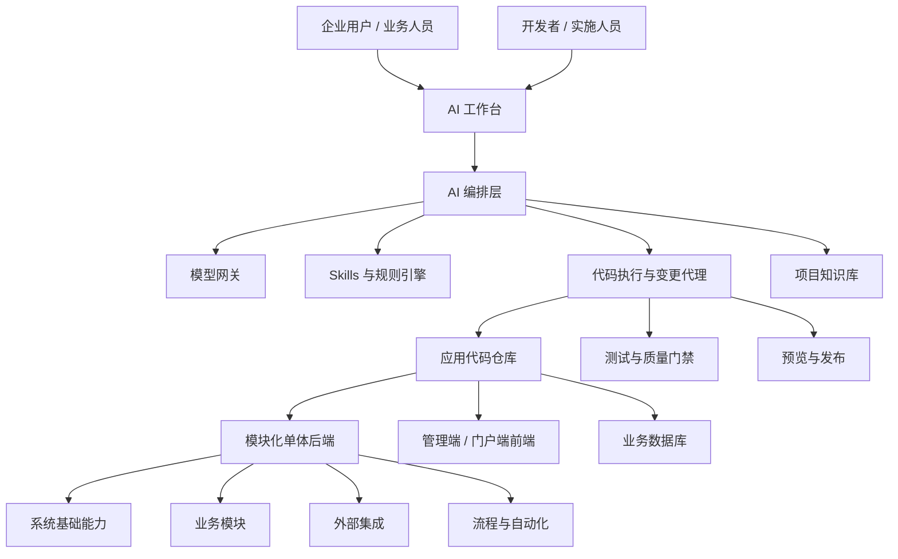
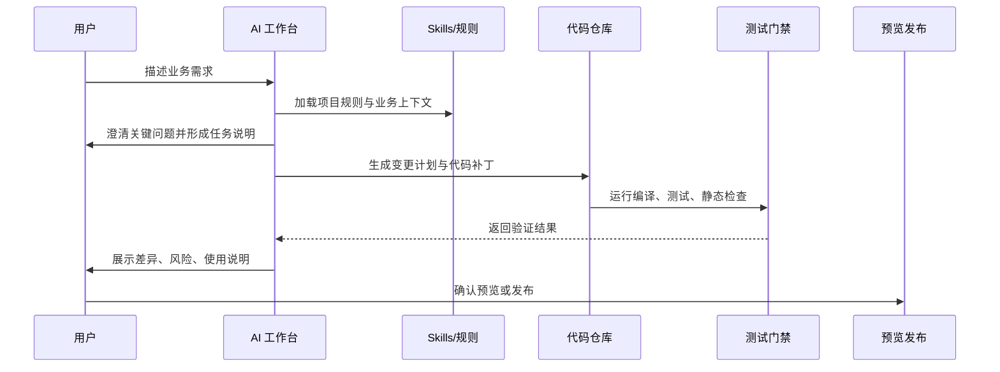

# Vibe Boot：面向中小企业的 AI 原生单体应用架构

## 1. 项目定位

Vibe Boot 不是传统低代码平台，也不是单纯的后台管理脚手架。它的目标是提供一个可运行、可理解、可持续演进的单体应用基础，让中小企业用户在 AI 辅助下，通过 vibe coding 的方式从真实代码开始迭代业务系统。

平台不追求让用户在页面上拖拽出所有能力，而是把一个企业系统常见的基础设施、业务骨架、模型接入、技能约束、代码生成、验证发布流程预先搭好。用户可以用自然语言描述需求，AI 在既定架构、规则和代码边界内生成、修改、测试和解释代码。

AI 工具使用方式已分层定稿，不再作为未定问题悬空：外部 AI Coding 工具负责开发模式下的真实源码修改，平台内 AI 工作台负责企业用户的受控生成流程，模型网关统一模型接入，生产模式只保留安全的业务 AI 能力。具体使用路径见 `docs/adr/0003-ai-tool-usage-boundary.md` 和 `docs/ai-tool-usage-guide.md`；真正进入实现仍必须完成 `docs/coding-start-signoff.md` 人工签收。

| 维度 | 设计取向 | 说明 |
| --- | --- | --- |
| 目标用户 | 中小企业、创业团队、内部系统团队 | 没有大型 IT 团队，但需要持续演进的信息系统 |
| 核心价值 | 极低成本搭建与扩展业务系统 | 从可运行底座开始，而不是从空仓库开始 |
| 产品形态 | AI 原生开发平台 + 单体应用模板 | 平台提供 AI、技能、规范、工程能力；应用仍是真代码 |
| 技术路线 | 模块化单体优先，保留未来拆分能力 | 降低部署、运维、调试和数据一致性成本 |
| 用户体验 | 对话驱动、代码可见、变更可审计 | 用户能看到、理解和接管 AI 生成的内容 |

## 2. 为什么要“超过低代码”

低代码平台解决了快速搭建的问题，但常见瓶颈是复杂业务难表达、平台锁定严重、工程质量不可控、后期扩展成本升高。AI 快速发展后，真正有价值的方向不是把所有业务都抽象成可视化配置，而是让用户和 AI 一起在高质量代码底座上迭代。

| 对比项 | 传统低代码 | Vibe Boot 目标 |
| --- | --- | --- |
| 业务表达 | 表单、流程、报表配置为主 | 自然语言 + 代码 + 结构化规则共同表达 |
| 扩展方式 | 插件、脚本、平台专用 DSL | 标准 Java / Spring Boot / Vue 工程扩展 |
| 复杂逻辑 | 容易绕路或写脚本堆积 | AI 直接在分层架构内实现业务逻辑 |
| 可维护性 | 依赖平台运行时和配置解释器 | 产物是真实代码，可测试、可审查、可迁移 |
| 成本结构 | 平台授权和定制成本可能上升 | 单体部署，低运维成本，按需接入模型能力 |
| 用户主权 | 用户受平台能力边界限制 | 用户逐渐拥有自己的系统代码资产 |

## 3. 核心原则

| 原则 | 含义 | 落地要求 |
| --- | --- | --- |
| 真实代码优先 | AI 生成的是标准工程代码，不是黑盒配置 | 后端、前端、数据库、测试均进入仓库 |
| 模块化单体优先 | 中小企业先要低成本稳定交付 | 采用清晰模块边界，避免过早微服务化 |
| AI 有边界 | AI 不是随意改代码的自由代理 | 通过 skills、约束规则、代码审查、测试门禁限制变更范围 |
| 人可接管 | 用户或开发者能理解和维护系统 | 文档、命名、分层、日志和测试要优先清晰 |
| 业务资产沉淀 | 每次迭代都沉淀为领域模型、流程、规则和知识 | 建立业务字典、实体模型、流程模型、提示词资产 |
| 文档优先 | 编码前先收敛产品约束、技术边界和交付策略 | 未进入实现前，新增想法必须先修订文档 |
| 渐进增强 | 从 CRUD 到流程、报表、AI 助手逐步扩展 | 不为了平台完整性牺牲首个可用版本 |

文档准入、冻结清单、S1 工作令和本文总纲都不单独授权编码。当前是否允许创建源码目录，只以 `docs/coding-start-signoff.md` 的签收状态和维护者明确的启动口令为准。

## 4. 总体架构



## 5. 架构分层

| 层级 | 职责 | 建议能力 |
| --- | --- | --- |
| 交互层 | 用户通过自然语言、表单、任务看板描述需求 | AI 工作台、需求澄清、变更预览、发布确认 |
| AI 编排层 | 管理模型调用、上下文、skills、约束和执行计划 | 模型网关、提示词模板、工具调用、审计日志 |
| 工程执行层 | 对代码仓库执行受控修改并验证 | 代码生成、补丁应用、单测运行、构建检查、差异摘要 |
| 应用层 | 真实业务系统运行体 | Spring Boot 模块化单体、Vue 管理端、API、任务调度 |
| 平台基础层 | 支撑用户、租户、权限、文件、消息、日志等通用能力 | RBAC、数据权限、字典、配置、通知、审计、对象存储 |
| 运维发布层 | 让中小企业低成本部署和升级 | Docker Compose、单机部署、备份恢复、版本升级脚本 |

说明：工程执行层在 P0/P1 阶段主要由外部 AI Coding 工具、本地脚本和后续受控执行器承担；生产环境不运行开发型代码代理，也不允许在线修改源码、执行任意 shell 或直接变更数据库结构。

## 6. 单体应用模块设计

模块化单体不是把所有代码放在一起，而是在一个部署单元内保持清晰边界。Vibe Boot 的第一阶段应优先构建可复用的企业应用底座。

| 模块 | 阶段口径 | 说明 |
| --- | --- | --- |
| `vibe-starter` | P0 必选 | 应用启动入口、环境配置、装配各模块 |
| `vibe-common` | P0 必选 | 通用结果、异常、工具、基础实体、校验规则 |
| `vibe-security` | P0 必选 | 登录认证、RBAC、数据权限、接口鉴权 |
| `vibe-system` | P0 必选 | 用户、角色、菜单、部门、岗位、字典、参数配置 |
| `vibe-ai` | P0 必选 | 模型接入、对话、上下文、工具调用、用量统计 |
| `vibe-skill` | P0 必选 | skills 管理、规则集、项目约束、提示词模板 |
| `vibe-gen` | P0 必选 | 代码生成、模板管理、元数据建模、脚手架生成 |
| `vibe-file` | P0 必选 | P0 只实现本地文件基础服务，MinIO/云 OSS 仅预留接口 |
| `vibe-workflow` | P2 预留 | 审批流、状态机、自动化任务 |
| `vibe-report` | P2 预留 | 查询、报表、仪表盘、导入导出 |
| `vibe-message` | P2+ 预留 | 站内信、通知、WebSocket、企业微信/钉钉集成 |
| `vibe-integration` | P2 预留 | 第三方 API、Webhook、ERP/CRM/财务系统连接 |

S1 工程骨架只允许创建 P0 必选模块。任何 P2/P2+ 预留模块进入实现前，必须先更新 `docs/module-design.md`、`docs/terminology-and-naming.md` 和对应任务分解。

## 7. AI 原生能力设计

### 7.1 模型网关

平台需要统一接入常用大模型，而不是让业务代码直接调用各家 SDK。模型网关负责路由、鉴权、用量、成本、降级和审计。

| 能力 | 说明 |
| --- | --- |
| 多模型接入 | 支持 OpenAI、Anthropic、Gemini、通义、DeepSeek、智谱等供应商 |
| 模型路由 | 按任务类型选择模型，例如代码生成、长文档、结构化抽取、轻量问答 |
| 成本控制 | 按用户、租户、项目、任务统计 token 和费用 |
| 敏感信息处理 | 请求前脱敏、输出后过滤、审计留痕 |
| 降级策略 | 主模型不可用时切换备用模型，或切换为人工确认流程 |

### 7.2 Skills 与约束规则

Skills 是平台超过普通 AI Chat 的关键。它让 AI 明确知道当前项目的技术栈、代码风格、架构边界、业务术语和禁止事项。

| 类型 | 示例 | 作用 |
| --- | --- | --- |
| 工程 Skill | Spring Boot 模块规范、Vue 页面规范、MyBatis-Plus 规范 | 保证生成代码符合项目结构 |
| 业务 Skill | 进销存术语、客户管理规则、审批状态流转 | 提高业务实现准确度 |
| 安全 Skill | 权限校验、数据权限、敏感字段处理 | 降低越权和泄露风险 |
| 测试 Skill | 单元测试模板、接口测试模板、回归检查清单 | 让 AI 变更必须可验证 |
| 文档 Skill | 需求说明、变更说明、接口说明模板 | 每次迭代沉淀项目知识 |

约束规则应显式化，例如：

| 规则 | 说明 |
| --- | --- |
| 禁止绕过权限 | 新增接口必须声明权限标识，除公开接口外不得匿名访问 |
| 禁止直接拼接 SQL | 查询必须使用 ORM、参数化 SQL 或经过审查的动态 SQL |
| 禁止跨模块随意依赖 | 业务模块只能依赖公共契约，不能循环引用 |
| 高风险变更需确认 | 删除字段、迁移数据、修改鉴权、批量任务必须人工确认 |
| 生成代码需验证 | 至少通过编译、格式化和关键单测，失败时返回原因 |

## 8. Vibe Coding 工作流



| 阶段 | 用户输入 | AI 产出 | 质量门禁 |
| --- | --- | --- | --- |
| 需求澄清 | “我要做客户拜访记录” | 实体、字段、页面、权限、流程草案 | 关键字段、角色、数据范围确认 |
| 变更计划 | 确认后的需求 | 文件清单、接口清单、数据库变更计划 | 高风险操作标记 |
| 代码生成 | 允许执行 | 后端、前端、SQL、测试、文档补丁 | 编译、格式化、单测 |
| 预览验收 | 页面试用反馈 | 修复补丁、说明文档 | 关键路径可运行 |
| 发布沉淀 | 发布确认 | 版本记录、回滚点、业务知识更新 | 备份、迁移、审计 |

## 9. 与参考项目的关系

当前仓库包含 `mars-admin` 与 `AgileBoot` 两类参考项目。Vibe Boot 可以吸收它们的优点，但不应简单复制。

| 参考来源 | 可借鉴点 | 需要调整的方向 |
| --- | --- | --- |
| `mars-admin` | Spring Boot 3、Vue 3、Naive UI、模块清晰、功能完整 | 增加 AI 编排、skills、代码生成闭环、租户/用量治理 |
| `AgileBoot` | 规范意识、测试覆盖、轻量后台脚手架、领域层整理 | 升级现代技术栈，减少传统后台模板味道，强化 AI 迭代体验 |

建议第一版以 `mars-admin` 的现代技术栈和模块化方式为主参考，同时吸收 `AgileBoot` 对规范、测试和简洁性的追求。

### 9.1 主流 Java Admin 项目启示

参考 RuoYi、RuoYi-Vue、RuoYi-Vue-Pro、JeecgBoot、Spring Boot Vue Admin、Mars Admin、AgileBoot 等项目后，可以看到国内 Java Admin 生态的共同点：它们通常围绕权限、菜单、字典、日志、代码生成、数据库访问和前后端分离展开。Vibe Boot 不应堆叠更多中间件，而要把这些成熟能力收敛成一个更适合 AI coding 的极简底座。

| 项目类型 | 常见技术/能力 | 对 Vibe Boot 的取舍 |
| --- | --- | --- |
| 传统权限后台 | Spring Boot、权限、菜单、角色、日志、代码生成 | 保留，作为企业应用基础盘 |
| 现代前后端分离后台 | Spring Boot + Vue + MyBatis/MyBatis-Plus + Redis | 保留，但控制依赖数量 |
| 低代码/代码生成平台 | 在线表单、代码生成、报表、流程、插件 | 只保留“生成真实代码”的部分，不做复杂运行时 DSL |
| 大而全企业平台 | 多租户、多数据源、多数据库、多 MQ、微服务 | 首版不做，避免中小企业部署复杂度失控 |
| AI 低代码平台 | AI 生成表、报表、页面、助手 | 保留 AI 生成链路，但必须经过代码仓库和质量门禁 |

### 9.2 技术栈最小化原则

首版技术栈必须克制。每增加一个中间件，就会增加用户安装、调试、备份、升级和 AI 理解系统的成本。

| 层级 | 首版选择 | 暂不引入 | 原因 |
| --- | --- | --- | --- |
| 后端 | JDK 17、Spring Boot 3.5.16、Maven 3.8 | Spring Cloud、Nacos、Dubbo、Spring Boot 4.x | 单体优先，减少服务治理成本 |
| 数据库 | MySQL 8 | PostgreSQL、Oracle、SQL Server、多数据源 | 先服务中国中小企业最常见部署 |
| 缓存 | Redis | MQ、分布式缓存集群 | 满足登录态、验证码、限流、轻量缓存 |
| ORM | MyBatis-Plus 3.5.16 | JPA、复杂查询 DSL | 国内 Java Admin 生态成熟，代码生成友好 |
| 前端 | Node.js 20.19+ LTS、npm、Vue 3.5.39、Vite 8.1.3、TypeScript 6.0.3、Element Plus 2.14.2 | 多套 UI、移动端、小程序 | 先做好一个 PC 管理端 |
| AI 接入 | 统一模型网关 | 每个模块直接接 SDK | 降低供应商耦合，方便用量和安全治理 |
| 部署 | Windows 一键脚本 + 安装包 | Kubernetes、Docker 强依赖 | 面向中小企业，先保证拿来能跑 |

生产网络默认采用“安全关闭”策略：local 模式只绑定 `127.0.0.1`；需要局域网多人访问时必须显式选择 lan 模式并提供 HTTPS PKCS12 和精确 Origin。业务端口默认 8080，Actuator 使用只绑定 `127.0.0.1` 的独立管理端口 8081，生产脚本不通过公开业务地址探测健康状态。

推荐首版只声明以下外部运行依赖：

| 依赖 | 版本 | 用途 | 首版策略 |
| --- | --- | --- | --- |
| JDK | 17 | 运行后端与构建 | 随开发包准备好，不要求用户自行安装 |
| Maven | 3.8.x | 后端构建 | 随开发包准备好，并内置国内镜像配置 |
| MySQL | 8.x | 主业务数据库 | 提供 Windows 初始化脚本和连接检查 |
| Redis | 7.x 或兼容版本 | 缓存、会话、限流 | 提供 Windows 启动脚本和连接检查 |
| Node.js | 20.19+ LTS | 前端构建 | 随开发包准备好，并内置国内 npm 镜像配置 |

## 10. Windows 优先的平台策略

Java 虽然天然跨平台，但 Vibe Boot 第一阶段先做 Windows 平台。原因不是技术不能跨平台，而是目标用户更可能在 Windows 笔记本、Windows Server 或普通办公环境中完成试用、开发和交付。

| 项目 | Windows 首版要求 |
| --- | --- |
| 支持系统 | Windows 10/11、Windows Server 2019+ |
| 开发入口 | 双击或执行 `dev-start.ps1` 启动开发环境 |
| 生产入口 | 执行 `install.ps1` 安装生产服务 |
| 脚本语言 | PowerShell |
| 路径规范 | 默认使用项目内相对路径，避免依赖用户机器全局环境 |
| 端口检查 | 启动前检查后端、前端、MySQL、Redis 常用端口占用 |
| 日志位置 | 统一写入 `logs/`，开发与生产区分目录 |
| 数据位置 | 统一写入 `data/`，便于备份和迁移 |

建议交付包目录：

```text
vibe-boot/
├── app/                    # 后端 jar、前端静态资源、配置文件
├── data/                   # MySQL/Redis/文件存储数据目录
├── logs/                   # 运行日志
├── runtime/
│   ├── jdk17/              # 预置 JDK
│   ├── maven-3.8/          # 预置 Maven
│   ├── node/               # 预置 Node.js
│   └── redis/              # Windows 可运行 Redis 或兼容服务
├── scripts/
│   ├── dev-start.ps1       # 开发模式启动
│   ├── dev-stop.ps1        # 开发模式停止
│   ├── build-prod.ps1      # 生成生产安装包
│   ├── install.ps1         # 生产安装
│   ├── uninstall.ps1       # 生产卸载
│   ├── backup.ps1          # 数据备份
│   └── restore.ps1         # 数据恢复
└── README.md
```

### 10.1 国内镜像与离线友好

面向中国用户时，第一体验不能卡在依赖下载。开发包应默认配置国内镜像，并允许切换回官方源。

| 工具 | 默认国内配置 | 文件位置 |
| --- | --- | --- |
| Maven | 阿里云 Maven 镜像或公司内网 Nexus | `runtime/maven-3.8/conf/settings.xml` |
| npm | `https://registry.npmmirror.com` | `.npmrc` 或 `scripts/dev-start.ps1` 环境变量 |
| npm 缓存 | 项目本地缓存目录 | `.cache/npm` |
| 后端依赖 | 首次构建后缓存到本地仓库 | `.m2/repository` 或用户目录 |
| 前端依赖 | 锁定 `package-lock.json` | 前端工程根目录 |

开发启动脚本应做以下检查：

| 检查项 | 处理方式 |
| --- | --- |
| JDK 不存在 | 使用 `runtime/jdk17` |
| Maven 不存在 | 使用 `runtime/maven-3.8` |
| Node.js 不存在 | 使用 `runtime/node` |
| Maven 镜像未配置 | 自动注入项目级 `settings.xml` |
| npm 镜像未配置 | 自动设置项目级 registry |
| MySQL/Redis 未启动 | 给出明确提示，或尝试启动内置开发实例 |
| 大模型未配置 | 打开配置向导，只要求填写模型供应商、API Key、模型名 |

## 11. 开发模式与生产模式

平台应明确区分开发模式和生产模式。开发模式面向“用 AI 改代码”，生产模式面向“稳定运行已生成的业务系统”。

| 模式 | 目标用户 | 核心目标 | 默认入口 |
| --- | --- | --- | --- |
| 开发模式 | 企业用户、实施人员、轻量开发者 | 接入大模型后用自然语言迭代系统 | `scripts/dev-start.ps1` |
| 生产模式 | 企业管理员、最终用户 | 运行稳定、可备份、可升级的业务系统 | `scripts/install.ps1` |

### 11.1 开发模式

开发模式下，用户拿到项目后不需要先理解所有工程细节。平台应准备好 Java、Maven、Node.js、国内镜像和基础脚本。用户只需要完成大模型接入，即可开始通过 AI 工作台进行代码开发。

| 阶段 | 用户动作 | 平台动作 |
| --- | --- | --- |
| 1. 解压项目 | 解压到本地目录 | 使用相对路径识别 `runtime/`、`scripts/`、`app/` |
| 2. 启动开发环境 | 执行 `dev-start.ps1` | 检查 JDK、Maven、Node、MySQL、Redis、端口 |
| 3. 配置大模型 | 填写供应商、API Key、模型名 | 保存到本地安全配置，不写入 Git |
| 4. 进入 AI 工作台 | 用自然语言描述需求 | 加载 skills、项目规则、业务上下文 |
| 5. 生成代码 | 用户确认变更计划 | 修改真实代码，运行编译和测试 |
| 6. 本地预览 | 访问本地管理端 | 用户验收页面、接口和业务流程 |

开发模式的默认约束：

| 约束 | 说明 |
| --- | --- |
| 禁止默认推送远端 | AI 修改先停留在本地工作区 |
| 禁止自动执行高风险 SQL | 删除字段、清表、批量修改必须二次确认 |
| 必须输出变更摘要 | 每次 AI 修改都说明改了哪些文件、影响哪些模块 |
| 必须可回滚 | 修改前创建本地检查点或 Git 提交建议 |
| 密钥不入库 | 模型 API Key、数据库密码写入本地 ignored 配置 |

### 11.2 生产模式

生产模式不保留前端热更新、AI 开发代理和源码编辑入口，只运行构建后的业务系统。

| 能力 | 生产模式要求 |
| --- | --- |
| 安装 | 一键安装为 Windows 服务或后台进程 |
| 配置 | 使用生产配置文件，敏感项独立保存 |
| 数据库 | 自动创建库表、执行迁移、检查版本 |
| 前端 | 使用构建后的静态资源，由后端或轻量 Web 服务承载 |
| 日志 | 按日期滚动，保留最近 N 天 |
| 备份 | 支持一键备份 MySQL、文件和关键配置 |
| 升级 | 新安装包执行迁移脚本并保留回滚点 |
| AI | 默认关闭代码编辑能力，仅保留业务内 AI 功能 |

## 12. 自动打包与部署设计

代码开发完成后，平台应能生成生产环境安装包。安装包面向非专业运维用户，目标是“复制到服务器，执行安装脚本，自动运行”。


| 步骤 | 输入 | 输出 |
| --- | --- | --- |
| 后端构建 | Java 源码、Maven 配置 | 可运行 `vibe-boot.jar` |
| 前端构建 | Vue 源码、Node.js、锁文件 | 静态资源目录 |
| 配置生成 | 环境模板、用户选择 | `application-prod.yml`、安装配置 |
| 数据库脚本 | Flyway/Liquibase 或自研迁移脚本 | 初始化/升级 SQL |
| 安装包生成 | jar、静态资源、脚本、runtime | `vibe-boot-win-x64.zip` |
| 生产安装 | 安装包、数据库连接、端口 | Windows 服务、日志、数据目录 |

首版生产安装包建议包含：

| 内容 | 是否包含 | 说明 |
| --- | --- | --- |
| 后端 jar | 是 | 单体应用主程序 |
| 前端静态资源 | 是 | 随后端一起发布，减少 Nginx 依赖 |
| JDK 17 runtime | 是 | 降低用户环境准备成本 |
| Maven/Node.js | 否 | 生产只运行构建产物，不需要构建工具 |
| MySQL 安装程序 | 可选 | 默认连接外部 MySQL；演示包可内置 |
| Redis 可执行包 | 可选 | 默认连接外部 Redis；演示包可内置 |
| 安装/卸载脚本 | 是 | PowerShell 一键操作 |
| 备份/恢复脚本 | 是 | 降低生产维护风险 |

## 13. 数据与元模型

Vibe Boot 需要维护一套“业务元模型”，作为 AI 理解系统和生成代码的中间层。

| 元模型 | 内容 | 用途 |
| --- | --- | --- |
| 实体模型 | 表、字段、关联、枚举、校验 | 生成后端实体、Mapper、接口、前端表单 |
| 权限模型 | 菜单、按钮、接口权限、数据范围 | 自动生成权限标识和菜单 |
| 页面模型 | 列表、详情、表单、筛选、操作 | 生成管理端页面 |
| 流程模型 | 状态、动作、角色、条件 | 生成审批、状态机、通知 |
| 集成模型 | 外部系统、接口、凭证、映射 | 生成 API 对接和同步任务 |
| 知识模型 | 业务术语、规则、历史决策 | 为 AI 提供项目上下文 |

## 14. 安全与治理

中小企业并不意味着安全要求低。AI 参与编码后，安全边界更要前置。

| 风险 | 治理策略 |
| --- | --- |
| AI 误改核心代码 | 文件级白名单、任务级权限、变更 diff 审核 |
| 越权接口 | 权限注解强制检查，接口扫描未授权项 |
| 数据泄露 | 模型请求脱敏、敏感字段标记、日志脱敏 |
| 成本失控 | 模型用量限额、任务预算、租户级账单 |
| 生成代码质量不稳定 | 编译、测试、静态检查、人工确认高风险变更 |
| 供应商锁定 | 模型网关抽象，多供应商适配 |
| 升级破坏用户定制 | 模块边界、迁移脚本、变更记录、插件化扩展点 |

## 15. 部署策略

Vibe Boot 面向中小企业，应优先支持“Windows 单机也能跑好”的部署模式。Docker 可以作为未来增强选项，但不应成为首版使用门槛。

| 阶段 | 部署形态 | 适用场景 |
| --- | --- | --- |
| 开发/演示 | Windows 本地启动、预置 JDK/Maven/Node、国内镜像 | 试用、培训、快速验证 |
| 标准生产 | Windows 安装包 + MySQL 8 + Redis + 本地文件存储 | 大多数中小企业 |
| 增强生产 | 独立 MySQL、独立 Redis、对象存储、反向代理 | 数据量较大或有合规要求 |
| 未来扩展 | Docker Compose、Linux 部署、模块拆分为服务 | 更专业的运维场景 |

首版不建议默认引入 MinIO、Nginx、MQ、Elasticsearch、Kubernetes。文件存储先使用本地目录，后续再通过 `vibe-file` 模块扩展到对象存储。

## 16. 第一阶段 MVP 范围

第一阶段不要做成“大而全平台”，而要让用户真实完成一个业务模块从描述到上线的闭环。

优先级口径：P0 是最小开发闭环，P1 是 MVP 完整交付闭环，P2 是 MVP 后增强。生产安装包虽然列为 P1，但仍是 S7 宣称 MVP 闭环通过前必须跑通的能力。

| 优先级 | 能力 | MVP 要求 |
| --- | --- | --- |
| P0 | 基础后台 | 登录、用户、角色、菜单、部门、字典、参数、日志 |
| P0 | Windows 开发包 | 预置 JDK 17、Maven 3.8、Node.js、国内镜像配置 |
| P0 | AI 对话工作台 | 能读取项目规则，生成变更计划和文档 |
| P0 | 模型网关 | 至少支持 2 类模型供应商配置，记录用量 |
| P0 | 代码生成 | 基于实体模型生成 CRUD 后端、前端、SQL、权限菜单 |
| P0 | 规则约束 | 项目规范、权限规则、高风险操作提示 |
| P0 | 文件基础 | 本地单文件上传、鉴权下载、图片预览、配额和两阶段删除 |
| P1 | 测试门禁 | 编译、格式化、关键单测、失败摘要 |
| P1 | 预览发布 | 本地预览、版本记录、回滚说明、生产安装包 |
| P2 | 文件能力增强 | 业务附件、Office 在线预览、MinIO/OSS、CDN |
| P2 | 通用导入导出 | Excel 导入导出、模板和错误回执 |
| P2 | 流程能力 | 简单审批流、状态机、通知 |
| P2 | 知识库 | 业务术语、需求记录、历史变更检索 |

## 17. 演进路线

| 阶段 | 目标 | 关键交付 |
| --- | --- | --- |
| 0. 架构定稿 | 明确产品边界和技术选型 | 架构文档、模块清单、规范草案 |
| 1. Windows 开发包 | 用户解压后可启动开发模式 | JDK/Maven/Node runtime、国内镜像、PowerShell 脚本 |
| 2. 应用底座 | 建立可运行的模块化单体 | 后端基础模块、前端管理端、权限和日志 |
| 3. AI 接入 | 让平台能稳定调用模型 | 模型网关、对话记录、用量统计、脱敏 |
| 4. 生成闭环 | 从需求生成一个完整 CRUD 模块 | 元模型、代码模板、SQL、菜单权限、页面 |
| 5. 质量与发布闭环 | AI 变更可验证、可审查、可打包 | 测试门禁、diff 摘要、生产安装包 |
| 6. 业务增强 | 支持更多真实企业流程 | 流程、报表、导入导出、第三方集成 |
| 7. 生态化 | 形成可复用 skills 和模板市场 | 行业模板、插件、模型策略、最佳实践 |

## 18. 关键设计决策

| 决策 | 选择 | 理由 |
| --- | --- | --- |
| 架构形态 | 模块化单体 | 中小企业优先降低部署和运维复杂度 |
| 生成产物 | 真实代码 | 便于维护、测试、迁移和二次开发 |
| AI 边界 | 工具化代理 + skills 约束 | 避免 AI 任意发挥，提升稳定性 |
| 前后端 | Spring Boot 3.5.16 + Vue 3.5.39 | 成熟、生态好、易招聘、适合后台系统 |
| 首版平台 | Windows 优先 | 降低中国中小企业试用、开发和交付门槛 |
| 技术栈 | JDK 17 + Maven + MySQL + Redis + Node.js | 能覆盖主流 Admin 系统，同时保持依赖克制 |
| 权限模型 | RBAC + 数据权限 | 覆盖大多数企业内部系统需求 |
| 扩展方式 | 模块 + 模板 + skills | 比纯插件平台更贴近 AI coding 工作流 |
| AI 工具路线 | 外部 AI Coding 工具 + 平台 AI 工作台 + 模型网关 + 生产业务 AI | 分层定稿，不再作为未定问题；实现前仍需签收 |

## 19. 已拆分文档与维护入口

以下文档已经从总纲中拆分出来，作为后续 AI Coding、人类实现和编码准入审计的依据。完整阅读顺序、编码闸门和维护规则以 `docs/README.md` 为准。

阅读到 S1 工作令或工程骨架规格并不表示可以开工。正式创建 `backend/`、`frontend/`、`scripts/`、`config/` 等源码目录前，必须先完成 `docs/coding-start-signoff.md` 签收，并由维护者明确说出“开始 S1 工程骨架编码”。

| 文档 | 内容 |
| --- | --- |
| `docs/module-design.md` | 后端模块、包结构、依赖边界 |
| `docs/terminology-and-naming.md` | 术语、模块、目录、状态、权限和脚本命名规范 |
| `docs/backend-implementation-spec.md` | Spring Boot 后端分层、事务、权限、异常和生成规范 |
| `docs/frontend-admin-spec.md` | Vue 管理端布局、路由、权限按钮和页面生成规范 |
| `docs/product-constraints.md` | 产品约束、技术约束、AI 约束、实现准入 |
| `docs/competitive-analysis.md` | 竞品分层、差异化定位、应吸收与不应跟随的方向 |
| `docs/ai-tooling-strategy.md` | 外部 AI coding 工具、平台内 AI 工作台、模型网关的分工 |
| `docs/ai-tool-usage-guide.md` | 开发者、企业用户和生产环境如何使用 AI 工具 |
| `docs/external-ai-coding-prompt.md` | 外部 AI Coding 工具标准提示词 |
| `docs/model-gateway-spec.md` | S3 模型网关施工规格 |
| `docs/s3-task-breakdown.md` | S3 模型网关任务分解 |
| `docs/ai-workbench-design.md` | AI 工作台、模型网关、任务编排 |
| `docs/ai-workbench-task-breakdown.md` | AI 工作台基础任务分解 |
| `docs/skill-rule-design.md` | skills 格式、规则引擎、项目约束 |
| `docs/code-generation-design.md` | 元模型、模板、CRUD 生成链路 |
| `docs/s4-task-breakdown.md` | S4 代码生成闭环任务分解 |
| `docs/quality-gates.md` | 质量门禁、验证命令、失败处理和阶段验收 |
| `docs/windows-devkit-design.md` | Windows 开发包、国内镜像、PowerShell 脚本 |
| `docs/s5-task-breakdown.md` | S5 Windows 开发包任务分解 |
| `docs/release-package-design.md` | 生产安装包、服务安装、备份恢复、升级回滚 |
| `docs/s6-task-breakdown.md` | S6 生产安装包任务分解 |
| `docs/security-governance.md` | 权限、安全、审计、脱敏、成本治理 |
| `docs/mvp-roadmap.md` | 版本计划、任务拆分、验收标准 |
| `docs/implementation-readiness-audit.md` | 编码实现准入审计和 S1 开工清单 |
| `docs/coding-freeze-checklist.md` | 编码前冻结确认清单 |
| `docs/documentation-readiness-review.md` | 编码前文档就绪审计报告 |
| `docs/documentation-maintenance-guide.md` | 文档维护规则、ADR 和引用同步规则 |
| `docs/post-coding-change-control.md` | 编码后变更控制、范围变化和阶段推进规则 |
| `docs/pre-coding-reader-test.md` | 编码前读者测试问题集 |
| `docs/pre-coding-reader-test-results.md` | 编码前读者测试执行结果 |
| `docs/requirements-traceability-matrix.md` | 原始产品要求到文档证据的追踪矩阵 |
| `docs/documentation-verification-log.md` | 文档索引、引用、manifest、最终审查表、签收状态和目录状态验证日志 |
| `docs/coding-start-signoff-package.md` | 编码启动最终人工签收包 |
| `docs/coding-start-signoff.md` | 编码启动人工签收记录 |
| `docs/adr/0001-mvp-tech-decisions.md` | MVP 首版技术决策 |
| `docs/adr/0002-mvp-implementation-contracts.md` | MVP 实现契约 |
| `docs/adr/0003-ai-tool-usage-boundary.md` | AI 工具使用边界 |
| `docs/s1-implementation-work-order.md` | S1 工程骨架实施工作令 |
| `docs/engineering-skeleton-spec.md` | S1 工程骨架施工规格 |
| `docs/s1-task-breakdown.md` | S1 工程骨架任务分解 |
| `docs/basic-admin-spec.md` | S2 基础后台施工规格 |
| `docs/s2-task-breakdown.md` | S2 基础后台任务分解 |
| `docs/customer-visit-demo-spec.md` | MVP 客户拜访记录演示规格 |
| `docs/s7-demo-acceptance.md` | S7 MVP 端到端演示验收剧本 |
| `docs/api-conventions.md` | API、响应、分页、错误码、权限标识规范 |
| `docs/database-baseline.md` | MySQL 表域、基础字段、Flyway 迁移和 P0 表清单 |

## 20. 参考资料

| 来源 | 参考点 |
| --- | --- |
| [RuoYi 官网](https://ruoyi.vip/) | 轻量权限后台、依赖克制、国内 Java Admin 用户基础 |
| [RuoYi-Vue 文档](https://doc.ruoyi.vip/ruoyi-vue/) | Spring Boot、Spring Security、MyBatis、Jwt、Vue 的经典组合 |
| [RuoYi-Vue-Pro 仓库](https://github.com/yunaiv/ruoyi-vue-pro) | Spring Boot 多模块、MySQL、MyBatis Plus、Redis、Vue3 等现代 Admin 能力 |
| [JeecgBoot README](https://github.com/jeecgboot/JeecgBoot/blob/main/README.en-US.md) | AI 低代码、AI 建表、AI 报表等方向参考 |
| [Spring Boot Vue Admin](https://github.com/Zoctan/spring-boot-vue-admin) | 前后端分离权限模板参考 |
| `reference/mars-admin` | 本地现代 Spring Boot 3 + Vue 3 模块化后台参考 |
| `reference/AgileBoot-*` | 本地轻量脚手架、规范、测试和重构思路参考 |

## 21. 一句话总结

Vibe Boot 的本质是“AI 时代的企业应用可进化底座”：它先在 Windows 上把 JDK、Maven、Node、MySQL、Redis 和国内镜像准备好，让中国中小企业用户只需接入大模型就能开始用 AI 生成真实代码，并在开发完成后自动打包成可安装、可运行、可备份、可升级的生产系统。
